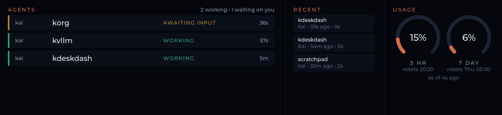

# kdeskdash



A multi-mode, touch-enabled desk dashboard for the Raspberry Pi 5, built with
[LVGL](https://lvgl.io/). It runs fullscreen on an 11.26" 1920x440 capacitive touch
panel and is designed to host multiple interactive *modes* (dev stats, Game of Life, a
main-menu launcher, …). Sibling project to `kpidash`, reusing its LVGL + DRM + Pi-sysroot
cross-compile approach and adding touch input.

> Status: **active** — a multi-mode shell with swipe navigation (Game of Life, GoLZ,
> Clock, Dev graphs, Claude agent activity, and a Menu launcher), optional Redis remote
> control / last-mode persistence / settings injection, and a systemd service for
> boot-to-dashboard. See [docs/plans](docs/plans/) and [docs/brainstorms](docs/brainstorms/).

> **Note:** Like many of my projects, I've produced this for my own environment. If you
> want to make use of this code, have your AI agent help change the hardcoded
> `KDESKDASH_TELEMETRY_REDIS_HOST` to your own Redis, and take a look at
> [`kenhia/kpidash`](https://github.com/kenhia/kpidash) for the client telemetry utilities.

## Modes

- **Menu** — swipe-down launcher with a tile per content mode; tap to open. Startup default.
- **Game of Life** — full-screen Conway's Game of Life; settings randomize per entry (or are
  injected via Redis).
- **GoLZ** — Game of Life with Zombies: Humans vs. Zombies vs. the ordinary Living, with
  machetes, adaptive win thresholds, and persistent outcome counters.
- **Clock** — local (America/Los_Angeles) + UTC time and a wall-clock stopwatch.
- **Dev** — live CPU/RAM + GPU/VRAM charts for two selectable fleet hosts (kpidash
  telemetry from the `rpi53` Redis).
- **Claude** — fleet Claude Code agent activity: attention-first session rows
  (awaiting-input on top), recent completions, and 5-hour / 7-day subscription usage
  gauges. Fed by [publisher/claude-pub.sh](publisher/README.md) hooks + statusline on
  each dev machine via a dedicated Redis instance
  ([deploy/redis-claude.conf](deploy/redis-claude.conf), port 6380).

Navigation: swipe **left/right** to cycle content modes, swipe **down** for the Menu.

## Hardware / target

- Raspberry Pi 5 (8GB), Debian 13 (Trixie), hostname `rpidash2`, user `ken`
- GeeekPi 11.26" 1920x440 HDMI capacitive touch (ILITEK controller)
- Display: DRM `/dev/dri/card1` (vc4 GPU) · Touch: evdev `/dev/input/by-id/usb-ILITEK_ILITEK-TOUCH-event-if00`
- 3D Printed case (work in progress, will include STLs once I finish the design)

## Build (cross-compile from a dev host)

### 1. Prerequisites

```bash
# On the dev host: cross toolchain
sudo apt-get install -y gcc-aarch64-linux-gnu g++-aarch64-linux-gnu cmake pkg-config rsync

# On the Pi: DRM dev headers + hiredis (linux/input.h for touch is already present)
ssh ken@rpidash2 'sudo apt-get install -y libdrm-dev libhiredis-dev'
```

### 2. Clone with submodules

```bash
git clone --recurse-submodules <repo-url>   # LVGL is pinned at v9.2.2 in lib/lvgl
cd kdeskdash
```

### 3. Sync the Pi sysroot

```bash
scripts/sync-sysroot.sh        # rsyncs /lib, /usr/lib, /usr/include into ~/pi5-sysroot
```

### 4. Build and deploy

```bash
cmake -B build-pi -DCMAKE_TOOLCHAIN_FILE=cmake/aarch64-toolchain.cmake
cmake --build build-pi --target kdeskdash -j"$(nproc)"
cmake --build build-pi --target deploy        # scp binary to ken@rpidash2:~/kdeskdash
```

## Run (on the Pi)

DRM master and evdev require root.

```bash
sudo -E ./kdeskdash      # Ctrl-C to exit
```

| Environment variable | Default | Description |
|----------------------|---------|-------------|
| `KDESKDASH_DRM_DEV`    | `/dev/dri/card1`     | DRM device (card1 = vc4 GPU) |
| `KDESKDASH_ROTATE_180` | _(off)_              | Parsed but currently a **no-op** — the DRM driver has no software-rotation path yet, so setting it only logs a warning (the panel is mounted the right way up via the case). Reserved for a future rotation path. |
| `KDESKDASH_TOUCH_DEV`  | `/dev/input/by-id/usb-ILITEK_ILITEK-TOUCH-event-if00` | evdev touch device; the by-id symlink is stable across replug/reboot |
| `KDESKDASH_REDIS_HOST` | `127.0.0.1`          | Control Redis host (optional) |
| `KDESKDASH_REDIS_PORT` | `6379`               | Control Redis port           |
| `REDISCLI_AUTH`        | _(unset)_            | Control Redis password, if any (AUTH) |
| `KDESKDASH_TELEMETRY_REDIS_HOST` | `rpi53`    | Telemetry source Redis host (kpidash host metrics; read-only, separate from the control Redis). Used by `dev` mode. |
| `KDESKDASH_TELEMETRY_REDIS_PORT` | `6379`     | Telemetry source Redis port |
| `KDESKDASH_TELEMETRY_REDISCLI_AUTH` | _(unset)_ | Telemetry source Redis password, if any (AUTH) |
| `KDESKDASH_CLAUDE_REDIS_HOST` | `127.0.0.1`   | Claude-feed Redis host (agent activity + usage limits; a second, LAN-reachable instance on the Pi itself). Used by `claude` mode. |
| `KDESKDASH_CLAUDE_REDIS_PORT` | `6380`        | Claude-feed Redis port |
| `KDESKDASH_CLAUDE_REDISCLI_AUTH` | _(unset)_  | Claude-feed Redis password, if any (AUTH) |

## Redis (optional)

Redis enables remote control, last-mode persistence, and Game of Life settings injection.
The dashboard runs fully by touch without it.

```bash
ssh ken@rpidash2 'sudo apt-get install -y redis-server'   # enabled on install
```

Keys:

| Key | Type | Purpose |
|-----|------|---------|
| `kdeskdash:active_mode`  | string | Active mode id (e.g. `clock`, `game_of_life`, `dev`); `SET` to switch remotely, written on every change (persistence). |
| `kdeskdash:gol:settings` | hash   | One-shot Game of Life settings, consumed (deleted) on the next GoL entry. |
| `kdeskdash:dev:left`     | string | Dev mode: hostname assigned to the left charts; written on assign, restored on dev entry. |
| `kdeskdash:dev:right`    | string | Dev mode: hostname assigned to the right charts; written on assign, restored on dev entry. |
| `kdeskdash:screenshot`   | string | One-shot device self-screenshot (consumed with GETDEL): `SET` any value to write the active screen to `/tmp/kdeskdash-shot.bmp`; a value starting with `/` names the output path. How the README hero image above was taken — no glossy-panel photography. |

Examples (run on the Pi or any host pointed at its Redis):

```bash
redis-cli set kdeskdash:active_mode clock         # switch to the Clock mode
redis-cli hset kdeskdash:gol:settings \
  cell_size 6 padding 1 density 0.4 trail 1 trail_turns 8 speed_ms 120 rgb 1
redis-cli set kdeskdash:active_mode game_of_life  # applies the injected settings
```

GoL fields (all optional; absent fields randomize): `cell_size` (2–64), `padding` (0–16),
`density` (0–1.0), `trail` (0/1), `trail_turns` (1–64), `speed_ms` (10–5000), `rgb` (0/1).
With `rgb` on, three independent boards run with the same settings and are
composited into the red/green/blue channels.

## Service (boot-to-dashboard)

Install the systemd unit once, then deploys restart it automatically:

```bash
cmake --build build-pi --target install-service   # installs unit + /etc/kdeskdash/kdeskdash.env, enables
ssh ken@rpidash2 'sudo systemctl start kdeskdash'
```

Edit `/etc/kdeskdash/kdeskdash.env` on the Pi to override the environment variables above
(template: [deploy/kdeskdash.env.example](deploy/kdeskdash.env.example)). The deploy target
(`cmake --build build-pi --target deploy`) stops the service, installs the binary to
`/usr/local/bin/kdeskdash`, and starts it.

## Project layout

```
kdeskdash/
├── CMakeLists.txt                  # LVGL + libdrm + hiredis + pthread; deploy/install-service
├── lv_conf.h                       # LVGL config: DRM + EVDEV + Montserrat fonts
├── cmake/aarch64-toolchain.cmake   # Pi 5 cross-compile toolchain
├── deploy/
│   ├── kdeskdash.service           # systemd unit (boot-to-dashboard)
│   ├── kdeskdash.env.example       # env template -> /etc/kdeskdash/kdeskdash.env
│   ├── redis-claude.conf           # claude-feed Redis instance (port 6380, ephemeral)
│   └── redis-claude.service        # systemd unit for the claude-feed instance
├── publisher/
│   ├── claude-pub.sh               # zero-dep hook/statusline publisher (RESP over /dev/tcp)
│   ├── settings-fragment.json      # ~/.claude/settings.json hook + statusline config
│   └── README.md                   # per-machine install + smoke test
├── scripts/
│   ├── sync-sysroot.sh             # rsync Pi sysroot for cross-compilation
│   └── deploy.sh                   # remote deploy / systemd install
├── src/
│   ├── main.c                      # entry: DRM + evdev bring-up, main loop, teardown
│   ├── config.{c,h}                # env-var configuration
│   ├── shell.{c,h}                 # mode shell: registration, gestures, lifecycle
│   ├── redis.{c,h}                 # optional Redis client (control/persistence/injection)
│   ├── gol.{c,h} / stopwatch.{c,h} # pure, host-tested mode cores
│   └── modes/                      # game_of_life, clock, menu
├── tests/                          # host unit tests (registry, gol, stopwatch)
├── lib/lvgl/                       # LVGL v9.2.2 (submodule)
└── docs/                           # brainstorms, plans, solutions
```
