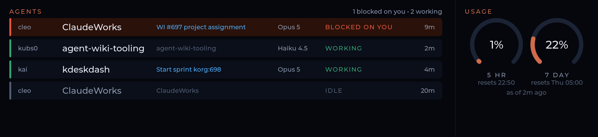

# kdeskdash

A multi-mode, touch-enabled desk dashboard for the Raspberry Pi 5, built with
[LVGL](https://lvgl.io/). It runs fullscreen on an 11.26" 1920x440 capacitive touch
panel and is designed to host multiple interactive *modes* (dev stats, Game of Life, a
main-menu launcher, …). Sibling project to `kpidash`, reusing its LVGL + DRM + Pi-sysroot
cross-compile approach and adding touch input.




> Status: **active** — a multi-mode shell with swipe navigation (Game of Life, GoLZ,
> Clock, Dev graphs, Claude agent activity, and a Menu launcher), optional Redis remote
> control / last-mode persistence / settings injection, and a systemd service for
> boot-to-dashboard. See [sprints/](sprints/) for how it got built, one record per
> unit of work.

> **Note:** Like many of my projects, I've produced this for my own environment. If you
> want to make use of this code, have your AI agent help change the hardcoded
> `KDESKDASH_TELEMETRY_REDIS_HOST` to your own Redis, and take a look at
> [`kenhia/kpidash`](https://github.com/kenhia/kpidash) for the client telemetry utilities.

## Modes

- **Menu** — swipe-down launcher with a tile per content mode; tap to open. Startup default.
- **Game of Life** — full-screen Conway's Game of Life; settings randomize per entry (or are
  injected via Redis).
- **GoLZ** — Game of Life with Zombies: Humans vs. Zombies vs. the ordinary Living, with
  machetes, adaptive win thresholds, and persistent outcome counters.
- **Clock** — the shared dual clock (local America/Los_Angeles + UTC, the *same*
  widget the Launcher's side pane renders) beside an almanac panel — the long date,
  the ISO week and the day of the year — and a wall-clock stopwatch. Extra world-clock
  faces are configuration: see `KDESKDASH_CLOCK_ZONES`. See
  [sprints/036-calc-and-clock.md](sprints/036-calc-and-clock.md).
- **Dev** — live CPU/RAM + GPU/VRAM charts for two selectable fleet hosts (kpidash
  telemetry from the `rpi53` Redis).
- **Claude** — fleet Claude Code agent activity: attention-first session rows
  (`BLOCKED ON YOU` — an agent sitting on a question — above awaiting-input, then
  working), each labelled with Claude's own session name, plus subscription usage
  gauges: 5-hour and 7-day windows, and — where a machine runs the publisher's
  OAuth poll — the model-scoped weekly window as a third gauge. Each gauge greys
  its percentage independently when its own data goes stale. Fed by
  [publisher/claude-pub.sh](publisher/README.md) hooks + statusline on each dev
  machine, and session-free by its `poll` mode (desktop-app usage file, or the
  OAuth usage endpoint on headless hosts). The feed lives on the homelab's
  central Redis (`rpi53:6379`) since sprint 031 — publishers reach it through
  `kdash-pub`, which resolves the endpoint from khlenv, so moving it again is a
  store edit rather than a sweep of every publisher host. Since sprint 034 the
  panel reads it through **libkdash** (`lib/kdashdata`), the shared consumer
  library every homelab dashboard uses, rather than its own copy of the
  parsers.
- **Icons** — a Nerd Font browser: page a glyph set (Font Logos, Devicons, Codicons,
  Font Awesome, Material Design, …) in a touch grid, preview the selected glyph at several
  sizes, and mark favourites saved to a bake-ready file. Renders any of ~9,300 glyphs at
  runtime via LVGL's TinyTTF over the vendored `SymbolsNerdFont-Regular.ttf` — no static
  font bake. See [sprints/009-icons-nerdfont-browser](sprints/009-icons-nerdfont-browser/requirements.md).
- **Remote** — the fleet's live editor/browser windows + configured apps (published by
  whichever deck runs on the paired workstation — [`kctrldeck`](https://github.com/kenhia/kctrldeck)
  on `cleo`, [`kvscf`](https://github.com/kenhia/kvscf) on `kwork` until Ken replaces it;
  the `kvscf:` key namespace is the contract's, and kctrldeck kept it deliberately)
  in a 4×7 grid. A left **app rail**
  switches the view between **VS Code / Insiders** (`kvscf:instances:*`; open windows first
  with a ★ on favorites, then closed favorites dimmed with ○), **Microsoft Edge**
  (`kvscf:edge:*`, named windows first in teal, then unnamed with a tab count), and **Apps**
  (`kvscf:apps:*`, non-running apps greyed). **Tapping brings a window to the foreground on its
  host — or launches it** (a closed Code favorite relaunches the editor; a stopped app starts)
  — the dashboard's first *control-plane* mode, not just a view. Publishes to `kvscf:focus:<host>`
  on its own endpoint (`KDESKDASH_KVSCF_REDIS_*`, defaulting to this board's own
  `127.0.0.1:6380` — there is no Claude-feed fallback since sprint 040); commands
  (`{id}` for windows, `{app}` for apps) are authenticated with a per-pair token,
  and the panel reads and commands only the workstation named by
  `KDESKDASH_KVSCF_PAIR_HOST`. See
  [sprints/011-remote-foreground-mode](sprints/011-remote-foreground-mode/requirements.md).
- **Launcher** — the Stream Deck replacement: a touch grid of buttons published by that
  same per-host deck on `kvscf:launcher:<host>`, with a local + UTC
  clock beside it. **Tapping a button opens its URL in the Edge window that button
  prefers** — the part a Stream Deck cannot do — by publishing `{button:<key>}` to
  `kvscf:focus:<host>`, the same authenticated channel Remote uses. The grid is 70% of the
  panel; on 1920×440 the published 9×3 works out to ~149×146 px cells, **~21.6 mm — larger
  than a Stream Deck key (19 mm)** — and the clock pane fills the other 30%, replacing the
  two of Ken's 32 keys that were displaying exactly those two times.

  The mode is entirely feed-driven: it renders whatever grid the feed describes, **including
  the grid dimensions**, and never learns where a button goes (on a work machine those URLs
  are an employer's business, and they stay there). When the publishing machine sleeps or
  locks, the last-good layout **stays on screen, greyed, with a `kvscf offline` note** rather
  than blanking — the 10s key TTL is right for a live window list and wrong for a button
  layout. Labels are filtered to what the panel can actually draw, so an emoji the font
  lacks disappears instead of rendering as a box. See
  [sprints/025-launcher-mode.md](sprints/025-launcher-mode.md), and
  [docs/kwork-rpidash3-pairing.md](docs/kwork-rpidash3-pairing.md) for the work-desk
  pairing that put it in front of the Stream Deck it replaced.
- **Calc** — a desk calculator built for the wide panel: big result + hex/binary readouts
  and always-live unit conversions (in↔mm exact; px↔mm via the ruler-measured 7.69 px/mm
  panel calibration) on the left, six store/recall registers (R0–R5) in the middle, and a
  9×4 keypad on the right (numpad island, `+ − × ÷ xʸ x² x³ ± π e`, `√x` `1/x`, and
  `sin cos tan` with an `INV` modifier for the inverses and a `DEG`/`RAD` key that names
  the angle mode it is in). `CE` clears the operand you are typing; `C` takes the pending
  operation with it. Immediate-execution infix. **Registers survive a restart** — the only
  thing here that touches durable state (`calc.regs` in the panel state file), and the
  calculator works normally without it. **Tap a register row to recall it, hold it to store** — the two STO/RCL
  buttons that used to sit on each row are what paid for the keypad's extra columns. See
  [sprints/016-calc-mode](sprints/016-calc-mode/requirements.md) and
  [sprints/036-calc-and-clock.md](sprints/036-calc-and-clock.md).
- **Palette** — the living style guide: the canonical named color palette
  (`src/palette.h`, ~30 paint-store names like `CLAUDE_CORAL`, `EDGE_TEAL`,
  `GUNMETAL_SEAM`) as paged swatch cards — name and sample text in the color, filled +
  outlined boxes, hex, and a usage note — so colors are judged on the actual panel and
  referenced by name. See
  [sprints/017-palette-mode](sprints/017-palette-mode/requirements.md).

Navigation: swipe **left/right** to cycle content modes, swipe **down** for the Menu,
and **double-tap the background** to jump straight to the current mode's quick-switch
partner.

The partner is the previously active mode unless `KDESKDASH_QUICK_PAIRS` pins one, so
bouncing between two modes (Claude and Remote, say) needs no configuration at all:
swipe to the second one once, and the double-tap toggles from then on. The Menu is
deliberately left out of that history — passing through it to reach a mode does not
make it the partner. Set a pair to make the partner fixed regardless of history:

```bash
KDESKDASH_QUICK_PAIRS="claude:foreground,clock:calc"
```

To turn the gesture off entirely without touching the mode set, set it to `none`:

```bash
KDESKDASH_QUICK_PAIRS=none
```

The double-tap is read on a mode's **bare background** only: LVGL does not bubble a
click to the screen, so a fast double-tap on a calc key or a launcher button stays
with that widget and never switches modes.

### Per-device mode sets

A panel does not have to carry every mode. `KDESKDASH_MODES` names the ones it
registers, in the order it registers them, grouped into the Menu's sections:

```bash
KDESKDASH_MODES="fun:game_of_life,golz,icons,palette;ops:claude,foreground,clock,dev,calc"
```

Each section is `name:id,id,…`; sections are separated by `;`. Valid ids are the
mode ids above (`game_of_life`, `golz`, `clock`, `dev`, `claude`, `icons`,
`foreground`, `launcher`, `calc`, `palette`) and the section names are `fun` and `ops`, the
two the Menu draws. **A section's list order is both the swipe-cycle order and
the Menu tile order** — the two can no longer disagree.

Unset means every mode, which is what both panels ship with. Each device's line
lives in its [deploy/hosts/](deploy/hosts/) file, so changing a panel's mode set
is a one-line edit and a redeploy — including adding a future mode to just one
device.

Nothing about a bad value can leave you with a panel you cannot navigate: an
unknown mode id or section name is warned about on stderr and skipped, and a
spec that selects *nothing* usable falls back to the full set rather than
rendering an empty menu. `journalctl -u kdeskdash` shows what was dropped. The
grammar and every one of those degradation paths are host-tested in
[tests/test_modeset.c](tests/test_modeset.c).

## Hardware / target

Two panels run the same build — the binary is generic aarch64, so board choice
does not fork the artifact:

| Host | Board | Desk |
|---|---|---|
| `rpidash2` | Raspberry Pi 5, 8GB | dev desk |
| `rpidash3` | Raspberry Pi 4 Model B Rev 1.5, 8GB | work desk |

Both run Debian 13 (Trixie) as user `ken`, and share the rest of the hardware
story:

- GeeekPi 11.26" 1920x440 HDMI capacitive touch (ILITEK controller)
- Display: DRM `/dev/dri/card1` (vc4) · Touch: evdev `/dev/input/by-id/usb-ILITEK_ILITEK-TOUCH-event-if00`
- 3D printed case — STLs in [stl/](stl/)

**Building one?** [docs/hardware.md](docs/hardware.md) has the bill of materials
with links and the print settings; [docs/assembly.md](docs/assembly.md) is the
step-by-step build with photos.

The Pi 4 needs no overrides for either: it puts the vc4 display on `card1` too
(`card0` is the render-only v3d node) and negotiates the panel's native
1920x440 straight from EDID. Its evdev *index* differs — `event0` rather than
`event1` — but the by-id path above is the default and resolves correctly on
both. On the Pi 4's A72 the GoL/GoLZ `rgb 1` composite is the only mode that
noticeably works harder; see the sprint 018 record for measurements.

## Build (cross-compile from a dev host)

### 1. Prerequisites

```bash
# On the dev host: cross toolchain
sudo apt-get install -y gcc-aarch64-linux-gnu g++-aarch64-linux-gnu cmake pkg-config rsync

# On each Pi: DRM dev headers + hiredis (linux/input.h for touch is already present)
ssh ken@rpidash2 'sudo apt-get install -y libdrm-dev libhiredis-dev'
```

### 2. Clone with submodules

```bash
git clone --recurse-submodules <repo-url>   # pins LVGL v9.2.2 (lib/lvgl) and libkdash (lib/kdashdata)
cd kdeskdash
```

### 3. Sync a Pi sysroot

```bash
just sync-sysroot              # rsyncs /lib, /usr/lib, /usr/include into ~/pi-sysroot
just sync-sysroot rpidash3     # ...from a specific board
```

One sysroot serves every dashboard: both boards run the same Trixie aarch64
userspace (verified — matching `libdrm` and `libhiredis` versions), and only the
kernel flavor differs, which never reaches the linker. An existing
`~/pi5-sysroot` from before the rename is still used as-is, so no re-sync is
forced.

### 4. Publish and deploy

kdeskdash ships from the [homelab package store](docs/deploying.md): a release
is a versioned artifact, and a deploy installs *that artifact* on a board.

```bash
just publish                     # build + publish artifacts/kdeskdash/<version>/
just deploy                      # install the newest published version on rpidash2
just deploy rpidash3             # ...on any other dashboard
just deploy rpidash2 0.24.0-1a2b3c4    # ...a specific version — this is the rollback
just versions                    # what is published / cached / running where
just published                   # is this version already in the store? (exit code is the answer)
```

`just publish` is **self-skipping**: the version is derived from the payload
(the files that ship), so a sprint that changed only docs or the publisher
reproduces the version already in the store and the recipe answers `nothing to
publish` and exits 0 rather than cutting an identical release. See
[docs/deploying.md](docs/deploying.md) for the three-outcome store predicate
behind it — an unreachable store is never read as "not published".

Set `KDESKDASH_STORE_URL` and `KDESKDASH_STORE_HOST` in `.env` first (see
[docs/deploying.md](docs/deploying.md)). The fetch happens on the dev box, not
the board — the Pis stay unmanaged, and the artifact reaches them over the same
ssh that was always the deploy path.

For the dev loop — where the panel is the only place a change can be seen —
`just push-dev [host]` cross-compiles and pushes this tree straight to a board.
It is not a deploy: the build is stamped `-dirty`, so `just versions` reports a
board running something that is not in the store.

```bash
just build-pi                    # cross-compile only
just push-dev rpidash3           # ...and put it on a panel to look at
```

## Run (on the Pi)

DRM master and evdev require root.

```bash
sudo -E ./kdeskdash      # Ctrl-C to exit
```

| Environment variable | Default | Description |
|----------------------|---------|-------------|
| `KDESKDASH_DRM_DEV`    | `/dev/dri/card1`     | DRM device (card1 = vc4 GPU) |
| `KDESKDASH_ROTATE_180` | _(off)_              | Parsed but currently a **no-op** — the DRM driver has no software-rotation path yet, so setting it only logs a warning (the panel is mounted the right way up via the case). Reserved for a future rotation path. |
| `KDESKDASH_TOUCH_DEV`  | `/dev/input/by-id/usb-ILITEK_ILITEK-TOUCH-event-if00` | evdev touch device; the by-id symlink is stable across replug/reboot |
| `KDESKDASH_STATE_FILE` | `/var/lib/kdeskdash/state` | Where the panel keeps its **durable state** — GoLZ counters and threshold, calculator registers, dev-mode host assignments, last active mode. Written atomically (temp + rename) on every change; a malformed file is rejected whole and the panel starts from defaults. Lived on a Redis server running on the board itself until sprint 039. |
| `KDESKDASH_PANEL_HOST` | _(hostname, lowercased)_ | The `{host}` segment this panel answers to on central (`kdash:panelmode:<host>`, `kdash:panelshot:<host>`). Derived from `gethostname()`'s first label, **lowercased** — rpidash2's kernel hostname is `rpiDash2` while the fleet calls it `rpidash2`, and the panel must answer to the name people and tools write. Set it only to override; junk disables the command feed rather than guessing. The panel logs the name it chose at startup. |
| `KDESKDASH_CMD_REDIS_HOST` | _(telemetry host → `rpi53`)_ | Where the panel **reads its commands** from. Defaults to the telemetry endpoint, which is already central, so neither device needs a line. Read-only; the panel never writes these keys. |
| `KDESKDASH_CMD_REDIS_PORT` | _(telemetry port → `6379`)_ | Falls back independently of the host. |
| `KDESKDASH_CMD_REDISCLI_AUTH` | _(telemetry auth, **same instance only**)_ | Unset on both panels: the command feed rides the telemetry endpoint and inherits `REDISCLI_AUTH` with no line anywhere. Inherits *only when it resolves to the same host:port* — the same rule, and the same reason, as `KVSCF_REDISCLI_AUTH`. |
| `KDESKDASH_REDIS_HOST` | `127.0.0.1`          | The board's own **legacy** Redis, read exactly **once**: on a first run with no state file, to copy the old `kdeskdash:*` values into it. Copy, never move — nothing is deleted, so a rollback finds its state where it left it. |
| `KDESKDASH_REDIS_PORT` | `6379`               | As above. |
| `KDESKDASH_CONTROL_REDISCLI_AUTH` | _(unset)_ | Password for that legacy instance, if any (AUTH). Unset on both panels — it is loopback-only and passwordless. Deliberately **not** bare `REDISCLI_AUTH`, which is the fleet's name for the central rpi53 password and is always set once the unit reads `/etc/khomelab/secrets.env`; a Redis with no password configured answers `AUTH` with an *error*, so reading the bare name here would break the migration silently. Guarded by `just unit-lint` and `test_config`. |
| `KDESKDASH_TELEMETRY_REDIS_HOST` | `rpi53`    | Telemetry source Redis host (kpidash host metrics; read-only, separate from the control Redis). Used by `dev` mode. |
| `KDESKDASH_TELEMETRY_REDIS_PORT` | `6379`     | Telemetry source Redis port |
| `REDISCLI_AUTH`        | _(unset)_            | The **central rpi53 password**, and the one credential four handles share: telemetry, the Claude feed, the service card, and the command feed. **Secret, and not this repo's to install** — k-homelab renders it into `/etc/khomelab/secrets.env` on every host from the age store, and the unit reads it there. One name, one secret, fleet-wide (sprint 037). |
| `KDESKDASH_CLAUDE_REDIS_HOST` | `127.0.0.1`   | Claude-feed Redis host (agent activity + usage limits). Used by `claude` mode. The compiled-in default is a leftover from when the feed was loopback-local on rpidash2; the feed lives on the central Redis now (kdashdata CD-7) and both shipped panels set `rpi53` explicitly — see sprint 031. |
| `KDESKDASH_CLAUDE_REDIS_PORT` | `6380`        | Claude-feed Redis port (both panels set `6379`) |
| `KDESKDASH_KVSCF_REDIS_HOST` | `127.0.0.1` | kvscf instance the `Remote` and `Launcher` modes read and publish to. **Its own default since sprint 040** (korg WI 2305): it used to fall back to the Claude-feed host, which stopped being the same place in sprint 031 and so pointed at a server with no kvscf on it. rpidash3 pins its own `127.0.0.1:6380`; rpidash2 points at central (`rpi53:6379`) now that cleo's deck publishes there. |
| `KDESKDASH_KVSCF_REDIS_PORT` | `6380` | As above, and independent of the host. |
| `KDESKDASH_KVSCF_REDIS_AUTH_KEY` | _(unset → legacy lookup)_ | **Which fleet key name holds this board's kvscf password.** Set it to `REDISCLI_AUTH` when the endpoint is central, `CLAUDE_REDISCLI_AUTH` on rpidash2's own 6380, `KVSCF_REDISCLI_AUTH` on rpidash3's. Naming it matters once the endpoint can be central: both published names are then in the panel's environment and they are **different secrets**, so the legacy ordered lookup picks the board-local password and AUTH fails — which shows up as "the endpoint is down", not as a permissions error. Unset keeps that ordered lookup, correct for a panel on its own board's instance. |
| `KDESKDASH_KVSCF_PAIR_HOST` | _(unset → any publisher)_ | The one workstation this panel reads (`kvscf:*:<host>`) and will send a command to. Unset keeps the pre-fold wildcard, still right for a private instance only one workstation writes to (rpidash3). **On a shared server this is the only scoping there is** (kdashdata CD-8), so rpidash2 sets `cleo`. A value that is not a legal host token warns and degrades to the wildcard rather than stopping the panel. |
| `KVSCF_REDISCLI_AUTH` | _(claude-feed auth, **same instance only**)_ | The **transport** gate, distinct from `KVSCF_TOKEN`'s application one. **Secret, from `/etc/khomelab/secrets.env`**; needed on both panels since sprint 035 (each board's own 6380 instance has a `requirepass`). The two panels' instances are different services with different passwords, and k-homelab publishes **one key name per secret** (its `bin/check-secrets` refuses one key naming two store entries), so the name is per-host: `KVSCF_REDISCLI_AUTH` on rpidash3, `CLAUDE_REDISCLI_AUTH` on rpidash2 — the latter named for the *instance* (`redis-claude`), not the Claude feed, which reads central. kdeskdash tries them in that order. Wrong or missing looks like an unreachable endpoint, not a permissions error. Since sprint 040 it inherits nothing from the Claude feed at all, and the preferred spelling is to name the key in `KDESKDASH_KVSCF_REDIS_AUTH_KEY` rather than rely on this two-name order. |
| `KDESKDASH_MODES`      | _(unset → all modes)_ | Per-device mode set: `fun:<ids>;ops:<ids>`. See [Per-device mode sets](#per-device-mode-sets). |
| `KDESKDASH_ICONS_TTF`  | `/usr/local/share/kdeskdash/SymbolsNerdFont-Regular.ttf` | Symbols Nerd Font read at runtime by the `icons` mode (installed by the deploy target). If missing, the mode shows an "unavailable" state and the rest of the dashboard is unaffected. |
| `KDESKDASH_ICONS_FAVORITES` | `/var/lib/kdeskdash/icon-favorites.txt` | `icons`-mode favourites file (loaded on entry, written by **Save**). One lowercase-hex codepoint per line — drops straight into `lv_font_conv -r` ranges for a future static bake. |
| `KDESKDASH_CLOCK_ZONES` | _(unset → no extra faces)_ | Clock mode: extra world-clock rows, comma-separated `[<label>=]<tz>` — e.g. `"Asia/Tokyo,HQ=Europe/London"`. Without a label the zone's last path segment is used with underscores as spaces (`America/New_York` → "New York"). Up to four; malformed entries are skipped, so a typo costs one row. An unknown zone name is not an error to the C library — it silently shows UTC under whatever label you gave it. |
| `KDESKDASH_QUICK_PAIRS` | _(unset → previously active mode)_ | Double-tap partner pairs, `"<id>:<id>[,<id>:<id>]"`. Three states: **unset** → the partner is whichever mode was active before this one (a working default, not "off"); **`none`** (or `off`) → the double-tap is inert; **pairs** → the partner is pinned regardless of history. Malformed entries are warned about and skipped, so one typo costs one pair, not the feature. |
| `KDESKDASH_CARD_REDIS_HOST` | _(telemetry host → `rpi53`)_ | Where this instance publishes its own kpidash **service card** (`kpidash:services:deskdash:<host>`). Write-only — kdeskdash never reads that namespace. Defaults to the telemetry endpoint because the card lives on the same board Redis, so neither device needs a new line. |
| `KDESKDASH_CARD_REDIS_PORT` | _(telemetry port → `6379`)_ | Falls back independently of the host. |
| `KDESKDASH_CARD_REDISCLI_AUTH` | _(telemetry auth, **same instance only**)_ | A local override, unset on both panels: the card rides the telemetry endpoint and so inherits `REDISCLI_AUTH` with no line anywhere. Inherits *only when the card endpoint resolves to the same host:port* — the same rule, and the same reason, as `KVSCF_REDISCLI_AUTH`. |
| `KDESKDASH_CARD_NAME`  | `deskdash`           | The card's name segment. Card identity is `(name, host)`, so two panels on two hosts need nothing here; **two instances on one host** would otherwise clobber each other's key and must be given distinct names (`deskdash-left`). |
| `KDESKDASH_KVSCF_TOKEN_KEY` | _(unset)_ | **Which fleet key name holds this pair's token.** `KCTRLDECK_TOKEN_CLEO_PAIR` on rpidash2, `KCTRLDECK_TOKEN_KWORK_PAIR` on rpidash3 — one name per *pair*, because the two desks hold different values and k-homelab's `bin/check-secrets` refuses one key name meaning two store entries. There is deliberately no shared name and no list spanning both desks: the failure a swap causes is silent, taps simply stop working. |
| `KVSCF_TOKEN`          | _(unset)_            | The **deprecated** last rung for the above: the hand-installed `/etc/kdeskdash/secrets.env` each board still carries. Same secret, older home — k-homelab sprint 069 put both desks' tokens in the age store, and the file is deleted per board once the named read is proven there. Must byte-match the deck's copy (format `kvscf-<64hex>`); unset with nothing named → both modes still render but tapping cannot act ("view only"). **Secret.** |

## Remote control (from central)

The panel takes commands from the **central** Redis on rpi53, read-only, through
the kdashdata control families. It runs no Redis server of its own, and it never
writes these keys — a command is *acted on* and left alone.

| Key | Payload | Purpose |
|-----|---------|---------|
| `kdash:panelmode:<host>` | `{"mode": "<id>", "settings": {…}}` | Switch to `<id>`, optionally injecting one-shot settings for it. `settings` is optional; names and meanings belong to the mode, values are text. A mode this panel does not have is ignored (and logged). |
| `kdash:panelshot:<host>` | `{"path": "/var/lib/kdeskdash/…"}` | Capture the active screen to BMP. `path` is optional — absent means `/var/lib/kdeskdash/kdeskdash-shot.bmp`. When present it is **absolute by contract**, and the panel **refuses anything outside `/var/lib/kdeskdash/`**, saying so in its log: this key is writable by every holder of the central password, so where a root process puts a 2.5 MB file is the panel's decision, not the wire's. |

`<host>` is the panel's **lowercase short name** — `rpidash2`, `rpidash3`. The
panel logs the one it chose at startup; `KDESKDASH_PANEL_HOST` overrides it.

**A command is an edge, not a state.** The panel remembers the `ts` of the last
command it acted on — separately per key — and acts only when a newer one
arrives, ignoring anything older than 60 s. Three things follow, and they are
the reason the shape is this one:

- **A mode you pick by hand sticks.** The key may still say "GoL"; its `ts` has
  not moved, so nothing yanks the screen back.
- **Re-publishing is idempotent**, so a script can set the same command twice.
- **A panel that was off for an hour comes back to its own screen**, not to
  whatever it was told while it was away.

Examples (from any fleet host — `kdash-pub` finds central and the password):

```bash
kdash-pub set kdash:panelmode:rpidash2 '{"mode":"clock"}'
kdash-pub set kdash:panelmode:rpidash2 '{"mode":"game_of_life","settings":{
  "cell_size":"6","padding":"1","density":"0.4","trail":"1","trail_turns":"8",
  "speed_ms":"120","rgb":"1"}}'
kdash-pub set kdash:panelshot:rpidash2 '{}'
```

GoL setting names (all optional; absent fields randomize): `cell_size` (2–64),
`padding` (0–16), `density` (0–1.0), `trail` (0/1), `trail_turns` (1–64),
`speed_ms` (10–5000), `rgb` (0/1). With `rgb` on, three independent boards run
with the same settings and are composited into the red/green/blue channels.
GoLZ adds `initial_count` (0–5), `zombie_reinfect`, `zombie_spawn_chance`,
`machete_percentage`, `human_kill_zombie` (all 0–100), `max_generations` and
`generations_to_win` (1–1,000,000). An out-of-range or non-numeric value is
ignored, leaving that field randomized; the injection applies to the next round,
so naming the mode already showing configures it without switching.

[scripts/kddss](scripts/kddss) wraps the whole screenshot flow: `kddss
[basename]` publishes the trigger, waits for the file on the panel and lands a
PNG in the current directory; `KDD_HOST=rpidash3 kddss` targets another panel.
It is how the hero image above was taken — no glossy-panel photography.

## Durable state (one file)

Everything the panel must remember across a restart lives in
`/var/lib/kdeskdash/state`, a flat `key=value` file the panel owns:

| Key | Purpose |
|-----|---------|
| `golz.human_wins`, `golz.zombie_wins`, `golz.ties` | GoLZ outcome counters. |
| `golz.gens_to_win` | The adaptive Human-win generation threshold (floor 100). |
| `golz.wins` | The legacy pre-machete zombie-win counter; display-only. |
| `calc.regs` | Calc mode's store/recall registers, `<idx>:<value>` pairs. |
| `dev.left`, `dev.right` | Dev mode's assigned hosts. |
| `active_mode` | The last active mode id, restored at startup. |

Written atomically — temp file then rename — so a power cut leaves the previous
file intact rather than half of a new one. A malformed file is **rejected
whole** (the rule `calc:regs` already followed: half-restored state is worse
than none, because nobody can tell which half they are looking at) and the panel
starts from defaults. An **unknown key** is the one thing that does not reject
it, because naming an older version is how this project rolls back.

On a first run with no state file, the panel copies the old `kdeskdash:*` values
out of the board's local Redis if one answers — **copy, never move** — so scores
survive the move and a rollback finds Redis as it left it.

## Service (boot-to-dashboard)

Install the systemd unit once per device, then deploys restart it automatically:

```bash
just install-service            # rpidash2 (the default)
just install-service rpidash3   # any other dashboard
ssh ken@rpidash3 'sudo systemctl start kdeskdash'
```

The unit comes out of a published artifact (the newest, or a version named as a
second argument), so the unit a build was released with is the unit that build
runs under. That installs it and the device's committed config from
[deploy/hosts/](deploy/hosts/) — `<host>.env` → `/etc/kdeskdash/kdeskdash.env` —
but only if that file is absent, so hand edits on the panel are never clobbered.
[deploy/kdeskdash.env.example](deploy/kdeskdash.env.example) stays the
full-surface reference for every variable in the table above.

**Passwords come from the fleet, not from here.** The unit reads three env
files, later winning over earlier: `/etc/khomelab/secrets.env` (k-homelab
renders it per host from the age store — `REDISCLI_AUTH`, the board's own
kvscf-instance password, and since k-homelab sprint 069 that desk's pairing
token as `KCTRLDECK_TOKEN_<DESK>_PAIR`; this repo neither writes nor holds any
of them), then this host's committed config, then `/etc/kdeskdash/secrets.env`
for the legacy hand-installed `KVSCF_TOKEN` — the same pairing secret in its
older home, kept only until the fleet-file read is proven on that board. See
[deploy/hosts/README.md](deploy/hosts/README.md). Every entry is optional, so a
device missing any of them still boots — Remote reports "view only", Dev shows
no host data, Claude shows nothing.

`just deploy [host] [version]` stops the service, installs the fetched binary to
`/usr/local/bin/kdeskdash`, asks it its version to prove the push landed, and
starts it.

## Project layout

```
kdeskdash/
├── CMakeLists.txt                  # LVGL + libdrm + hiredis + pthread; version stamp
├── VERSION                         # base version; minor tracks the sprint number
├── .sprint-deploy                  # declares BOTH deploy steps /sprint-ship runs (panel + publisher bundle)
├── .claude/skills/deploy-panels/   #   ...the skill half: publish from main, roll the boards
├── lv_conf.h                       # LVGL config: DRM + EVDEV + Montserrat fonts
├── cmake/aarch64-toolchain.cmake   # aarch64 cross-compile toolchain (one build, every Pi)
├── deploy/
│   ├── kdeskdash.service           # systemd unit (boot-to-dashboard)
│   ├── kdeskdash.env.example       # full-surface env reference (every var + default)
│   ├── hosts/                      # per-device committed config, no secrets
│   │   ├── rpidash2.env            #   Pi 5, dev desk
│   │   ├── rpidash3.env            #   Pi 4, work desk
│   │   └── README.md               #   install flow + the hand-installed secrets.env
│   ├── redis-claude.conf           # rpidash2:6380 kvscf-feed instance (ephemeral, AUTH + LAN bind since sprint 035) — serves kvscf ALONE; the claude keys were retired by the CD-7 close-out (name is historical)
│   ├── redis-claude.service        # systemd unit for that instance
│   ├── redis-kvscf.conf            # kvscf-feed Redis instance (rpidash3:6380, ephemeral, AUTH + LAN bind)
│   └── redis-kvscf.service         # systemd unit for the kvscf-feed instance
├── publisher/
│   ├── claude-pub.sh               # hook/statusline/poll publisher — batches through kdash-pub
│   ├── tests/batch-shape.sh        #   what it hands kdash-pub, pinned (ctest: test_publisher_batch)
│   ├── ghcp-pub.sh                 # the same, for GitHub Copilot CLI sessions → ghcp:session:*
│   ├── ghcp-hooks.json             #   ~/.copilot/hooks/ declaration — a deliverable, not a fragment
│   ├── tests/ghcp-batch-shape.sh   #   pinned against real captured payloads (ctest: test_publisher_ghcp)
│   ├── tests/fixtures/ghcp/        #   one hook payload per event, captured verbatim from a live session
│   ├── settings-fragment.json      # ~/.claude/settings.json hook + statusline config
│   ├── poll-hidden.vbs             # Windows shim: run `poll` from Task Scheduler windowless
│   ├── kdeskdash-claude-poll.*     # systemd user unit pair for `poll` on headless hosts
│   └── README.md                   # per-machine install, source decision table, key contract
├── scripts/
│   ├── sync-sysroot.sh             # rsync a Pi sysroot for cross-compilation
│   ├── version.sh                  # the one place the PANEL version is derived (payload-scoped, not HEAD)
│   ├── version-publisher.sh        # ...and the one place the BUNDLE version is; separate clocks
│   ├── store-has.sh                # is a version already in the store? present / absent / could-not-ask
│   ├── publish.sh                  # release: build + kpkg into the package store (self-skipping)
│   ├── publish-publisher.sh        # the same for the claude-feed publisher bundle
│   ├── unit-lint.sh                # static contract checks on the systemd unit + its secret key names
│   ├── deploy.sh                   # fetch a published version + install it on a board
│   └── kddss                       # trigger + fetch a device screenshot as PNG
├── src/
│   ├── main.c                      # entry: DRM + evdev bring-up, main loop, teardown
│   ├── config.{c,h}                # env-var configuration
│   ├── shell.{c,h}                 # mode shell: registration, gestures, lifecycle
│   ├── redis.{c,h}                 # optional Redis client (control/persistence/injection)
│   ├── modeset.{c,h}               # pure core: KDESKDASH_MODES grammar + the mode roster
│   ├── gol.{c,h} / stopwatch.{c,h} / iconset.{c,h} / kvscf_feed.{c,h} / calc.{c,h} / palette.{c,h} / clock_core.{c,h} # pure, host-tested mode cores
│   ├── clock_widget.{c,h}          # shared dual-clock widget (Launcher pane + clock mode)
│   ├── quickswitch.{c,h}           # pure core: double-tap partner (pairs, previous-mode fallback, off)
│   ├── service_card.{c,h}          # pure core: the kpidash service-card key + payload contract
│   ├── service_pub.{c,h}           # write-only kpidash service-card publisher (own Redis handle)
│   └── modes/                      # game_of_life, clock, menu, dev, claude, icons, foreground, launcher, calc, palette
├── fonts/ttf/                      # vendored SymbolsNerdFont-Regular.ttf (icons mode, runtime TinyTTF)
├── tests/                          # host unit tests (registry, gol, stopwatch, iconset, …)
├── lib/lvgl/                       # LVGL v9.2.2 (submodule)
├── lib/kdashdata/                  # libkdash: shared feed readers (submodule) — the claude:* family
├── stl/                            # 3D-printable case: main body + left/right end caps
│                                   #   (right side also comes in a pen-holder variant)
└── docs/                           # brainstorms, plans, solutions
    ├── hardware.md                 #   BOM + print settings
    ├── assembly.md                 #   step-by-step build, with photos
    └── images/assembly/            #   assembly photos
```
