# Assembling the panel

The step-by-step build, with photos. This picks up where
[Building the hardware](hardware.md) leaves off — you have the parts printed and
the bits in hand, and now they become a panel.

Set aside an evening. None of it is difficult, but two steps have a waiting
period and one of them is worth doing slowly.

## What you should have

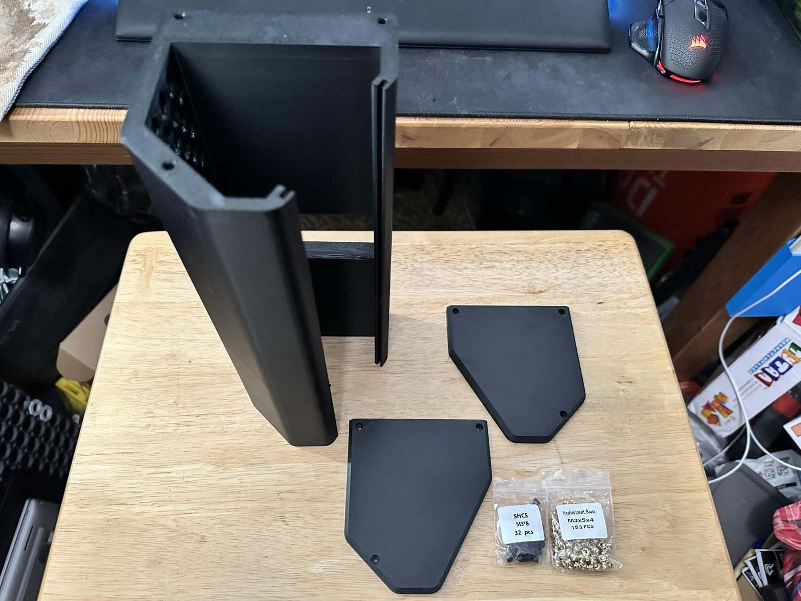

The three printed parts and the hardware, decanted from the much larger packs
the [BOM](hardware.md#bill-of-materials) buys you — six M3 × 8 socket-head cap
screws and six M3 heat-set inserts is the whole fastener count.

The main body is standing on its left end here. The channel running its length
is where the monitor slides in; the honeycomb you can see through the opening is
the vent wall behind the Pi.

You will also want a soldering iron with an insert-setting tip, and a 2.5 mm hex
driver.

## 1. Set the heat-set inserts

Six inserts into the main case body, three at each end.

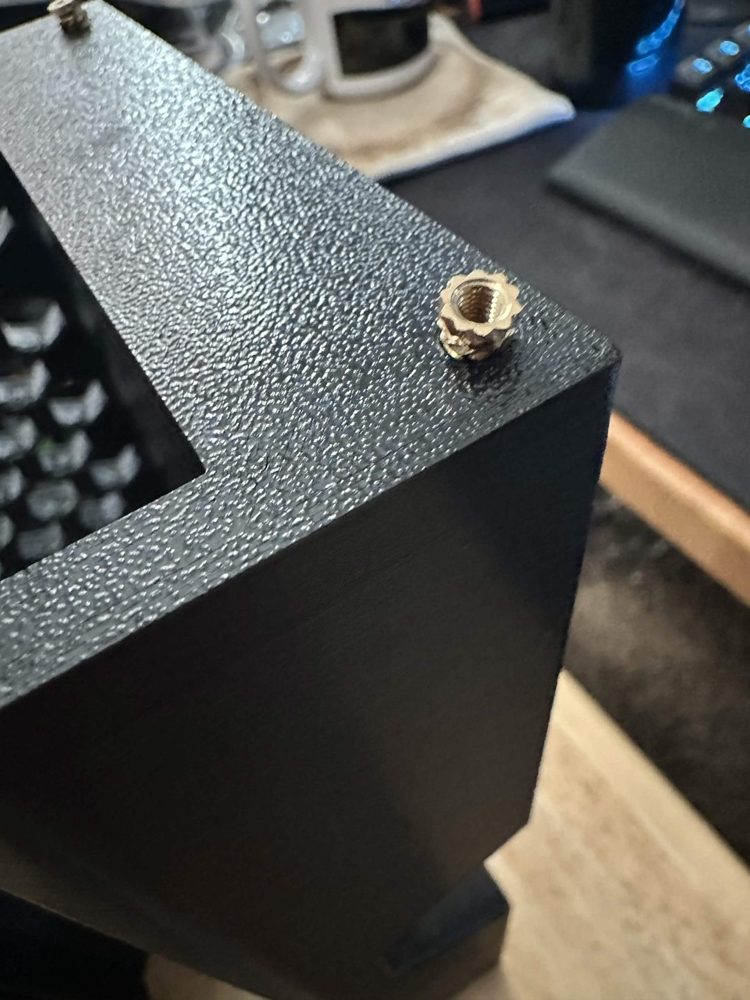

Push each one in square and stop when the shoulder is flush with the surface.
Sunk too deep and the screw bottoms out before it clamps; left proud and the end
cap will not sit flat.

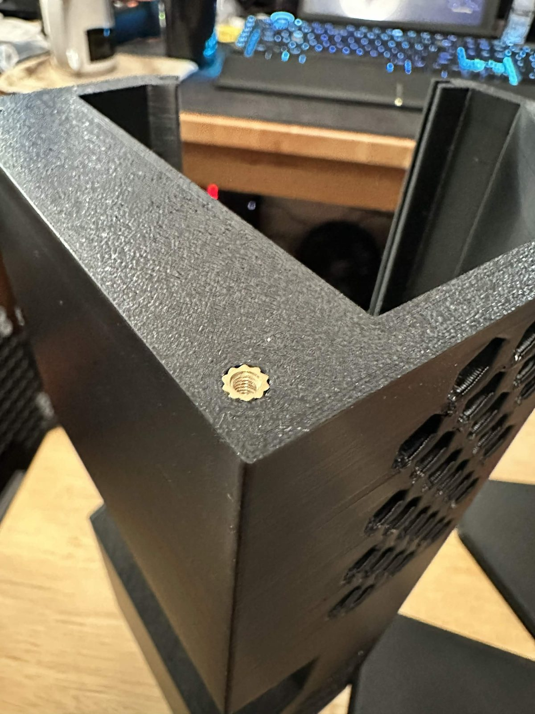

**Then let them cool for about 30 minutes before you put any load on them.** If
you have not done heat-set inserts before, this is the step that goes wrong:
inserts that are still warm will turn in the plastic the first time you tighten
a screw, and once an insert spins it is very hard to recover.

## 2. Image the Pi

Nothing to photograph, but do it now — it is dead time you can spend while the
inserts cool.

Raspberry Pi OS **Lite, 64-bit** — the headless image. kdeskdash draws straight
to DRM and reads touch from evdev; it does not need or want a desktop
environment.

## 3. Mount the Pi to the monitor

The monitor ships with its own mounting instructions for the Pi, and they are
decent. Follow them.

**One thing to know first.** The vendor uses ordinary tape to secure the
monitor's PCB to the panel, and it does not survive the heat of a Pi and monitor
running together in an enclosed case. The Pi 5 unit's PCB came loose; the Pi 4
one has not yet, but I would not count on it.

If you have VHB on hand, it is worth pre-empting: the vendor tape runs along the
long edges of the PCB, top and bottom. *Carefully* free the PCB, then reattach
it with two strips of VHB. Take your time — this is a ribbon-cable-adjacent
operation and there is no upside to rushing it.

If you do not already own suitable tape, it is reasonable to skip this and deal
with it only if the PCB actually lets go.

### A word on the tape

It needs to be genuine **VHB** — 3M's acrylic foam tape, of which 5952 (black,
~1.1 mm) is the common general-purpose grade. This matters more than it sounds
like it should. The failure you are fixing is *heat-driven adhesive creep*, and
the heavy-duty tapes sold for wall mounting are frequently **removable** —
engineered to release cleanly, which is precisely the property you do not want
six inches from a Pi under load. VHB is a permanent structural bond and is rated
for sustained elevated temperature.

The tradeoff is that it means it: assume anything you stick with VHB is not
coming apart again without damage. Dry-fit first.

## 4. Attach the left side

Three M3 × 8 screws into the inserts you set in step 1.

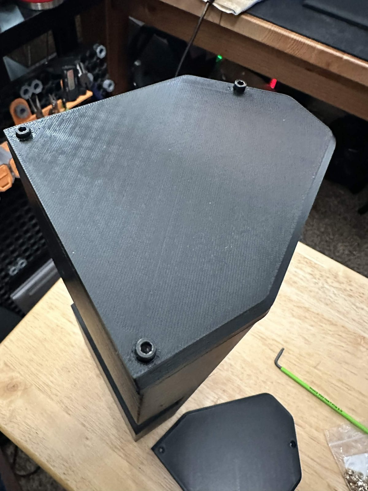

Doing this before the monitor goes in gives you a closed end to work against —
the case now stands up on its own, and everything from here is loaded in through
the end that is still open.

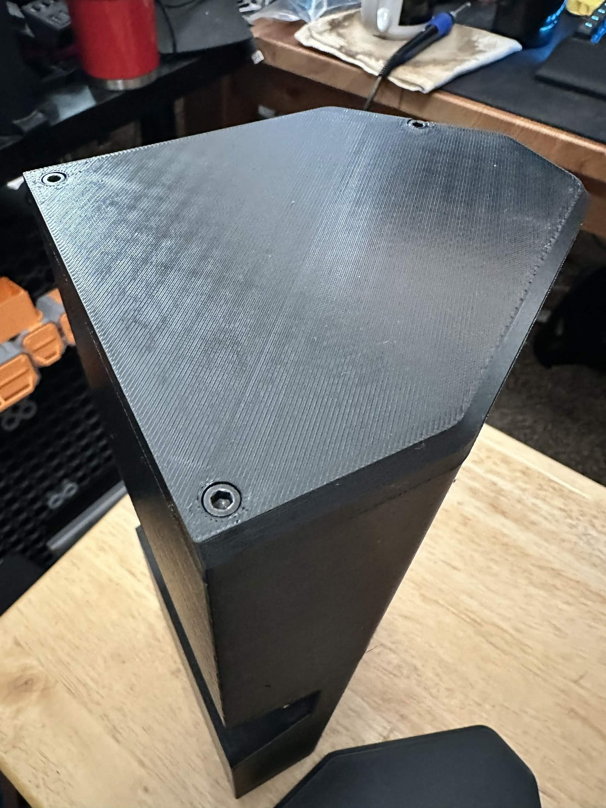

**Do not crank them.** Snug is enough; overtightening strips the inserts you
just set. If you printed in PLA or PETG, both will creep a little under load —
gently retighten after a couple of days, then again after about a week, and they
will settle.

## 5. Fit the right-angle adapter

Insert the 90° adapter into the **monitor's** power USB-C port — not the Pi's.
The adapter is what lets the power lead exit within the case's depth.

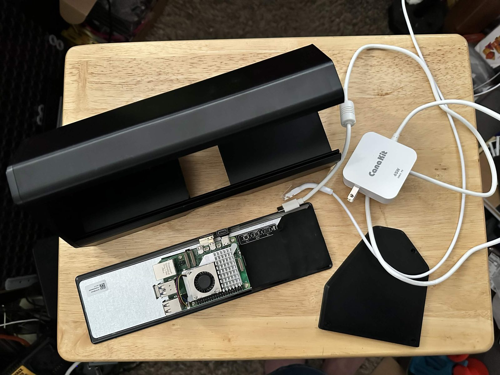

This is everything at the halfway mark: case half-closed, monitor-plus-Pi as a
single sub-assembly, power supply, one cap left to go.

## 6. Route and connect the cables

Thread the power and ethernet cables in through the back of the case and out
through the still-open end. Then connect them with the monitor still on the
bench: power to the monitor via the 90° adapter, ethernet to the Pi.

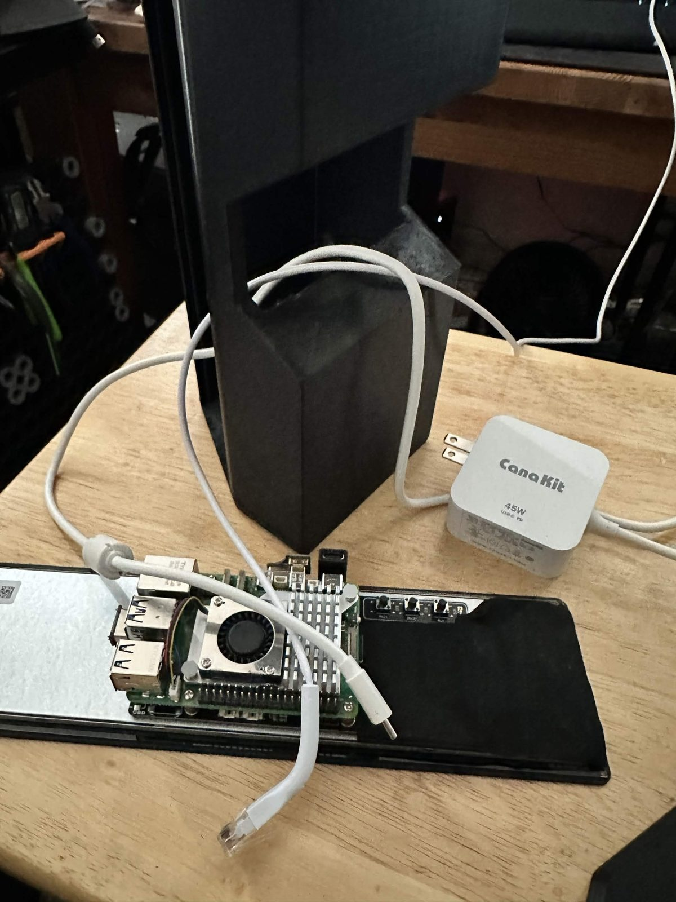

Cables first, connections second. Doing it this way means you are never trying
to find a port by feel inside a closed case, and the cable is already dressed
through its exit before anything is under tension.

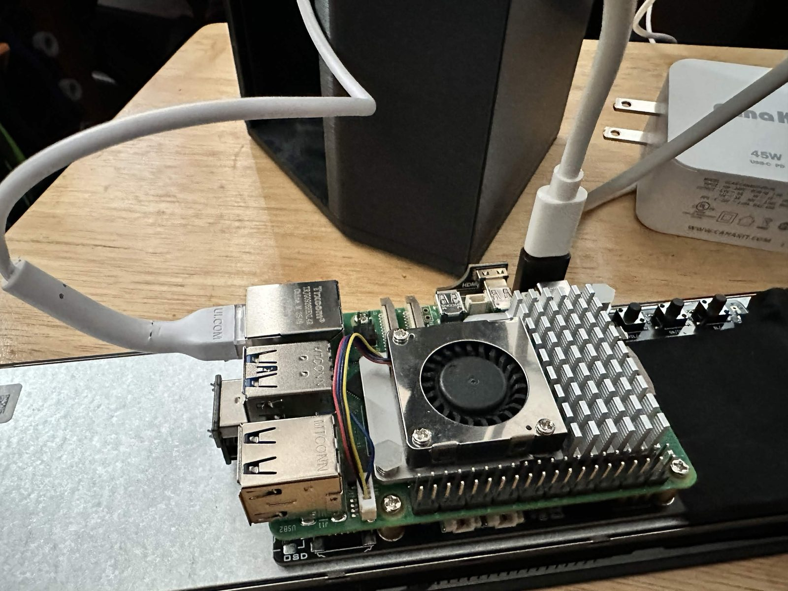

The detail shot is the one worth studying. Both cables leave toward the same
side, and the right-angle adapter turns the power lead flat against the board
instead of standing it off the back — that clearance is why the specific adapter
in the BOM is called out.

## 7. Seat the monitor

Line the monitor up with the grooves in the case. **Orientation matters:** the
power cable should be toward the top, and the ethernet and USB ports should face
you. Slide it gently all the way in, feeding the cable slack ahead of you into
the case.

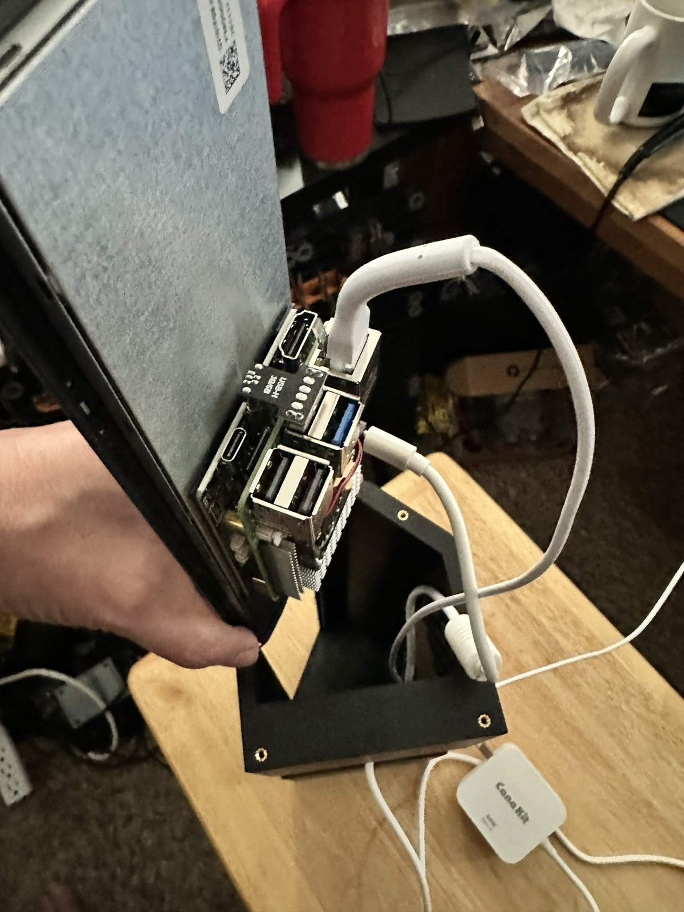

Support the monitor's weight the whole way — do not let it hang on the ribbon
cable while you fish for the groove.

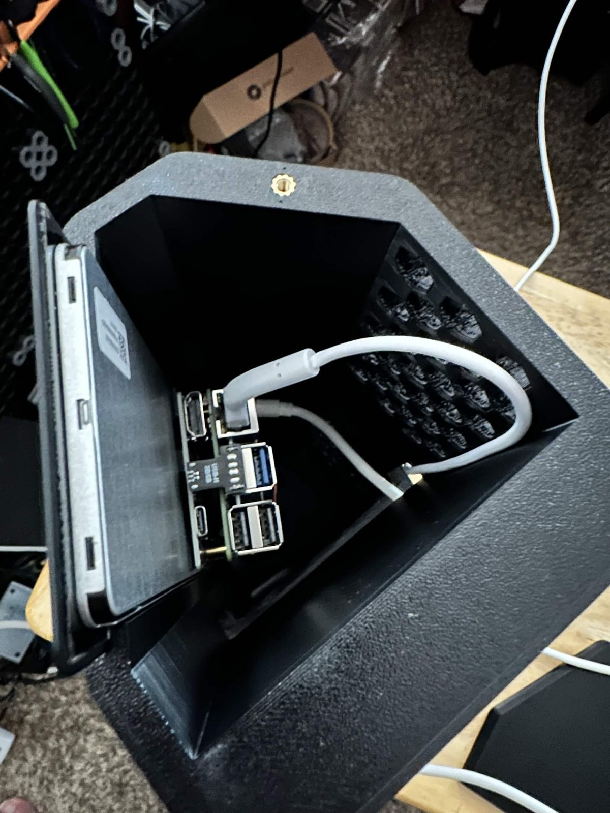

Looking down the open end once it is home. The slack loops into the volume
behind the Pi, clear of the vent wall and clear of the end cap's screw bosses —
check that before you close it, because the cap will happily pinch a cable and
still look seated.

## 8. Close it up

Secure the right side with the remaining three M3 × 8 screws — same restraint on
torque as step 4.

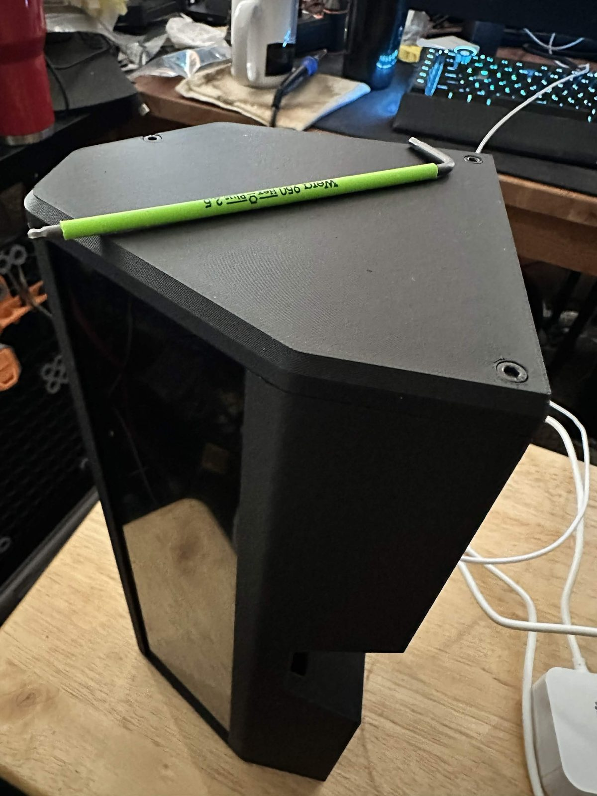

## 9. Done

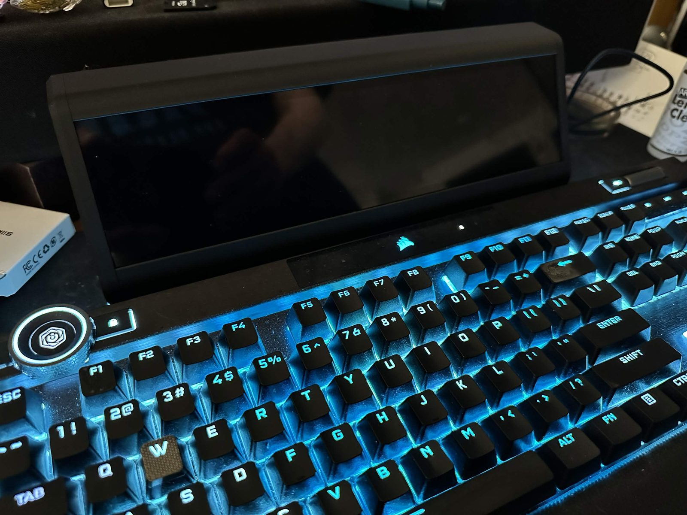

Stand it where it is going to live and plug it in.

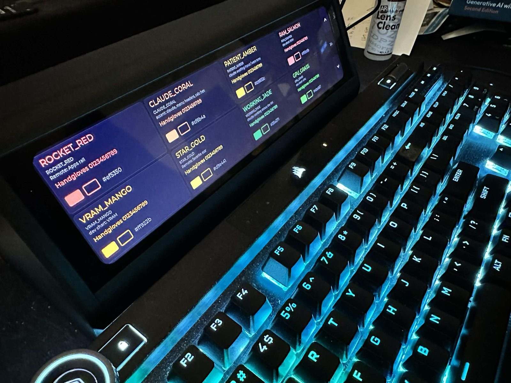

First light, showing the `palette` mode. If you get this far, the display and
the DRM/evdev path are both working and the rest is software.

*Honest transparency: these photos are from the "bad" ABS print — the one whose
shrinkage sent the model back for compensation, described in
[ABS: not yet](hardware.md#abs-not-yet--the-model-needs-work-first). The last
three are the exception: those are everything put back into the PLA case, which
is what is on the desk, because I wanted my dashboard back. That is why the
surface finish changes near the end — same geometry, different print.*

## Next

Deploy kdeskdash to it — see
[Build](../README.md#build-cross-compile-from-a-dev-host) and
[Service](../README.md#service-boot-to-dashboard) in the README.
