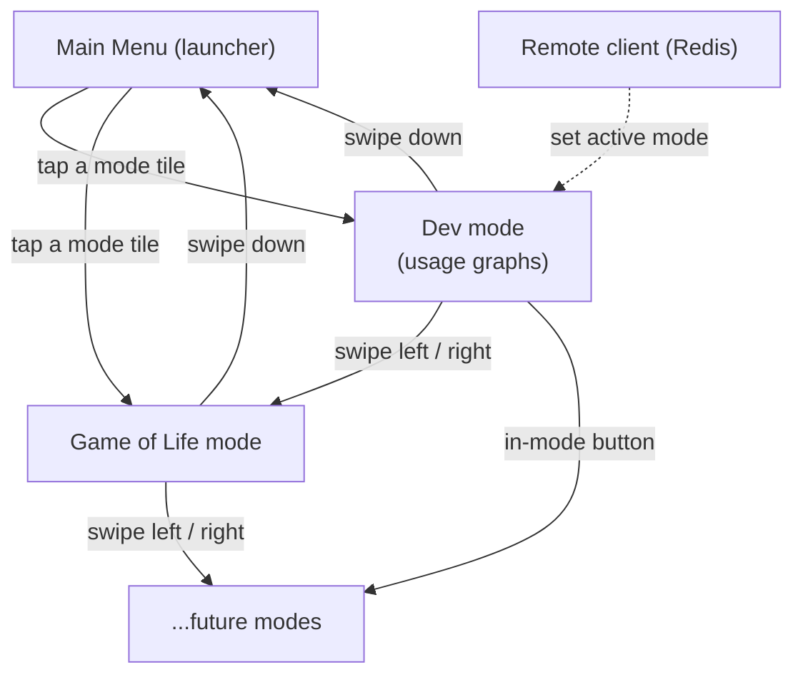

# Multi-Mode Touch Desk Dashboard (kdeskdash) — Vision + Pre-MVP

## Problem Frame

Ken wants an interactive, glanceable dashboard appliance that sits in front of his
keyboard on a wide, short touchscreen (1920x440) driven by a dedicated Raspberry Pi 5
(`rpidash2`). Unlike `kpidash` — a display-only, single-layout KPI board — this device
is **interactive** (capacitive touch) and **multi-mode** (e.g. a dev-stats mode with
usage graphs, a Game of Life mode, a main-menu launcher). Data and control come from
**two directions**: direct touch on the device, and client apps on other hosts feeding
state through a shared store (proven well in `kpidash` via Redis).

The durable capability this should create is a reusable **multi-mode LVGL app shell**:
a thin runtime where new modes can be added cheaply, each owning its own screen and
lifecycle, navigable by touch and overridable remotely. The near-term goal is a
**pre-MVP** that brings up that shell's hardest integration points — DRM display and
evdev touch — by drawing basic shapes/text/an image and responding to touch.

## Navigation Model (vision)

Prose is authoritative: swipe left/right cycles to the previous/next mode, swipe down
returns to the main menu, a mode may expose buttons that jump to a specific mode, and a
remote client may force the active mode via the shared store.

## Requirements

**Pre-MVP (Phase 1 — the actionable near-term scope)**
- R1. The app boots fullscreen on `rpidash2` using LVGL v9.2.2's `lv_linux_drm` display
  driver on DRM `card1` (the vc4 GPU), at the panel's native 1920x440.
- R2. Render basic shapes on screen (at minimum a rectangle, a circle/arc, and a line).
- R3. Render text using a bundled font.
- R4. Render an image asset on screen.
- R5. Initialize touch input via LVGL's `lv_evdev` driver bound to the ILITEK touch
  device at `/dev/input/event1`.
- R6. Detect a touch and respond with clearly visible on-screen feedback (e.g. tapping a
  shape/target changes its appearance and/or displays the tap coordinates).
- R7. Ship as a single binary cross-compiled on a dev host and deployed to `rpidash2`,
  reusing `kpidash`'s aarch64 toolchain + Pi-sysroot workflow.
- R8. The app installs a SIGINT/SIGTERM handler that deinitializes LVGL, releases DRM
  master, and restores the console on exit; for the pre-MVP, exit is triggered via Ctrl-C
  from the attached keyboard.

**Product Vision (multi-mode shell — captured lightly, refined in later brainstorms)**
- R9. An app shell hosts multiple modes; each mode is its own LVGL screen with an
  activate/deactivate lifecycle so background modes do no work (e.g. Game of Life only
  ticks while visible).
- R10. Touch navigation: swipe left/right = previous/next mode; swipe down = main menu;
  modes may expose in-mode buttons that navigate directly to another mode.
- R11. A main-menu mode acts as a launcher (tile/grid of available modes) and is itself
  a mode within the shell.
- R12. A remote client on another host can set the active mode via the shared store.
- R13. Modes receive data from a shared store fed by client apps on other hosts, and from
  touch on the device — both input paths coexist.
- R14. Ship at least two example modes beyond the menu: a dev mode (usage graphs) and a
  Game of Life mode.
- R15. Only the dashboard and its supporting services (shared store + dependencies) run
  on `rpidash2`.

## Success Criteria

- Pre-MVP: the deployed binary runs fullscreen on `rpidash2`, showing the shapes, text,
  and image; touching the target produces an immediate, visible response; the app runs
  without crashing and exits cleanly.
- Pre-MVP de-risks the two hardest integration points (DRM bring-up + evdev touch) so the
  mode shell can be built on a known-good foundation.
- Vision: a new mode can be added with minimal boilerplate; swipe navigation and the
  main-menu launcher work by touch; a remote client can switch the active mode.

## Scope Boundaries

- The 3D-printed case is a separate project — entirely out of scope here.
- Pre-MVP excludes Redis/shared store, the mode framework, client apps, networking, and
  persistence. It is purely local: display + touch + draw + respond.
- This is an opinionated personal appliance (like `kpidash`), not a general-purpose
  dashboard-builder tool.
- Mode authoring conventions, the data schema, and individual mode designs (dev graphs,
  Game of Life rules/rendering) are deferred to later brainstorms/planning.

## Key Decisions

- Reuse the `kpidash` stack as the foundation: LVGL v9.2.2 submodule, `lv_linux_drm` on
  DRM `card1`, the `cmake/aarch64-toolchain.cmake` cross-compile + sysroot workflow, and
  (later) cJSON/hiredis. Rationale: proven on the same OS (Debian 13 Trixie) and hardware
  class; minimizes new risk.
- Touch via LVGL's built-in `lv_evdev` driver on `/dev/input/event1`. Rationale: the
  driver ships in the v9.2.2 tree already used by `kpidash`, and it uses raw
  `linux/input.h` ioctls — no `libevdev`/`libinput` dependency required.
- Shared store for data/control will be Redis (as in `kpidash`), deferred to a
  post-pre-MVP phase. Rationale: the dual host/client Redis model worked well before;
  no compelling reason to change for a single-device LAN setup.
- The pre-MVP is built as a thin vertical slice / app-shell skeleton, not a throwaway
  hello-world. Rationale: same drawing+touch effort, but it establishes the structure the
  mode system grows into and proves display+touch end-to-end. Concretely, the skeleton MAY
  include a single LVGL screen, the entry-point/init sequence (DRM + evdev bring-up,
  teardown), and a clean source-file layout. It must NOT yet include the multi-mode
  registry, the per-mode activate/deactivate lifecycle, or a gesture/navigation router —
  those are deferred so the framework is designed against settled navigation requirements,
  not guessed at.

## Dependencies / Assumptions

Verified on `rpidash2` during this brainstorm:
- OS Debian 13 (Trixie) — matches `kpidash`'s sysroot target (glibc 2.38).
- DRM `card0`/`card1`/`renderD128` present; `card1` = vc4 GPU (as in `kpidash`).
- Touch controller `ILITEK-TOUCH` exposed as evdev `event1` (also `mouse0`).
- 8GB RAM, ~7.5GB free.
- Redis, CMake, and `libdrm-dev`/`libinput`/`libevdev` dev packages are **not** installed
  on the Pi yet.

Assumptions (to confirm during planning):
- Runtime `libdrm.so` is present on `rpidash2` (the vc4 display stack uses it) even though
  the `-dev` package is absent; the absent `-dev` package only affects header availability
  for the sysroot.
- DRM master access on `rpidash2` requires root or `video`-group membership (as in
  `kpidash`, which runs under `sudo`).

## Outstanding Questions

### Resolve Before Planning
- (none — pre-MVP scope, build approach, and success criteria are settled)

### Deferred to Planning
- [Affects R1][Technical] Confirm the vc4 KMS driver enumerates and accepts a native
  1920x440 mode on `card1` for this panel (correct connector, timing, no scaling or
  letterboxing) via `modetest` before relying on the `kpidash` DRM path. The non-standard
  wide-short panel's mode-setting — not the (reused) LVGL code — is the primary R1
  bring-up risk.
- [Affects R7][Technical] The cross-compile sysroot needs DRM headers; decide whether to
  `apt install libdrm-dev` on `rpidash2` before syncing the sysroot, or vendor the headers
  another way. (`lv_evdev` needs only `linux/input.h` from `linux-libc-dev`.)
- [Affects R1][Technical] Confirm runtime `libdrm` presence and the privilege model
  (root vs `video` group) for DRM master on `rpidash2`.
- [Affects R5, R6][Technical] Verify touch coordinate mapping/orientation on the 1920x440
  panel — the ILITEK controller may need axis swap/scaling/calibration for taps to land.
- [Affects R4][Technical] Choose the pre-MVP image format (runtime PNG decode via libpng,
  as `kpidash` links, vs a converted LVGL C-array image).
- [Affects R9, R10][Needs research] Gesture detection approach in LVGL v9 for swipe
  left/right/down at the shell level, and the per-mode activate/deactivate lifecycle API.
- [Affects R14][Needs research] Game of Life rendering approach and performance on
  1920x440 (LVGL canvas vs object grid) — a later mode, not pre-MVP.

## Next Steps
→ `/ce-plan` for structured implementation planning of the pre-MVP (with the vision frame
as context for shaping the skeleton).
