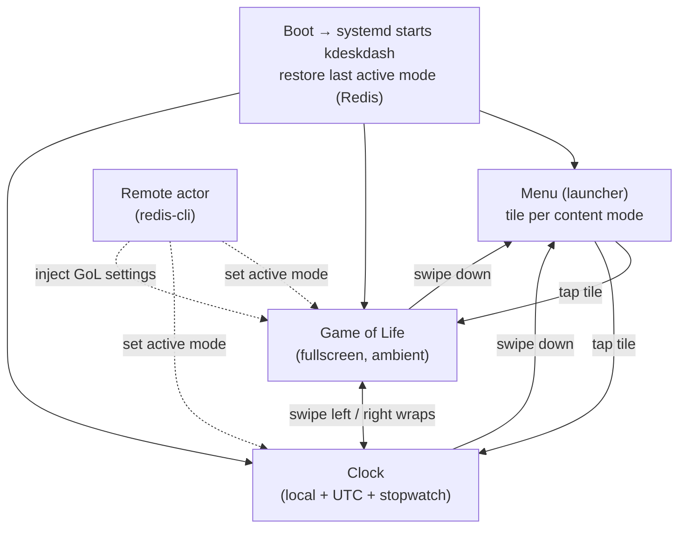

# kdeskdash MVP — Mode Shell, Game of Life + Clock, Redis & Auto-start

## Problem Frame

The pre-MVP proved display + touch on `rpidash2` (committed). The MVP turns that
skeleton into something Ken **gets immediate daily use from**: a desk appliance that
boots on its own, shows a useful Clock, can run an ambient Game of Life, and lets him
swipe between modes and drop to a launcher by touch. It also lands the multi-mode shell
(registry + lifecycle + navigation) and the Redis data/control path so later sprints add
modes and clients without re-churning the core.

This realizes vision requirements R9–R13 from the pre-MVP brainstorm
(see origin: docs/brainstorms/2026-06-06-multimode-dashboard-premvp-requirements.md),
substituting a **Clock** mode for the vision's dev/usage-graph mode (which needs a client
data pipeline that is out of MVP scope).

## Navigation & Control Model

Prose is authoritative: swipe left/right cycles between **content** modes (Game of Life ↔
Clock), wrapping; swipe down from a content mode returns to the Menu; tapping a Menu tile
opens that mode. The Menu is reached only by swipe-down, so left/right stays dedicated to
content modes.

## Requirements

**Mode Shell & Navigation**
- R1. A mode registry holds the available modes (Menu, Game of Life, Clock), tracks the
  active mode, and is structured so a new mode can be added with minimal boilerplate.
- R2. Each mode is its own LVGL screen with an activate/deactivate lifecycle; a
  deactivated mode does no ongoing work (e.g. Game of Life stops ticking when not visible).
- R3. Swipe left/right cycles to the previous/next content mode (Game of Life ↔ Clock),
  wrapping around.
- R4. Swipe down from any content mode returns to the Menu.
- R5. The Menu is a launcher showing one tile/entry per content mode; tapping a tile opens
  that mode.
- R6. On startup the shell restores the mode that was active before the last shutdown
  (persisted in Redis); if none is recorded, it opens a default (Menu).

**Game of Life mode**
- R7. Fullscreen Conway's Game of Life consuming the entire 1920x440 panel.
- R8. Toroidal grid — edges wrap, so an edge cell's neighbors include cells on the opposite
  edge(s).
- R9. On entering the mode the board is (re)initialized: user-supplied settings from Redis
  are applied (then cleared); any unset setting is randomized within its range; generation 0
  is randomly populated to the initial density. Each activation produces a fresh board.
- R10. Configurable settings (fixed green color for the MVP):

  | Setting | Type | Meaning | MVP default / random range |
  |---|---|---|---|
  | Cell size | int | pixels per cell side (e.g. 3 → 3×3 px) | random 1–10 |
  | Padding | int | gap between cells (0 = touching) | random ~0–3, bounded relative to cell size |
  | Initial density | float | fraction of cells alive at gen 0 (e.g. 0.33) | randomized in a sensible range |
  | Trail | bool | dead cells fade out instead of going dark immediately | ~33% chance "no trail" |
  | Trail turns | int | generations over which a trail fades to dark | randomized when trail on |
  | Speed | int (ms) | sleep time between generations | random 0–2000 (tune sweet spot) |
  | Color | — | cell color | fixed green (multi-color deferred) |

- R11. Trail behavior: when enabled, a cell that was alive dims over `trail turns`
  generations before going fully dark, instead of switching off in one step.

**Clock mode**
- R12. Displays local time, large and centered.
- R13. Displays UTC time on the left.
- R14. A wallclock-based stopwatch on the right with start/stop and reset controls, shown to
  0.1-second resolution.
- R15. Stopwatch running state and start time persist across mode switches (elapsed is
  computed from the wall clock, so it stays correct while the mode is hidden); the on-screen
  readout updates only while Clock is the active mode.

**Data & Control (Redis)**
- R16. A remote actor can set the active mode by writing to Redis — switchable on-screen and
  testable with raw `redis-cli`, no client app required for the MVP.
- R17. Game of Life accepts user-supplied settings via Redis, consumed and cleared when a
  board is initialized (R9).
- R18. Redis connection settings (host, port, auth) come from environment variables,
  mirroring `kpidash`; there is no separate on-device config system for the MVP.

**Deployment & Runtime**
- R19. kdeskdash runs as a systemd service that starts on boot and restarts on crash.
- R20. `redis-server` runs on the Pi as a service the dashboard depends on; only the
  dashboard and its supporting services run on `rpidash2`.

## Success Criteria

- Powering on `rpidash2` brings up the dashboard with no manual intervention, landing on the
  last-active mode.
- By touch alone: swipe between Game of Life and Clock, swipe down to the Menu, and tap a
  Menu tile to open a mode.
- Game of Life renders fullscreen, wraps at the edges, animates at the chosen speed, and the
  trail effect works when enabled.
- Clock shows correct local and UTC time; the stopwatch starts, stops, and resets, reads to
  0.1 s, and stays correct after swiping away and back.
- `redis-cli` setting the active-mode key switches the on-screen mode.
- `redis-cli` supplying Game of Life settings changes the next board, and the settings are
  cleared after use.

## Scope Boundaries

- No client apps, telemetry, or dev/usage-graph mode (vision R13/R14 dev mode deferred).
- No on-device settings UI — Game of Life settings come from Redis or randomization; there
  are no on-screen config screens.
- Stopwatch state does not persist across an app/Pi restart (only the active-mode selection
  persists).
- Single fixed green for Game of Life; multiple colors deferred.
- No on-screen mode indicator / swipe hint (deliberately not included).
- No screen blanking, brightness control, or DPMS scheduling.
- The 3D-printed case remains a separate project.

## Key Decisions

- **Redis in the MVP**: completes the core data/control infra, enables remote mode-select
  and Game of Life settings injection, and reuses `kpidash`'s proven hiredis pattern.
  Rationale: modest carrying cost now avoids shell churn later and is immediately testable.
- **systemd auto-start**: makes the dashboard a real appliance that comes up on boot and
  recovers from crashes — the highest-leverage move for the "immediate use" goal.
- **Clock replaces the vision's dev mode for the MVP**: delivers immediate daily utility
  without the client/data pipeline.
- **Wallclock-based stopwatch**: reconciles a useful stopwatch with the "no work while
  hidden" lifecycle (R2) — running state is a start timestamp, not a per-tick counter.
- **Game of Life re-randomizes on each activation**: a fresh board per visit, consistent
  with the activate lifecycle and the "randomly generated" intent.
- **Settings via Redis + randomization, not an on-device UI**: keeps the MVP lean while
  still allowing control.
- **Remember last active mode** (Redis-persisted) is in; a nav indicator/hint is not.

## Dependencies / Assumptions

- Redis is **not yet installed** on `rpidash2` (verified); the MVP installs and enables
  `redis-server` there.
- `kpidash` already uses hiredis (`redisConnectWithTimeout` / `redisCommand` / `AUTH`) and
  ships a systemd service + `systemctl start/stop` deploy — both reusable patterns.
- The pre-MVP shell skeleton (DRM display + evdev touch, committed) is the foundation this
  builds on.
- Assumption (confirm in planning): cross-building with hiredis needs `libhiredis-dev` in the
  Pi sysroot — likely an `apt-get install` on `rpidash2` + sysroot re-sync, mirroring the
  `libdrm-dev` step already done.

## Outstanding Questions

### Resolve Before Planning
- (none — MVP scope, modes, Redis, and auto-start are settled)

### Deferred to Planning
- [Affects R3, R4, R5][Needs research] LVGL v9 gesture detection for swipe left/right/down at
  the shell level, and disambiguating swipes from button/tile taps (Clock controls, Menu
  tiles).
- [Affects R7–R11][Needs research] Game of Life rendering approach and performance on
  1920x440 (LVGL canvas vs object grid), and the max viable cell count at speed; informs the
  cell-size random range.
- [Affects R9, R10][Technical] Exact randomization formulas/ranges (the values in R10 are
  starting points to tune on hardware — e.g. the padding-vs-cell-size relationship and the
  speed sweet spot).
- [Affects R16, R17, R6][Technical] Redis key schema (active-mode key, last-mode persistence,
  Game of Life settings keys) and remote-change delivery (poll vs pub/sub).
- [Affects R19, R20][Technical] systemd unit details (run user / DRM privilege, ordering after
  redis-server), Redis service config (loopback bind, auth), and the hiredis cross-build
  prerequisite.

## Next Steps
→ `/ce-plan` for structured implementation planning of the MVP.
