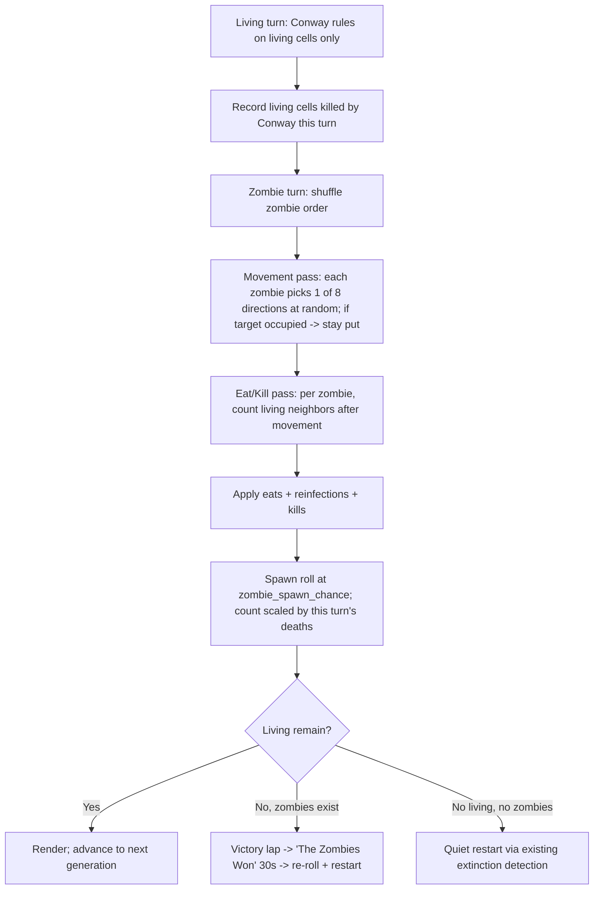

# GoLZ — Game of Life with Zombies

## Problem Frame

The Game of Life screensaver mode recently gained tap controls, an RGB tri-board
variant, and cycle detection, and it's a hit. GoLZ is a *new, additive* content
mode that turns Conway's Game of Life into a two-faction simulation: the
ordinary "living" population plus a roaming **zombie** population that hunts,
spreads, and can wipe out all life. It exists to add a distinct, higher-drama
screensaver that reuses the proven GoL core while standing on its own in the
swipe cycle and menu. The audience is the panel viewer (rpidash2, 1920×440); the
mode must run unattended forever, never freezing on any terminal state.

## One Generation (User Flow)

## Requirements

**Mode & Reuse**
- R1. Add a new content mode **GoLZ** registered alongside Game of Life; it appears in the swipe cycle and the launcher menu.
- R2. GoLZ is single-board only — no RGB tri-board variant.
- R3. Reuse the pure, host-testable GoL core where practical; the zombie layer is built on top of it. (Exact reuse mechanism is a planning decision.)

**Generation Model**
- R4. Each generation is two ordered turns: (1) the **Living turn**, then (2) the **Zombie turn**.
- R5. Living turn: apply standard toroidal Conway rules to the living cells only, and record the set of living cells that died this turn (the spawn pool for R10). Zombies are **not** counted as neighbors in the Conway step, and a Conway birth onto a zombie-occupied cell is suppressed (the zombie keeps the cell).
- R6. The Zombie turn uses a freshly randomized zombie order each generation; the movement pass (R7) completes fully before the eat/kill pass (R8) begins. Movement is applied sequentially (each zombie sees the board as-is). The eat/kill pass counts living neighbors against a **frozen post-movement snapshot** — every zombie is judged against the board as it stood after movement, so earlier eats/reinfections in the same pass do not change later zombies' counts (deterministic and host-testable).

**Zombie Movement**
- R7. Each zombie picks one of the 8 directions at random. If the chosen target cell is occupied by a living cell **or** another zombie, the zombie forfeits its move and stays put this generation (single attempt, no retry).

**Eat / Kill Resolution** (after movement, per zombie, based on living-neighbor count)

| Living neighbors | Outcome for the zombie |
|---|---|
| 0 | Nothing |
| 1–2 | Eats one randomly chosen living neighbor (reinfection may apply) |
| 3 | Standoff — nothing |
| 4–5 | The living kill the zombie (removed) |
| 6–8 | Nothing — surrounded but survives ("the mob can't coordinate") |

- R8. Resolve each zombie's fate using its 8-neighborhood living count (against the post-movement snapshot, R6) per the table above.
- R9. When a zombie eats a living cell, a **zombie_reinfect** chance (default 10%) turns the eaten cell into a *new zombie* instead of removing it; otherwise the eaten cell dies.

**Spawning & Reinfection**
- R10. After the eat/kill pass, with probability **zombie_spawn_chance** (default 20%) a batch of zombies spawns, sized from this generation's death count (placement per R11). The death count = Conway (living-turn) deaths **plus** living cells eaten-and-killed by zombies this generation (reinfected cells become zombies, not deaths, and are excluded). Count = `ceil( random(1%..30%) × deaths )`; when the roll succeeds and at least one cell died, at least one zombie spawns. If **zero** cells died this generation, nothing spawns regardless of the roll.
- R11. Spawned zombies are placed on randomly chosen empty cells (no living, no zombie). If there are fewer empty cells than the spawn count, place as many as fit and drop the remainder.
- R12. Reinfected (R9) and spawned (R10) zombies first act on the **following** generation, not the one in which they appear.

**Round End & Victory**
- R13. A **zombie win** triggers when no living cells remain and at least one zombie exists. This check is evaluated **before** any cycle/extinction restart each generation, so a win is never preempted by the stalemate safety net.
- R14. On a zombie win, surviving zombies take a **victory lap**: normal rules suspend and zombies move **strictly downward** (one row per step, guaranteed to drain within a bounded number of steps so the lap always terminates), dying at the bottom edge. Once all have died **and their trails have faded to black**, display a full-screen **"The Zombies Won — N total"** banner (running win count from R17), horizontally and vertically centered, sized to the panel's short axis with a high-contrast scrim over the frozen board; hold 30 seconds, then auto-restart with freshly re-rolled settings.
- R15. If zombies are eliminated while living remain, the round continues as ordinary Game of Life; the existing cycle/extinction detection (30s grace → auto-restart) ends the round. No celebration, no counter change.
- R16. Stalemates (stable oscillation) and simultaneous total extinction are handled by the existing cycle/extinction detection → auto-restart (a quiet restart, no win). The stalemate detector keys off **living cells only**, so a stable living population restarts even while surviving zombies wander.
- R23. **Restart backstop:** an unconditional per-round cap (a maximum generation count and/or wall-clock duration) forces a quiet re-roll regardless of board state, guaranteeing "never freezes" even under an unforeseen equilibrium. The cap value is a tuning detail.

**Persistence & Menu**
- R17. A persistent **zombie-win counter** is stored in Redis (`kdeskdash:golz:wins`) via an atomic `INCR`, incremented exactly once at win detection (R13). A missing or unparseable value reads as 0 and the count is never displayed negative. Without Redis the counter is in-memory only and resets on restart.
- R18. The current zombie-win count renders **inside the GoLZ mode surface** (a small corner readout, plus the celebration banner per R14) — the shared menu is left untouched, preserving the purely-additive boundary. Renders "Zombie wins: 0" at zero and when Redis is absent.

**Visual & Controls**
- R19. Living cells render **green** and zombies render **red**; both leave a fading trail in their **own** color when a cell empties. The current occupant's color always overrides any existing trail: a zombie moving onto a green (living or living-trail) cell turns it red, then it fades as a normal trail; a living cell appearing on a red (zombie or zombie-trail) cell turns it green, then fades normally. Hue is the sole faction differentiator (see Key Decisions).
- R20. Reuse the GoL tap control menu (Reset / Restart / Cancel) in GoLZ.

**Configuration / Tuning**
- R21. `zombie_reinfect` (default 10%), `zombie_spawn_chance` (default 20%), and the initial zombie count (randomized 0–5) are tunable via the existing Redis settings-injection mechanism, for live on-device tuning.
- R22. Per-round settings are randomized within sensible ranges at activation (mirroring GoL's `random_settings`), to be tuned on device.

## Success Criteria

- A GoLZ round is distinguishable from GoL at a glance (red zombies vs. green living) and **never freezes** — every terminal state leads to an automatic restart.
- The full rule set produces self-sustaining outbreak/survival dynamics on the panel with no manual intervention.
- Zombie wins accumulate on the menu tile across restarts (with Redis), and the "The Zombies Won" celebration → 30s hold → re-roll runs end to end.
- The new zombie parameters can be tuned live via Redis without rebuilding.
- The zombie rules are host-testable like the GoL core, with deterministic coverage for movement-blocking, the eat/kill thresholds, reinfection, and spawn counts.
- Over a representative unattended run on rpidash2, outbreak/survival swings are visibly watchable, zombie wins occur from time to time (frequency tuned on device by feel, no fixed target), and zero freezes occur.

## Scope Boundaries

- No RGB tri-board variant in GoLZ.
- No "living survive" celebration or counter — zombie wins are the only celebrated/counted outcome.
- No new on-disk persistence mechanism; the counter uses Redis only.
- GoL itself is unchanged — GoLZ is purely additive.
- No interactivity beyond the reused tap control menu.

## Key Decisions

- **Initial zombies randomized 0–5**: occasionally a round starts zombie-free and the outbreak emerges purely from die-offs, adding variety.
- **Sequential, reshuffled resolution**: each generation reshuffles zombie order; movement and eat/kill each run as a sequential pass. Avoids collision math; per-generation reshuffling washes out order bias.
- **Occupied = blocked**: a zombie targeting any occupied cell (living or zombie) simply stays put — this also resolves zombie–zombie collisions with no extra rules.
- **Zombie win only**: keeps the end-state animation and persistence scope tight; non-zombie endings fall through to existing GoL cycle/extinction detection.
- **Literal eat/kill window (4–5 kills, 6–8 survives)**: intentionally quirky — a zombie swarmed by a large crowd survives because the mob "can't coordinate."
- **Redis-backed counter**: reuses the established persistence pattern rather than introducing on-disk state.
- **Palette green/red**: maximum panel contrast, minimal change to the current GoL look.
- **Eat/kill snapshot**: the eat/kill pass judges every zombie against a frozen post-movement board, keeping outcomes deterministic and host-testable (movement still applies sequentially).
- **Spawn pool includes the eaten**: spawn count scales with Conway deaths plus zombies' kills (excluding reinfected), creating an eating→spawning feedback that fuels outbreaks.
- **Hue-only factions, by choice**: green vs. red is the sole differentiator; both factions leave their own colored trails and the live occupant overrides. The red/green colorblind tradeoff is consciously accepted for this personal panel.
- **Emergent win cadence**: no target win frequency — the owner tunes the parameters on device until wins feel right.
- **Counter renders in-mode**: the win count lives in the GoLZ surface and celebration banner, not the launcher tile, keeping the menu untouched and GoLZ purely additive.

## Dependencies / Assumptions

- Redis is available on the device for counter persistence and live parameter tuning (already used for active mode + GoL settings).
- The GoL core can be extended or wrapped to represent a third cell state (zombie); the precise data-structure approach is deferred to planning.
- Reinfected/spawned zombies acting "next generation" is the intended timing (R12).
- During normal movement the board's toroidal wrap still applies; it is suspended vertically only during the victory lap.

## Outstanding Questions

### Resolve Before Planning
- (all resolved during brainstorm — see Key Decisions)

### Deferred to Planning
- [Affects R3][Technical] Code-reuse strategy: extend the existing `gol_t` core to carry a per-cell zombie state vs. a separate GoLZ core that shares helpers.
- [Affects R3/R12][Technical] The cell representation must distinguish zombies created **this** generation (reinfect/spawn) from existing ones so R12's "act next generation" holds (e.g. a per-zombie new flag or a separate pending set) — a plain 3-state enum cannot encode this.
- [Affects R10/R11/R21][Technical] A single **bounded** empty-cell placement routine (collect empties, sample without replacement) shared by initial seeding and spawn placement, to avoid unbounded retry scans on dense ~211k-cell boards.
- [Affects Success][Technical] A seedable/injectable RNG seam for the zombie layer (mirroring the GoL core's `rng_state`) so movement, eat targets, reinfection, and spawn counts are host-testable deterministically.
- [Affects R4/R19][Technical] Render one composed frame per generation (final post-zombie-turn state) vs. showing the living and zombie sub-turns as two visible frames — and what `speed_ms` means across a two-turn generation.
- [Affects R14][Technical] Victory-lap cadence/animation timing (pace it slower than normal so the downward march reads as deliberate), how the dead zombies' trails are drained to fully black before the banner shows, and exactly how toroidal wrap is suspended during the descent.
- [Affects R14/R20][Technical] Tap-control behavior during the victory lap and 30s banner (ignore, skip the hold, or open the menu over the banner).
- [Affects R21][Decision] A round that rolls 0 initial zombies looks identical to plain GoL until an outbreak emerges — consider a small persistent GoLZ identity marker so the mode reads as GoLZ at a glance.
- [Affects R21/R22][Needs research] Exact randomization ranges and Redis field names for the new parameters; tune on device.

## Next Steps

→ `/ce-plan` for structured implementation planning
