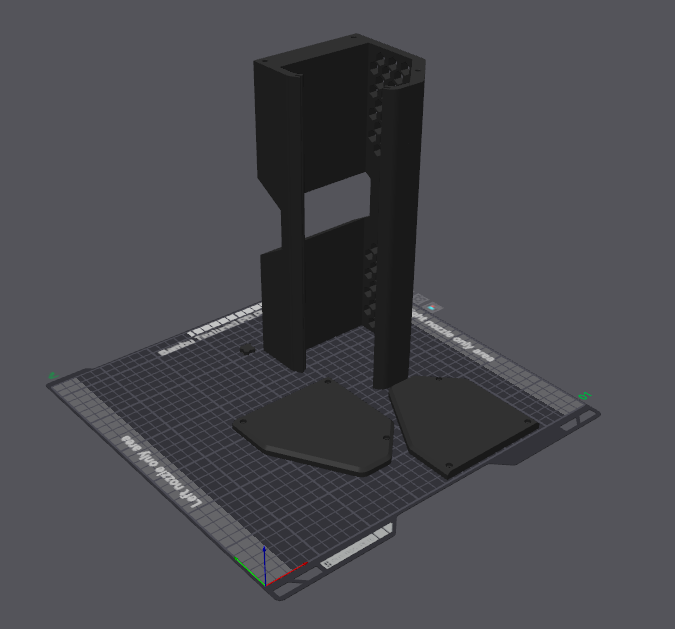

# Building the hardware

Everything you need to build a kdeskdash panel: what to buy, what to print, and
how it goes together. The result is a self-contained desk unit — a 1920×440
touch panel and a Raspberry Pi in one printed case, with a single power lead and
an ethernet cable out the back.

This is the *build* side. Once it is assembled and imaged, the
[README](../README.md) covers the software: cross-compiling, deploying, and the
boot-to-dashboard service.

> **Photos are coming.** This guide is text-only for now. A full set of assembly
> photos will land when the case is reprinted in ABS.

## Bill of materials

Links are Amazon US and were verified working when this was written; they are
not affiliate links. Several items come in packs larger than you need, which is
called out below so you know what you are actually buying.

| Item | Qty | Notes |
|---|---|---|
| [GeeekPi 11.26" 1920×440 HDMI capacitive touch screen](https://www.amazon.com/dp/B0F6NPCX1V) | 1 | The panel the case is designed around. ILITEK touch controller. |
| Raspberry Pi 5 or Pi 4 Model B | 1 | See [below](#which-pi). No direct link — listings churn too fast to keep one current. |
| [CanaKit 45W USB-C PD power supply](https://www.amazon.com/dp/B07H125ZRL) | 1 | Recommended for the Pi 5. A Pi 4 can use something smaller, but this works for both. |
| [Silkland USB-C 90° right-angle adapter](https://www.amazon.com/dp/B0CNGFZ1JD) | 1 | **Sold as a 2-pack.** This specific adapter is known to clear the case — others may not fit. |
| [M3 × 8 mm socket-head cap screws](https://www.amazon.com/dp/B07CMQ1SQH) | 6 | Sold 100 to a bag, so you will have plenty of spares. |
| [M3 heat-set inserts, 4 mm](https://www.amazon.com/dp/B0FD88XTV4) | 6 | Sold as a 300-piece kit spanning M3 3–10 mm, and it includes the soldering-iron tip you need to set them. |
| [3M VHB 5952 acrylic foam tape, 3/4" × 15 yd](https://www.amazon.com/dp/B0016HM7SE) | optional | Only if you hit the tape problem in [step 3](#3-mount-the-pi-to-the-monitor). It has to be real VHB — see [the note below](#a-word-on-the-tape). Sold in a 15-yard industrial roll, which is vastly more than this job needs, so it is not worth buying solely for this unless you have another use for it. |

You will also need a soldering iron (to set the inserts) and a hex driver for
the M3 screws.

### Which Pi

Either works, and the binary is generic aarch64 — board choice does not fork the
build. The two panels in service are a Pi 5 (8GB) and a Pi 4 Model B Rev 1.5
(8GB). On the Pi 4's A72 cores the Game of Life composite render is the only
mode that works noticeably harder; everything else is indistinguishable. Search
links, since product listings move around:
[Raspberry Pi 5](https://www.amazon.com/s?k=raspberry+pi+5) ·
[Raspberry Pi 4 Model B](https://www.amazon.com/s?k=raspberry+pi+4+model+b).

## Printing the case

Three STLs in [`stl/`](../stl/):

| File | What it is |
|---|---|
| [`deskdash_case.stl`](../stl/deskdash_case.stl) | The main case body |
| [`lside_deskdash_case.stl`](../stl/lside_deskdash_case.stl) | Left end cap |
| [`rside_deskdash_case.stl`](../stl/rside_deskdash_case.stl) | Right end cap |

**The main body is ~277 mm long, so it needs a large-format printer.** Print it
standing on its right end; no supports are needed in that orientation. All three
parts fit on one plate:

> **Smaller printer?** [Open an issue](https://github.com/kenhia/kdeskdash/issues/new)
> and I will add STLs that split the main body into three superglue-together
> parts. The parts already exist — they just need indexing features added so
> they align properly, which is not worth doing speculatively.

### Settings

The case in service was printed in **matte black PLA** on stock settings — 15%
infill, nothing special — in about 9.5 hours, and it has held up fine. But there
is real heat in this enclosure, with a Pi and a monitor running inside it, so the
Pi 5 case is being reprinted in **ABS**.

Current ABS print, on a **Bambu H2D** with **Bambu ABS Black**, starting from the
`0.20mm Standard @BBL H2D` profile:

| Setting | Value | Why |
|---|---|---|
| Wall loops | `4` | More solid plastic around the heat-set inserts |
| Bottom layers | `5` | Same |
| Enable clumping detection by probing | checked | Bambu recommended, wish they would just make this the default |

Estimated print time: **12 h 9 m**.

Note what did *not* change: infill stays at the profile default. It is tempting
to reach for 40% gyroid when moving to ABS, but the PLA case was already strong
enough in bulk, and ABS at the same parameters will be stronger still. The two
settings that were raised are both about **material around the heat-set
inserts** — that is where this part actually sees load, since six threaded
inserts carry the end caps and the whole assembly hangs off them. Adding walls
and bottom layers puts plastic exactly there; adding infill would mostly add
hours for nothing — just changing to 40% infill with gyroid would add over 12
more hours to the print!

## Assembly

### 1. Set the heat-set inserts

Six inserts into the main case body, three at each end.

**Then let them cool for about 30 minutes before you put any load on them.** If
you have not done heat-set inserts before, this is the step that goes wrong:
inserts that are still warm will turn in the plastic the first time you tighten
a screw, and once an insert spins it is very hard to recover.

### 2. Image the Pi

Raspberry Pi OS **Lite, 64-bit** — the headless image. kdeskdash draws straight
to DRM and reads touch from evdev; it does not need or want a desktop
environment.

### 3. Mount the Pi to the monitor

The monitor ships with its own mounting instructions for the Pi, and they are
decent. Follow them.

**One thing to know first.** The vendor uses ordinary tape to secure the
monitor's PCB to the panel, and it does not survive the heat of a Pi and monitor
running together in an enclosed case. The Pi 5 unit's PCB came loose; the Pi 4
one has not yet, but I would not count on it.

If you have VHB on hand, it is worth pre-empting: the vendor tape runs along the
long edges of the PCB, top and bottom. *Carefully* free the PCB, then reattach
it with two strips of VHB. Take your time — this is a ribbon-cable-adjacent
operation and there is no upside to rushing it.

If you do not already own suitable tape, it is reasonable to skip this and deal
with it only if the PCB actually lets go.

#### A word on the tape

It needs to be genuine **VHB** — 3M's acrylic foam tape, of which 5952 (black,
~1.1 mm) is the common general-purpose grade. This matters more than it sounds
like it should. The failure you are fixing is *heat-driven adhesive creep*, and
the heavy-duty tapes sold for wall mounting are frequently **removable** —
engineered to release cleanly, which is precisely the property you do not want
six inches from a Pi under load. VHB is a permanent structural bond and is rated
for sustained elevated temperature.

The tradeoff is that it means it: assume anything you stick with VHB is not
coming apart again without damage. Dry-fit first.

### 4. Fit the right-angle adapter

Insert the 90° adapter into the **monitor's** power USB-C port — not the Pi's.
The adapter is what lets the power lead exit within the case's depth.

### 5. Attach the left side

Three M3 × 8 screws.

**Do not crank them.** Snug is enough; overtightening strips the inserts you
just set. If you printed in PLA or PETG, both will creep a little under load —
gently retighten after a couple of days, then again after about a week, and they
will settle.

### 6. Route the cables

Thread the power and ethernet cables in through the back of the case and out
through the still-open right side.

### 7. Connect them

Power to the monitor via the 90° adapter; ethernet to the Pi.

### 8. Seat the monitor

Line the monitor up with the grooves in the case. **Orientation matters:** the
power cable should be toward the top, and the ethernet and USB ports should face
you. Slide it gently all the way in.

### 9. Close it up

Secure the right side with the remaining three M3 × 8 screws — same restraint on
torque as step 5.

## Networking

Both panels in service use **ethernet**, chosen for reliability rather than
because WiFi was tried and found wanting. A dashboard is only useful if it is
always current, and a panel showing stale data is worse than one showing none.

WiFi should work. kdeskdash polls Redis about once a second per enabled feed,
each feed is independently failure-isolated, and a dropped connection backs off
and retries without stalling the main loop. A brief outage should surface as
data that goes stale and then heals.

It is untested over the long haul, though. If you run a panel on WiFi, reports
are wanted in
[issue #25](https://github.com/kenhia/kdeskdash/issues/25) — especially whether
it survives idle overnight and recovers after an AP reboot.

## Next

Plug it in and deploy kdeskdash to it — see
[Build](../README.md#build-cross-compile-from-a-dev-host) and
[Service](../README.md#service-boot-to-dashboard) in the README.
