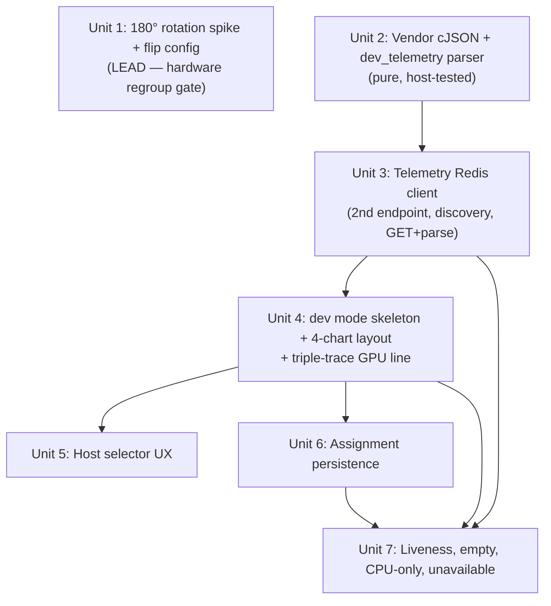

# feat: Dev mode — dual-host dev metrics panel

## Overview

Add `dev`, a content mode that shows CPU/RAM and GPU/VRAM load for two chosen
hosts side by side, picked from the live fleet already publishing telemetry to
kpidash's Redis on `rpi53`. `dev` is mostly an LVGL view plus a center host
selector over data that already flows — it does not define a new telemetry
contract.

Two cross-cutting changes ride along:
- **Dual-Redis:** kdeskdash already has a local control/persistence Redis client
  (`src/redis.c`); `dev` adds a *second* connection to the remote telemetry
  Redis on `rpi53`. JSON parsing (dropped after the MVP) returns.
- **Global 180° display flip:** the screen mounts upside-down in the 3D-printed
  case. This is validated **first**, by a hardware spike, so we can regroup
  early if the `lv_linux_drm` driver resists rotation (see origin: R19).

## Problem Frame

The MVP substituted a Clock for the dev/usage-graph vision because the client
data pipeline wasn't ready (see origin:
docs/brainstorms/2026-06-06-multimode-dashboard-premvp-requirements.md). That
pipeline now exists. `dev` is the workhorse mode the appliance was built for:
an at-a-glance view of two development machines' load from across the desk.
Enabling it makes Redis effectively required for the mode's value, though the
binary still degrades gracefully when telemetry is unreachable.

## Requirements Trace

Carried from the origin requirements doc (R1–R19):

- R1. Read host metrics from kpidash's remote Redis (`rpi53`), separate from the local control Redis.
- R2. Discover selectable hosts live from the fleet; appear/disappear with publishing.
- R3. Consume kpidash's existing `dev_telemetry` JSON as-is; define no new contract.
- R4. Enabling `dev` makes Redis a hard dependency for the mode; unreachable telemetry shows a clear unavailable state without crashing or hanging; other modes stay usable.
- R5. Two separate graphs per host (CPU/RAM and GPU/VRAM), not a combined chart.
- R6. Rolling time-series line charts (fixed window, shift-to-scroll), plain readable lines acceptable.
- R7. GPU compute series rendered as a thick line via kpidash's triple-trace offset technique.
- R8. VRAM filled-area under its line is a stretch goal; ships as a normal line if non-trivial.
- R9. Center selector lists live clients with prev/next controls and scrolling.
- R10. Tap host name to select; tap left/right control to assign that side.
- R11. Selector indicates each host's current L/R assignment.
- R12. Assigning a host to a side replaces that side; same host may sit on both sides.
- R13. Mirrored layout: GPU/VRAM toward center, CPU/RAM outer (see High-Level Technical Design).
- R14. CPU-only host (gpu null) shows a normal-size CPU/RAM graph centered in the two-graph footprint.
- R15. Left/right assignments persist via local control Redis and restore on boot.
- R16. Stale host shows "no new data" overlay, freezes history, auto-recovers.
- R17. Empty side shows a placeholder prompt.
- R18. A persisted host that vanished from the fleet stays visible as offline.
- R19. Global 180° display flip, env-toggleable, rotates render + touch together; validated by an early spike.

## Scope Boundaries

- Consumer only — no change to kpidash's schema or client publishing.
- No combined CPU/RAM + GPU/VRAM chart; separate graphs is a requirement.
- No per-host history persistence — graphs are live/rolling; only the host→side assignment persists.
- VRAM area-fill (R8) is out of committed scope this sprint (stretch only).
- Exactly two host slots (left + right); no third slot.
- The 180° flip is implemented and verified; touch-axis fallback work beyond the spike is deferred if the spike shows software rotation suffices.

## Context & Research

### Relevant Code and Patterns

**kdeskdash (this repo):**
- [src/redis.c](src/redis.c) — single static `redisContext *g_ctx`, `do_connect` (250 ms connect timeout, 50 ms read timeout, `REDISCLI_AUTH`→`AUTH`), `reconnect_if_needed` (5 s backoff via `g_next_attempt`), all failures swallowed. This is the connection/backoff pattern the second (telemetry) client must reuse. Currently hardwired to one endpoint via module statics — needs generalization (Unit 3).
- [src/config.c](src/config.c) / [src/config.h](src/config.h) — `env_or()` pattern; existing `KDESKDASH_REDIS_HOST/PORT` + `REDISCLI_AUTH`. New env vars follow this exactly.
- [src/main.c](src/main.c) — `lv_linux_drm_create()` + `lv_linux_drm_set_file()`, then `lv_evdev_create()`. Rotation hook goes right after display creation (Unit 1). `redis_init` + `shell_set_change_cb(redis_set_active_mode)` + 1 s throttled `redis_poll()` loop is the persistence/poll pattern.
- [src/mode.h](src/mode.h) — `struct kd_mode { id, title, screen, activate/deactivate/tick, state }`; `id` doubles as the Redis active-mode value (`"dev"`).
- [src/modes/clock.c](src/modes/clock.c) — reference mode: lazy `build_screen`, `lv_obj_create(NULL)` screen, `MM_TO_PX` panel calibration (7.69 px/mm), `LV_OBJ_FLAG_GESTURE_BUBBLE` on buttons so swipes still navigate, button helper. Mirror this for the selector buttons.
- [src/modes/game_of_life.c](src/modes/game_of_life.c) — reference for a tick-driven mode and randomized state on activate.
- [src/shell.h](src/shell.h) — `shell_register_content_mode`, `shell_set_change_cb` (persistence hook), `shell_content_count/at`.
- [CMakeLists.txt](CMakeLists.txt) — `add_executable` source list, `hiredis::hiredis` target, host-only `ctest` targets guarded by `if(NOT CMAKE_CROSSCOMPILING)`. New source + vendored cJSON + a host test target slot in here.

**kpidash (sibling reference, `/home/ken/src/tools/kpidash`, repo-relative paths below):**
- `src/widgets/dev_graph.c` — the canonical chart implementation to adapt: `lv_chart` LINE, `POINT_COUNT 300` (5 min @ 1 s), `LV_CHART_UPDATE_MODE_SHIFT`, `line_width 2` on `LV_PART_ITEMS`, indicator size 0 (no point dots), two Y-axes (primary 0–100 %, secondary 0–`mb_max`), dynamic secondary range. **Triple-trace thick line:** add `_lo` and `_hi` flanking series of the *same color* **before** the main series so the main renders on top; push `value ± offset` clamped to axis bounds. `GPU_PCT_OFFSET 1` (% point); VRAM offset = `vram_max / 240` (min 1). Stale overlay = a centered hidden `NO NEW DATA` label toggled by visibility.
- `src/protocol.h` — `KPIDASH_KEY_DEV_TELEMETRY "kpidash:client:%s:dev_telemetry"`, `KPIDASH_KEY_CLIENTS "kpidash:clients"`.
- `specs/006-layout-refresh-status-cards/contracts/redis-dev-telemetry-host.md` — authoritative `dev_telemetry` contract: STRING JSON, **TTL 5 s**, published ~1 s. Discovery via `SCAN MATCH kpidash:client:*:dev_telemetry`. Fields below.

**`dev_telemetry` JSON shape (R3 — consumed as-is):**
```json
{
  "host": "kai", "ts": 1748000000.123,
  "cpu_pct": 14.2, "top_core_pct": 88.5,
  "ram_used_mb": 9216, "ram_total_mb": 32768,
  "gpu": { "compute_pct": 42.0, "vram_used_mb": 7340, "vram_total_mb": 24576 }
}
```
`gpu` may be `null` or omitted (CPU-only host → R14). `host` is present from
kpidash sprint 006 onward; pre-006 publishers omit it (route under the key's
hostname). `ts` is the publisher wall-clock.

### Institutional Learnings

`docs/solutions/` is empty — no prior documented solutions. Repo memory notes
carried forward: `mode_t` collides with POSIX (`kd_mode_t` is the project
spelling); panel is 1920×440 (180° rotation does **not** swap w/h, so layout
math is unaffected); fish-shell build quirks; deploy requires stopping the
running binary first.

### External References

None gathered — the only reference patterns (kpidash chart/telemetry, LVGL
rotation API) are local (sibling repo + vendored `lib/lvgl`). The one true
unknown — whether `lv_linux_drm` honors `lv_display_set_rotation` — is an
execution-time hardware question resolved by the Unit 1 spike, not by docs.

## Key Technical Decisions

- **Lead with the rotation spike (Unit 1).** Per origin R19 and the user's
  direction, prove the 180° flip on hardware before building the mode, so a
  driver fight triggers an early regroup instead of a late surprise. Rotation is
  independent of the rest of the work, so leading with it costs no sequencing.
- **JSON: vendor cJSON rather than hand-roll.** kpidash uses cJSON; it is a
  single `.c/.h` pair that can be vendored directly into the repo (compiled into
  the binary — no system package, no sysroot sync), and JSON parsing is
  error-prone enough that a battle-tested parser beats a bespoke one for a small
  carrying cost. A hand-rolled parser was considered and rejected: the payload is
  fixed-shape but parsing edge cases (escapes, number formats, null/absent `gpu`)
  are exactly where hand-rolled parsers break.
- **Discover via `SCAN MATCH kpidash:client:*:dev_telemetry`, not `SMEMBERS kpidash:clients`.**
  This scopes the selector to hosts actually publishing dev metrics (kpidash's
  own dev-graph widget discovers the same way), avoids listing fleet members that
  never send dev telemetry, and gives liveness for free (key TTL 5 s → absent key
  = gone). The origin doc said "the clients Set"; this is the more precise
  realization of the same intent (R2) and is noted as a refinement, not a scope
  change.
- **Generalize the Redis client into a reusable handle.** Refactor the
  connect/reconnect/backoff primitives in `src/redis.c` so both the existing
  local control client and the new remote telemetry client share them, rather
  than duplicating the logic or copy-pasting a second module. The existing
  `redis_*` control API stays behavior-identical, re-expressed on top of the
  handle. **Boundary:** the `redis_client_t` handle owns *only* connect /
  reconnect / backoff plus a generic command passthrough (caller frees the
  reply); endpoint-specific concerns stay in their own layers — control keys
  (`active_mode`, `gol:settings`) and shell coupling in the control wrappers,
  `SCAN`/discovery/parse in the telemetry layer. **All** mutable connection
  state — context, `next_attempt` backoff, and resolved host/port/auth — lives
  **per handle**; nothing connection-related stays module-static (otherwise a
  down telemetry endpoint would push out the control client's reconnect window
  and silently degrade the local control path, violating R4).
  **No-leak invariant:** the generic command passthrough must never log command
  argv or `errstr` (the existing `AUTH %s` connect stays log-silent under the
  swallow-failures discipline) — preserve this across the refactor so the `AUTH`
  credential can't surface via a debug/error path.
- **Telemetry handle: lazy connect, startup→shutdown lifetime, poll-only
  gating.** Unlike the control client's eager loopback connect, the telemetry
  handle does **not** connect eagerly at startup (a remote `rpi53` that is down
  would cost the full 250 ms connect timeout during boot) — the first poll's
  `reconnect_if_needed()` establishes the socket. The handle is created once at
  startup and freed at shutdown; `dev` activate/deactivate gate *polling only*,
  never the connection — tying connect to activation would stall mode switches
  and reset backoff on every entry. An idle socket that died while inactive is
  already handled by the existing `ctx->err` check on the next poll.
- **Defensive ingestion (home-lab trust, proportionate).** Telemetry crosses a
  host/process boundary, so the new path extends the existing bounded-buffer +
  swallow-failures discipline: validate host tokens parsed from key names
  (length/charset/anchored prefix-suffix), bound the discovered host list and
  the `SCAN` cursor loop, validate `GET` reply type/length/size and honor the
  reply length (never `strlen`, embedded-NUL safe), and clamp/sanitize numeric
  fields (`isfinite`, range, zero-divisor guard) before casting JSON doubles to
  `int32` chart values.
- **Telemetry unavailable ≠ app failure.** "Redis becomes required" (origin) is
  a product posture — `dev` is useless without telemetry — but the binary stays
  graceful: an unreachable telemetry Redis yields a `dev`-local "telemetry
  unavailable" state; other modes and the app keep running (R4). This reuses the
  swallow-failures discipline already in `src/redis.c`.
- **Single-threaded polling from the mode tick.** Telemetry polls (discovery +
  up to two `GET`s per second) run on the UI/timer thread while `dev` is active,
  throttled like the existing 1 s control poll. No background threads (consistent
  with the existing model and origin assumptions).
- **Stale threshold ~10 s, key-absence primary.** `dev_telemetry` TTL is 5 s, so
  an absent key is the simplest "gone" signal. Track last-applied wall-clock per
  side and freeze + overlay when `now - last_applied ≥ ~10 s` (snappier than
  kpidash's 30 s, since this is a focused two-host desk view). Final threshold is
  a tuning detail (deferred to implementation).

## Open Questions

### Resolved During Planning

- *JSON approach?* → Vendor cJSON (see Key Decisions).
- *Host discovery source?* → `SCAN MATCH kpidash:client:*:dev_telemetry` (see Key Decisions).
- *Second Redis endpoint config?* → New env vars `KDESKDASH_TELEMETRY_REDIS_HOST` / `_PORT` and `KDESKDASH_TELEMETRY_REDISCLI_AUTH`, loaded in `config.c` alongside the existing control-Redis vars; reuse the generalized client handle (Unit 3).
- *Does 180° rotation change layout math?* → No. 180° preserves width/height; the panel stays 1920×440 and selector/graph geometry is unaffected.
- *Default assignment when nothing persisted?* → Empty both sides with the "Select a host" placeholder (R17); no auto-assign. Confirmed from origin lean.

### Deferred to Implementation

- *Does `lv_display_set_rotation(disp, LV_DISPLAY_ROTATION_180)` take effect under `lv_linux_drm`?* — The Unit 1 spike answers this on hardware. It may require a full-refresh render mode in `lv_conf.h`; if the driver ignores software rotation, fall back to KMS/kernel `rotate=180` plus `lv_evdev` calibration to invert both touch axes.
- *Does touch follow the rotation automatically?* — Verify in the spike; if pointer input is not transformed with the display, apply `lv_evdev` calibration (swap/invert axis min/max).
- *Exact stale threshold and discovery-refresh cadence* — tune against live data during implementation (~10 s stale, discovery every few seconds).
- *Triple-trace offset values for the separated GPU/VRAM chart* — kpidash's offsets (`GPU_PCT_OFFSET 1`, `vram_max/240`) are axis-unit based and chosen for a ~600 px chart; confirm they read as a thick band at this mode's graph height and adjust if needed.
- *VRAM area-fill feasibility (R8 stretch)* — LVGL 9 has no native chart area-fill; assess a draw-event approach only if time allows.

## High-Level Technical Design

> *This illustrates the intended approach and is directional guidance for review, not implementation specification. The implementing agent should treat it as context, not code to reproduce.*

**Component shape (dev mode while active):**

```text
                         dev mode (src/modes/dev.c)
   ┌──────────────────────────────────────────────────────────────────┐
   │ tick() ~1s while active:                                          │
   │   telemetry_discover() ── SCAN ──► live host list ──► selector    │
   │   for side in {left,right}:                                       │
   │     telemetry_get(host) ── GET+parse ──► sample | absent          │
   │       present → push to that side's 2 charts, stamp last_applied  │
   │       absent/stale(>~10s) → freeze + show "no new data" overlay   │
   │   if telemetry endpoint down → "telemetry unavailable" state      │
   └──────────────────────────────────────────────────────────────────┘
        │ assignments (left/right host)         ▲ samples
        ▼ persist/restore                       │
   local control Redis                    remote telemetry Redis (rpi53)
   kdeskdash:dev:left / :right            kpidash:client:*:dev_telemetry
        ▲                                       ▲
        └──────── reusable redis handle ────────┘  (src/redis.c primitives)
```

**Per-side chart pair (mirrored; R13):** each side owns two `lv_chart`s. The
GPU/VRAM chart uses the triple-trace thick line for GPU compute (R7):

```text
add order (flanks first, main last so it draws on top):
  gpu_lo, gpu_hi  (COLOR green, primary Y 0–100)   ← flanks at ±1%
  gpu_main        (COLOR green, primary Y 0–100)
  vram            (COLOR, secondary Y 0–vram_max)  ← plain line; triple-trace is GPU-only (R7), VRAM is a normal line (R6)
push per sample: gpu_main=pct; gpu_hi=clamp(pct+1,0,100); gpu_lo=clamp(pct-1,0,100)
```

**Selector (R9–R12):** center column = scrollable list of live host rows + a
left-assign and right-assign control. State machine:

```text
[idle] --tap host row--> [host selected] --tap ◄ assign--> left=host, persist, [idle]
                                          --tap ► assign--> right=host, persist, [idle]
rows show L / R markers for current assignments; assigning a side replaces it.
```

## Implementation Units



Unit 1 is independent and ships first as the go/no-go gate. Units 2→3→4 are the
data-and-view spine (checkpoint 3a, the control-client refactor, is independent of
Unit 2 and can start early). Unit 5 (selector) builds on Unit 4 and can run in
parallel with the persistence/liveness work. Units 6 and 7 are **co-dependent**,
not independent: Unit 6's restore produces the assigned-but-offline and empty-side
conditions that Unit 7 renders, so sequence 6→7 (or co-develop them).

---

- [ ] **Unit 1: 180° display rotation spike + global flip config**

**Goal:** Prove on hardware that the whole display (all modes) can flip 180° with
touch following, behind an env toggle. This is the lead-off regroup gate.

> **Note (2026-06-07):** A physical mounting fix *may* already solve the
> upside-down problem, but that won't be confirmed until the 3D-printed case
> finishes (~next day, 15h+ print). Pursue the software flip regardless: the env
> toggle keeps both options open, and inserting the monitor rotated makes the
> unit easier to service even if the physical hack works. So this unit ships the
> toggle even if the case ends up not needing it.

> **SPIKE OUTCOME (2026-06-07) — Attempt A FAILED, regroup triggered.**
> Implemented the env toggle + `lv_display_set_rotation(disp, LV_DISPLAY_ROTATION_180)`
> and ran it on `rpidash2` (single clean instance):
> - **Display: NOT rotated.** Content rendered in normal orientation — the
>   vendored `lv_linux_drm` flush ignores `disp->rotation` (confirms the feasibility
>   finding: no software-rotation path in that driver).
> - **Touch: DEAD.** LVGL still applied the rotation transform to pointer input,
>   producing a continuous `indev_pointer_proc: X/Y is -1` flood and no usable touch.
> - Net: Attempt A yields a **broken state** (unrotated display + dead touch), so
>   `lv_display_set_rotation` **must not ship enabled** as-is.
> - **KMS probe:** the panel is **HDMI-A-1** under **full KMS** (`vc4-kms-v3d`).
>   Legacy `config.txt` rotation (`display_rotate`) is ignored under full KMS, and
>   `modetest` isn't installed — so the plan's assumed "KMS `rotate=180` boot flip"
>   is **not** a turnkey option here. Real software paths reduce to: (A′) add a
>   rotating flush (`lv_draw_sw_rotate`) to the vendored `lv_linux_drm.c`, or set the
>   DRM plane `rotation` property (DRM_MODE_ROTATE_180) in its atomic commit if the
>   vc4 HVS plane supports it; (C) rely on the physical case mounting and leave the
>   toggle dormant. **Decision pending user regroup** (the explicit reason this unit
>   leads). Until decided, the `lv_display_set_rotation` call is neutralized so the
>   toggle can't ship a touch-breaking state.

**Requirements:** R19

**Dependencies:** None — ships first.

**Files:**
- Modify: `src/config.c`, `src/config.h` (add `rotate_180` from `KDESKDASH_ROTATE_180`)
- Modify: `src/main.c` (apply rotation after display creation; touch-follow check)
- Likely modify: the vendored DRM driver / boot config (see Approach — software rotation is **not** built into `lv_linux_drm`)
- Possibly modify: `src/main.c` `lv_evdev` setup (axis inversion if the KMS path is taken)
- Modify: `deploy/kdeskdash.env.example`, `README.md` (document the toggle)

**Approach (spike — expect the KMS fallback to be the likely path):**
- Add `bool rotate_180` to the config, parsed from `KDESKDASH_ROTATE_180` (default off) using the existing `env_or` style.
- Attempt A (software): after `lv_linux_drm_create()` / `lv_linux_drm_set_file()` in `src/main.c`, if enabled call `lv_display_set_rotation(disp, LV_DISPLAY_ROTATION_180)`. **Expected reality:** the vendored `lib/lvgl/src/drivers/display/drm/lv_linux_drm.c` flush does no rotation (unlike the `fb`/`sdl` drivers, which call `lv_draw_sw_rotate` in their flush). Meanwhile `lv_indev.c` *does* transform touch by `disp->rotation`. So the probable Attempt-A outcome is a **broken** state — display unrotated, touch inverted — not a graceful no-op. (Note: `lv_linux_drm_set_file` hardcodes `LV_DISPLAY_RENDER_MODE_DIRECT`, so a render-mode toggle in `lv_conf.h` is **not** a lever here.)
- Attempt A′ (software, if pursued): add a rotating flush wrapper to the vendored DRM driver mirroring `lv_linux_fbdev.c` (`lv_draw_sw_rotate` supports ARGB8888/180 at the configured `LV_COLOR_DEPTH 32`). This keeps R19's runtime env toggle meaningful but touches vendored LVGL.
- Attempt B (KMS fallback): kernel/KMS `rotate=180` for the panel **plus** `lv_evdev` axis inversion (`lv_evdev_set_swap_axes` / `lv_evdev_set_calibration` both exist). Caveat: on Pi DPI/DSI panels the KMS connector may not expose a rotation property and `video=...,rotate=180` is driver-dependent — **probe whether the property exists before relying on it.**
- Plan C (if neither A′ nor B works): physically rotate the layout, or accept the mounted orientation — captured as the regroup outcome, not silently dropped.
- 180° preserves width/height, so no layout math changes elsewhere regardless of mechanism.
- **Perf note:** if Attempt A′ requires enabling full-refresh rendering, that cost lands on **all** modes (1920×440), including the animating Game of Life — frame-rate/tearing must be re-checked, not assumed neutral.

**Execution note:** Spike-first. Land the env toggle + `lv_display_set_rotation`
path, then **stop and hardware-verify on `rpidash2` before proceeding to Unit 2**.
If the DRM driver resists, regroup on the KMS + evdev-calibration fallback rather
than pushing forward.

**R19 caveat (env-toggle contract):** R19 wants a per-deploy env var that flips
render + touch together. Only Attempt A/A′ (software rotation) satisfies that with
a single runtime env var. Under the KMS fallback, rotation is boot/kernel config
plus evdev calibration — the env var can still *gate evdev inversion* but cannot
flip the framebuffer at runtime. If the spike lands on KMS, R19 is met as
"boot-config rotation + env-gated evdev calibration"; flag this in the regroup
note so the requirement and the mechanism agree.

**Patterns to follow:** `env_or()` in `src/config.c`; display setup block in `src/main.c`.

**Test scenarios:**
- Happy path: with `KDESKDASH_ROTATE_180=1`, the dashboard renders upside-down-correct on `rpidash2` (text reads normally when the panel is physically inverted).
- Happy path: touch a known on-screen target (e.g. a menu tile) post-rotation; the correct element activates (touch transformed with display).
- Edge case: toggle unset/`0` → display renders in default orientation (no regression to existing modes).
- Edge case: invalid value (e.g. `KDESKDASH_ROTATE_180=foo`) → treated as off, no crash.
- *Test expectation:* hardware-verified on `rpidash2` (no host unit test — this is display/driver behavior). Record the spike outcome (software rotation vs KMS fallback, touch-follow result) in the plan/PR before Unit 2.

**Verification:** On `rpidash2` with the toggle on, the dashboard is readable
when the panel is mounted inverted and touch targets land where drawn; with the
toggle off, behavior is unchanged. The chosen mechanism (software vs KMS) and
touch result are documented.

---

- [ ] **Unit 2: Vendor cJSON + `dev_telemetry` parser**

**Goal:** Re-introduce JSON parsing (vendored cJSON) and a pure, host-testable
parser that turns a `dev_telemetry` payload into a typed struct, handling the
CPU-only (`gpu` null/absent) case.

**Requirements:** R3, R14 (data side)

**Dependencies:** None (parallel with Unit 1), but precedes Unit 3.

**Files:**
- Create: `lib/cjson/cJSON.c`, `lib/cjson/cJSON.h` (vendored single-file library)
- Create: `src/dev_telemetry.c`, `src/dev_telemetry.h` (parse payload → `dev_sample_t`)
- Create: `tests/test_dev_telemetry.c` (host unit test)
- Modify: `CMakeLists.txt` (compile cJSON + `dev_telemetry.c`; add `test_dev_telemetry` under the `NOT CMAKE_CROSSCOMPILING` block — give the test target `lib/cjson` on its include path and link `m`, since cJSON's number printing uses libm and existing host tests link neither)

**Approach:**
- Define `dev_sample_t` with `host`, `cpu_pct`, `top_core_pct`, `ram_used_mb`, `ram_total_mb`, a `bool has_gpu`, and `gpu_compute_pct`/`vram_used_mb`/`vram_total_mb`.
- `dev_telemetry_parse(const char *json, size_t len, dev_sample_t *out)` returns success/failure; missing `gpu` (null or absent) sets `has_gpu = false` and leaves GPU fields zeroed. The parser **honors `len`** (does not rely on NUL termination) so an embedded NUL cannot truncate or smuggle trailing bytes.
- **Failure contract:** on any failure the function returns failure **and** leaves `*out` fully zero-initialized (never partially populated) — callers treat a failed parse identically to a missing key (absent/no-data).
- **Numeric sanitization (before values reach the `int32` chart):** reject/replace non-finite values (`isfinite`); clamp percentages to 0–100 and MB values to a sane non-negative ceiling so the double→`int32` cast cannot overflow; guard `*_total_mb == 0` so downstream offset/range math (`vram_max/240`, secondary-axis scaling in Unit 4) never divides by zero.
- **Vendored cJSON hygiene:** pin a specific recent cJSON release (record version + upstream commit/URL in a header comment or `lib/cjson/VERSION`), at/after fixes for known parser recursion/DoS CVEs. cJSON ships a default `CJSON_NESTING_LIMIT`, which already bounds recursion for this shallow fixed-shape payload — rely on it rather than adding a bespoke depth cap unless the default proves insufficient.
- Keep the parser pure (no Redis, no LVGL) so it runs in the host test harness like `gol.c`/`stopwatch.c`.

**Execution note:** Test-first for the parser — write `tests/test_dev_telemetry.c`
against sample payloads (including `gpu: null`, omitted `gpu`, and a full GPU
payload) before wiring it into the client.

**Patterns to follow:** pure-core + host-test pattern of `src/gol.c` + `tests/test_gol.c`; CMake host-test target guarding in `CMakeLists.txt`; bounded-buffer + clamp discipline of `apply_field` in `src/redis.c`.

**Test scenarios:**
- Happy path: full GPU payload parses all fields correctly (`has_gpu=true`, GPU values populated).
- Happy path: CPU-only payload with `"gpu": null` → `has_gpu=false`, core fields correct.
- Edge case: payload with `gpu` key omitted entirely → `has_gpu=false`.
- Edge case: missing optional `host` field (pre-sprint-006 publisher) → parse still succeeds; caller supplies host from the key.
- Edge case: zero-length input → clean failure, fully-zeroed `out`.
- Edge case: embedded NUL before the closing brace → parser honors `len`, no over-read; defined result.
- Edge case: `len` shorter than the visible JSON → no read past `len`.
- Edge case (values): `NaN`/`Inf` in `cpu_pct` or `gpu.compute_pct` → non-finite handled (`isfinite`), field treated as absent or parse fails; never UB.
- Edge case (values): negative values, a value beyond `INT32_MAX` (e.g. `cpu_pct: 1e308`) → clamped to defined range before any cast.
- Edge case (values): `vram_total_mb: 0` → guarded; no divide-by-zero downstream.
- Error path: malformed JSON (truncated, not an object) → parse fails cleanly, `out` fully zeroed, no crash.
- Error path: wrong field types (e.g. `cpu_pct` a string) → parse fails or skips the field defensively without crashing.
- Error path: payload that fails mid-parse after partially populating fields → returns failure with `*out` fully zeroed (failure-contract assertion).

**Verification:** `test_dev_telemetry` passes on the host for all scenarios;
parser has no dependency on Redis or LVGL; failed parses always yield a
fully-zeroed `out`.

---

- [ ] **Unit 3: Telemetry Redis client (second endpoint + discovery + GET/parse)**

**Goal:** Connect to the remote telemetry Redis on `rpi53` (independent of the
local control client), discover live hosts, and fetch+parse per-host samples —
reusing the existing connect/backoff discipline.

**Requirements:** R1, R2, R3, R4

**Dependencies:** Checkpoint 3a (pure control refactor) is **independent of Unit 2** and can run in parallel with Units 1–2; only checkpoint 3b (GET + parse) depends on Unit 2.

**Files:**
- Modify: `src/redis.c`, `src/redis.h` (extract reusable connect/reconnect/backoff into a `redis_client_t` handle; keep existing `redis_*` control API behavior-identical on top of it)
- Create: `src/telemetry.c`, `src/telemetry.h` (telemetry client: init from second endpoint, `telemetry_discover_hosts`, `telemetry_get_sample`)
- Modify: `src/config.c`, `src/config.h` (add `KDESKDASH_TELEMETRY_REDIS_HOST/_PORT`, `KDESKDASH_TELEMETRY_REDISCLI_AUTH`)
- Modify: `CMakeLists.txt` (compile `telemetry.c`)

**Approach:** Land in two checkpoints to bound regression risk:

*3a — pure control-client refactor (no telemetry yet):*
- Introduce `redis_client_t` holding `ctx/host/port/auth/next_attempt`; move `do_connect`/`reconnect_if_needed` to operate on it. **All** connection state moves into the handle — nothing stays module-static (per-handle backoff is a correctness requirement, not cosmetics).
- Re-express the existing control client as a *single* `redis_client_t` instance, **keeping the `redis_*` signatures in `src/redis.h` byte-identical** so `src/main.c` and other callers don't change. Preserve eager loopback connect, the `reconnect_if_needed()` gate before every op, the 250 ms/50 ms timeouts, `AUTH`, and swallow-all-failures.
- **Hardware regression gate — assert behavior parity, not just signature identity.** Identical signatures are necessary but not sufficient; the real regression surface is `redis_poll`'s shell coupling (`shell_find_mode`/`shell_set_active`), the eager-loopback-connect timing at `redis_init`, and moving `next_attempt` from module-static to a handle field (behavior-neutral only if the control handle's backoff initializes identically). Verify on `rpidash2` via `redis-cli` (active-mode GET/SET + GoL settings inject) **before any telemetry code lands**.

*3b — telemetry instance on the proven handle:*
- Telemetry is a second `redis_client_t` instance with **lazy connect** (no eager startup connect — avoids a boot stall against a down remote), created at startup and freed in a `telemetry_shutdown` alongside `redis_shutdown`; polling (not the connection) is gated on `dev` being active.
- `telemetry_discover_hosts()` runs `SCAN MATCH kpidash:client:*:dev_telemetry` (cursor loop) and extracts the `<host>` segment, applying a **host-token contract**: anchored to the exact `kpidash:client:` prefix and `:dev_telemetry` suffix; non-empty; `<= HOST_MAX` (e.g. 63); charset `[A-Za-z0-9._-]` only. Keys failing the contract are skipped, never truncated-and-used.
- **Bounds & UI time budget:** cap the tracked host list at a small `HOSTS_MAX` (desk view); de-dup hosts. Discovery is a *remote* SCAN cursor loop (N round-trips, each bounded by the 50 ms read timeout), so budget it by **elapsed time per tick** — do at most one SCAN batch (with a `COUNT` hint) per tick and resume the cursor next tick — and run discovery **less often than the 1 s sample poll** (e.g. every few seconds). This keeps a connected-but-slow endpoint from blocking the UI thread past the loop's ~100 ms budget.
- `telemetry_get_sample(host, dev_sample_t *out)` does `GET kpidash:client:<host>:dev_telemetry` and parses via Unit 2. **Reply contract:** accept only `REDIS_REPLY_STRING` with `len > 0` (nil/other types → absent, not error); reject oversized replies (a few-KB ceiling — the payload is a tiny fixed object); pass `r->len` to the parser (never `strlen`). Distinguishes present / absent / parse-error.
- The validated host token is the **single choke point** — a host that fails validation never reaches `telemetry_get_sample`, key construction, or UI labels.
- **Ownership (single-threaded, no locking):** parse-then-`freeReplyObject`; never return a pointer into a `redisReply`. The SCAN cursor loop and per-host GETs each free their own replies.
- All failures swallowed; a down telemetry endpoint backs off and reports "unavailable" to callers (R4) without stalling the UI loop (250 ms connect timeout reused).
- **First-activation connect cost (lazy-connect tradeoff):** lazy connect keeps the *boot* path clean, but the first poll on the first `dev` activation pays one connect attempt on the UI thread — ~250 ms if `rpi53` is reachable, the full timeout if it's down (a bounded one-tick stall on mode entry, then backoff). To warm it, optionally kick a single non-blocking connect attempt at startup *after the first frame is presented* (off the boot critical path) so first activation is already connected. At minimum, the first-`dev`-entry-with-`rpi53`-down path must stay responsive (verified below).

**Execution note:** 3a is a structure-only change — keep the control path's behavior
identical and gate it on hardware before starting 3b.

**Patterns to follow:** `do_connect`/`reconnect_if_needed`/backoff and the bounded-buffer/`strncpy` discipline in `src/redis.c`; `env_or` config loading in `src/config.c`; kpidash discovery (`SCAN MATCH kpidash:client:*:dev_telemetry`) and key macro `kpidash:client:%s:dev_telemetry`.

**Test scenarios:**
- Happy path (host-testable seam): given a parsed sample, `telemetry_get_sample` returns present with correct fields. *(The SCAN/GET paths require a live Redis and are validated via `redis-cli` on hardware, like the MVP Redis unit.)*
- Happy path: discovery lists exactly the hosts publishing `dev_telemetry`.
- Edge case: key absent (TTL expired) → reported as absent, not an error.
- Edge case: SCAN returns zero matching keys → empty host list, no crash.
- Edge case (host token): oversized host segment → skipped; empty segment (`kpidash:client::dev_telemetry`) → skipped; illegal chars / embedded `:` → skipped; suffix/prefix not exactly anchored (`...:dev_telemetry:evil`) → skipped.
- Edge case (bounds): SCAN yields more than `HOSTS_MAX` keys → list caps cleanly, no overrun; a cursor that never returns 0 → bounded by the iteration cap, UI stays responsive; duplicate keys → de-duped.
- Edge case (reply): `GET` returns nil / integer / array type → absent; zero-length string → absent; oversized blob → rejected as malformed.
- Edge case (first activation, endpoint down): first `dev` entry with `rpi53` unreachable → the single connect attempt times out but the UI stays responsive (one-tick stall, then backoff); no repeated per-tick stalls.
- Error path: telemetry endpoint unreachable → connect backs off (no per-poll stall), client reports unavailable; control client (local) is unaffected (separate per-handle backoff).
- Error path: malformed payload from `GET` → treated as absent/unavailable for that host, not a crash.
- Integration: refactored control client still passes the existing active-mode + GoL-settings behavior (3a regression check via `redis-cli` on hardware).

**Verification:** With `rpi53` reachable, discovery lists the publishing hosts
and per-host `GET`+parse yields live values; with it unreachable, the UI stays
responsive and the local control client still works (independent backoff).
Verified via `redis-cli` inspection on hardware (mirrors the MVP Redis approach).

---

- [ ] **Unit 4: `dev` mode skeleton + mirrored 4-chart layout + triple-trace GPU line**

**Goal:** Register the `dev` content mode and render the static layout — two
chart pairs (CPU/RAM outer, GPU/VRAM inner, mirrored) flanking a center column —
with live data pushed from Unit 3, GPU compute drawn as a thick triple-trace line.

**Requirements:** R5, R6, R7, R13

**Dependencies:** Unit 3.

**Files:**
- Create: `src/modes/dev.c`, `src/modes/dev.h`
- Create: `src/modes/dev_graph.c`, `src/modes/dev_graph.h` (one CPU/RAM chart + one GPU/VRAM chart builder/updater, adapted from kpidash `src/widgets/dev_graph.c` but split into two separate charts)
- Modify: `src/main.c` (register via `shell_register_content_mode(dev_mode_create("dev","Dev"))`; init telemetry client)
- Modify: `CMakeLists.txt` (compile the new mode sources)

**Approach:**
- `dev_mode_create` mirrors `clock_mode_create`: lazy `build_screen` in `activate`, `deactivate` does no ongoing work, `tick` polls telemetry (throttled ~1 s) only while active.
- Layout: a horizontal arrangement — left pair `[CPU/RAM][GPU/VRAM]`, center selector column, right pair `[GPU/VRAM][CPU/RAM]` (mirrored so GPU/VRAM is inner on both sides, R13). Use the 1920×440 geometry; `MM_TO_PX` available if needed.
- `dev_graph` builds a CPU/RAM chart (CPU avg + top core on primary Y 0–100; RAM used on secondary Y 0–`mb_max`) and a GPU/VRAM chart (GPU compute on primary Y with triple-trace; VRAM used on secondary Y). Reuse kpidash's series setup, `POINT_COUNT 300`, `UPDATE_MODE_SHIFT`, line width 2, indicator size 0, dynamic secondary range. **Note:** kpidash scales one shared secondary Y to `max(VRAM, RAM)` on a single chart; splitting into two charts means **bifurcating that updater** — CPU/RAM tracks RAM-only, GPU/VRAM tracks VRAM-only, each with its own independent secondary-range state. The triple-trace technique itself is per-chart-additive and transfers unchanged.
- Triple-trace: add `_lo`/`_hi` flanks (same color) before the main GPU series; push `clamp(pct±GPU_PCT_OFFSET)`.

**Technical design:** *(directional, not implementation spec — see High-Level Technical Design for the add-order and push sketch.)*

**Patterns to follow:** `src/modes/clock.c` (mode lifecycle, screen build, gesture-bubble); kpidash `src/widgets/dev_graph.c` (chart + triple-trace) split into two charts per side.

**Test scenarios:**
- Happy path: with two hosts assigned (hardcoded/stubbed for this unit), all four charts render and advance as samples arrive.
- Happy path: GPU compute line is visibly thicker than CPU/RAM lines (triple-trace band).
- Edge case: GPU/VRAM inner on both sides (mirrored order verified visually).
- Edge case: secondary Y range adapts when a host reports a larger RAM/VRAM total — verified **per chart** (CPU/RAM scales to RAM independently of GPU/VRAM scaling to VRAM).
- Integration: switching away (`deactivate`) stops telemetry polling; switching back resumes (no work while hidden, per the mode lifecycle contract).
- *Test expectation:* charts/layout are visual — hardware-verified on `rpidash2`; the triple-trace offset logic shares the host-tested parser but rendering itself is verified on-device.

**Verification:** On `rpidash2`, `dev` appears in the swipe cycle and menu;
assigned hosts' four charts render live with a thick GPU line and mirrored layout.

---

- [ ] **Unit 5: Host selector UX**

**Goal:** The center column — a live, scrollable list of hosts with select +
left/right assign controls and assignment markers.

**Requirements:** R9, R10, R11, R12

**Dependencies:** Unit 4.

**Files:**
- Modify: `src/modes/dev.c` (selector widget, selection state, assign handlers)
- Possibly create: `src/modes/dev_selector.c`, `src/modes/dev_selector.h` (if the selector grows beyond a tidy section of `dev.c`)

**Approach:**
- Build a scrollable list (one row per discovered host) plus a left-assign and right-assign control, styled like `clock.c` buttons with `LV_OBJ_FLAG_GESTURE_BUBBLE` so swipes still navigate.
- **Stable row order:** `SCAN` returns keys in hash-table iteration order, which is *not* stable across passes (rehashing reorders). Sort the discovered host list **deterministically (lexicographic)** before rendering rows, so rows don't jump under the user's finger between discovery ticks.
- **Debounce churn:** a publisher stall just past the 5 s TTL drops then re-adds a key; debounce drop/re-add across one or two discovery ticks so rows don't flicker. If the currently *selected* host disappears from discovery, keep its row highlighted as "offline" (assign still allowed) rather than silently clearing the selection and turning assign controls into no-ops — define this explicitly.
- Tap a host row → mark it selected (highlight). Tap left/right assign → set that side's host, clear selection, repaint markers. Assigning replaces the side; the same host may be on both sides (R12).
- Rows show an `L`/`R` marker (or styling) for current assignments (R11).
- List refreshes from Unit 3 discovery on the throttled tick; selection survives a refresh if the selected host is still present.

**Patterns to follow:** `make_button` + `GESTURE_BUBBLE` + `lv_event` callbacks in `src/modes/clock.c`; menu's lazy list build in `src/modes/menu.c`.

**Test scenarios:**
- Happy path: tap host → row highlights; tap right-assign → that host's pair populates on the right and its row shows `R`.
- Happy path: assign a different host to the left; both sides show correct markers.
- Edge case: reassign a side → previous host's pair is replaced; old marker clears.
- Edge case: same host assigned to both sides → both `L` and `R` shown; both pairs mirror it (allowed).
- Edge case: list longer than visible rows → scrolls; assign controls remain reachable.
- Edge case: tap an assign control with no host selected → no-op (no crash, no spurious assignment).
- Edge case (stable order): repeated discovery ticks keep rows in the same (lexicographic) order — no reordering under the finger; a selected row stays put across refreshes.
- Edge case (selected host vanishes): selected host drops from discovery → row stays highlighted as offline, assign still works (no silent selection loss).
- Integration: a swipe gesture starting on a selector row navigates modes rather than selecting (gesture-bubble behavior, mirroring the menu tile fix).

**Verification:** On `rpidash2`, a couple of taps assign each side; markers and
scrolling behave; swipes still navigate out of `dev`.

---

- [ ] **Unit 6: Assignment persistence (local control Redis)**

**Goal:** Persist left/right host assignments and restore them when `dev`
activates / on boot.

**Requirements:** R15

**Dependencies:** Unit 4 (assignment state). Restore-on-activate needs only Unit 4; persist-on-assign wires into Unit 5's assign action. Unit 7 renders the restored-but-offline / empty states this unit's restore produces, so **sequence 6→7** (or co-develop) — Unit 6's restore scenarios can only be fully verified once Unit 7's offline/placeholder states exist.

**Files:**
- Modify: `src/redis.c`, `src/redis.h` (add `redis_set_dev_assignment(side, host)` / `redis_get_dev_assignment(side, buf, len)` on the local control client)
- Modify: `src/modes/dev.c` (persist on assign; restore on activate)

**Approach:**
- Keys on the local control Redis: `kdeskdash:dev:left` and `kdeskdash:dev:right` (string hostnames), mirroring the `kdeskdash:active_mode` persistence pattern.
- On assign (Unit 5), write the side's key. On `activate`, read both keys and restore assignments before the first telemetry poll.
- **Re-validate on restore:** a hostname loaded from local Redis is untrusted on read — apply the same host-token contract from Unit 3 (non-empty, `<= HOST_MAX`, legal charset). A stale/corrupted persisted value fails validation and is treated as "no assignment" (placeholder, R17), never used to build a telemetry key.
- No-ops gracefully when the local Redis is down (consistent with existing control-client behavior).

**Patterns to follow:** `redis_set_active_mode` / `redis_get_active_mode` in `src/redis.c`; restore-on-start flow in `src/main.c`.

**Test scenarios:**
- Happy path: assign left+right, restart the app, `dev` restores both sides.
- Edge case: only one side persisted → that side restores; the other shows the empty placeholder (R17, delivered in Unit 7).
- Edge case: persisted host no longer publishing → restored into its slot but shown offline (R18, Unit 7) rather than dropped.
- Edge case: persisted value empty/oversized/illegal charset → treated as "no assignment" (placeholder), not used to build a key.
- Error path: local Redis unavailable at assign time → assignment still applies in-session; persistence silently skipped (no crash).
- Integration: persistence uses the local control client, not the telemetry client (verified by host targeting — assignments survive even if `rpi53` is down).

**Verification:** Assignments survive a reboot of `rpidash2` (verified like the
MVP active-mode restore), and persistence is independent of telemetry reachability.

---

- [ ] **Unit 7: Liveness, empty, CPU-only, and unavailable states**

**Goal:** Handle the non-happy display states — stale host overlay with frozen
history, empty-side placeholder, vanished-but-persisted host kept visible, CPU-only
centered single graph, and telemetry-endpoint-unavailable.

**Requirements:** R4, R14, R16, R17, R18

**Dependencies:** Unit 3 (liveness signals), Unit 4 (charts).

**Files:**
- Modify: `src/modes/dev.c`, `src/modes/dev_graph.c` (overlay, placeholder, freeze, CPU-only centering, unavailable state)

**Approach:**
- **State precedence ladder.** When multiple conditions co-occur for a side, render exactly one state, highest-priority wins: **(1) telemetry endpoint unavailable** (R4, global — supersedes per-side states) ▷ **(2) empty / no assignment** (R17) ▷ **(3) assigned-but-offline** (R18 — assigned host never seen in discovery) ▷ **(4) stale** (R16 — was live, now ≥ ~10 s / key absent) ▷ **(5) live**. On cold boot with `rpi53` unreachable, discovery is empty → state (1) "telemetry unavailable" is shown app-wide for `dev` (not a dead-end empty selector telling the user to pick from nothing).
- **Stale (R16):** track per-side last-applied wall-clock; when `now - last_applied ≥ ~10 s` or the key is absent, stop pushing new points (freeze history) and show a centered "no new data" overlay (adapt kpidash's hidden-label toggle). Auto-recover: on a fresh sample, hide the overlay and resume.
- **Empty side (R17):** when a side has no assignment, show a "Select a host" placeholder instead of empty charts.
- **Vanished host (R18):** a persisted/assigned host missing from discovery stays in its slot shown offline (stale overlay), not dropped.
- **CPU-only (R14):** when a side's host reports `has_gpu=false`, hide the GPU/VRAM chart and center the CPU/RAM chart within the two-graph footprint at normal size (no stretch).
- **`has_gpu` runtime transitions (both directions).** A parsed sample with `has_gpu=false` is **authoritative "CPU-only now"** — it is *not* treated as stale GPU data (same payload, must not produce two different renders). Loss path (had GPU, now `gpu:null`): require **N consecutive** CPU-only samples (small N, anti-thrash) before re-laying-out to the centered single chart, so a one-off idle blip doesn't flap the layout. Gain path (CPU-only → GPU data arrives): re-introduce the GPU/VRAM chart on the next sample (or next activate — document whichever is chosen). Stale (R16) applies only when samples *stop arriving*, never when a sample arrives carrying `gpu:null`.
- **Unavailable (R4):** when the telemetry endpoint is unreachable, show a `dev`-level "telemetry unavailable" state; other modes and the app stay usable.

**Patterns to follow:** kpidash `dev_graph.c` stale overlay (`NO NEW DATA` label, visibility toggle); swallow-failures discipline in `src/redis.c`.

**Test scenarios:**
- Happy path: assigned host streaming → no overlay, charts advance.
- Edge case (stale): host stops publishing → after ~10 s the side freezes history and shows the overlay; history remains visible.
- Edge case (recover): host resumes → overlay clears, charts continue from frozen history.
- Edge case (empty): unassigned side shows the placeholder, not broken charts.
- Edge case (vanished): persisted host absent from discovery → slot shows it offline, not removed.
- Edge case (CPU-only): host with `gpu:null` → single CPU/RAM chart centered, normal size, balanced empty space.
- Edge case (GPU→CPU-only loss): a host that had GPU data then sends `gpu:null` → after N consecutive CPU-only samples the GPU/VRAM chart hides and CPU/RAM re-centers live; the arriving `gpu:null` is *not* rendered as a stale overlay.
- Edge case (CPU-only→GPU): a host that later reports GPU data → GPU/VRAM chart reappears (or remains hidden until next activate — document the chosen behavior).
- Edge case (composed states): telemetry endpoint down while one side is assigned and the other is empty → the precedence ladder renders a single unambiguous "telemetry unavailable" state (state 1 supersedes empty/stale), not a per-side overlay collage.
- Edge case (cold boot, endpoint down): app starts with `rpi53` unreachable → `dev` shows "telemetry unavailable", not an empty selector prompting selection from zero hosts.
- Error path (unavailable): telemetry endpoint down → "telemetry unavailable" shown; swiping to Clock/GoL still works.

**Verification:** On `rpidash2`, killing a publisher freezes+overlays its side
and recovery restores it; an unassigned side prompts to select; a CPU-only host
renders one centered graph; pulling `rpi53` shows unavailable without breaking
other modes.

## System-Wide Impact

- **Interaction graph:** `dev` joins the existing swipe/menu navigation via
  `shell_register_content_mode`; no change to shell gesture handling. The new
  telemetry client is a second Redis connection driven from the `dev` tick;
  the existing control poll in `src/main.c` is unchanged.
- **Error propagation:** both Redis clients swallow failures and back off; a down
  telemetry endpoint must never stall the single-threaded UI loop (250 ms connect
  timeout + 5 s backoff reused). Parse failures degrade to "absent" for a host.
- **State lifecycle risks:** charts hold rolling history (no persistence); only
  assignments persist. Freeze-on-stale must not leak or mis-restore series. The
  `redis.c` refactor must preserve exact control-path behavior (active-mode + GoL
  settings) — regression-check it.
- **API surface parity:** the local control client gains dev-assignment get/set
  alongside active-mode get/set; same swallow-failure contract.
- **Integration coverage:** SCAN/GET against a live `rpi53` and reboot-restore of
  assignments are validated on hardware (host unit tests cover only the pure
  parser).
- **Unchanged invariants:** other modes (Game of Life, Clock, Menu), the
  navigation model, and the optional posture of the *local* control Redis are
  unchanged. Only `dev` depends on telemetry; the binary still runs without it.

## Risks & Dependencies

| Risk | Mitigation |
|------|------------|
| `lv_linux_drm` has no software-rotation path (most likely spike outcome: display unrotated, touch inverted) | Expect KMS fallback as primary; spike probes whether the panel's KMS connector exposes a rotation property *before* relying on it; Plan C (physical/layout rotation) if neither SW-driver-wrapper nor KMS works |
| Enabling full-refresh (for a SW-rotation wrapper) regresses other modes | Full-refresh on 1920×440 hits all modes incl. animating Game of Life; re-check GoL/Clock frame-rate + tearing before committing the SW path |
| R19 env-toggle contract unmet under KMS fallback | If spike lands on KMS, redefine R19 as "boot-config rotation + env-gated evdev calibration"; capture in the regroup note so requirement and mechanism agree |
| Touch doesn't follow rotation | SW path: `lv_indev` auto-transforms by `disp->rotation` (touch follows for free); KMS path: `lv_evdev` axis-inversion calibration |
| Second Redis connection stalls the UI loop | Reuse 250 ms connect timeout + 5 s backoff; lazy connect (no eager remote connect at boot); poll only while `dev` active; swallow failures |
| First-`dev`-activation pays a connect stall (lazy connect) | Bounded one-tick stall (≤250 ms reachable / timeout if down) then backoff; optionally warm-connect after the first frame; verified responsive with `rpi53` down |
| Discovery SCAN loop blocks the UI thread on a slow endpoint | Budget by elapsed time: ≤1 SCAN batch/tick with `COUNT` hint, resume cursor next tick; run discovery less often than the 1 s sample poll |
| Selector rows reorder/flicker across discovery ticks | Deterministic lexicographic sort before render; debounce TTL drop/re-add across 1–2 ticks; keep a vanished selected host highlighted as offline |
| Shared backoff state degrades the control path | Per-handle `next_attempt` — no connection state stays module-static; a down telemetry endpoint can't push out the control client's reconnect window (R4) |
| `redis.c` refactor regresses control path | Land 3a as a pure structure change with byte-identical `redis_*` signatures; hardware regression-check active-mode + GoL settings via `redis-cli` before 3b |
| Malformed/oversized host token from a Redis key name | Host-token contract (anchored prefix/suffix, non-empty, `HOST_MAX`, legal charset) as a single validation choke point; skip non-conforming keys |
| Unbounded `SCAN` loop / host list growth | `HOSTS_MAX` cap, SCAN iteration cap + `COUNT` hint, de-dup |
| Non-finite / overflowing / zero-total numerics poison chart axes or cause UB | `isfinite` + clamp + zero-divisor guard before the double→`int32` cast (Unit 2) |
| Vendored cJSON drift / known parser CVEs | Pin a recent release + record provenance; cap nesting depth (shallow fixed-shape payload) |
| Vendored cJSON adds maintenance/footprint | Single-file vendored, compiled in (no system/sysroot dep); pinned copy; matches kpidash |
| Triple-trace offsets don't read as thick at this graph height | Tune offsets during implementation; baseline plain 2 px line is acceptable (R6) |
| Malformed/unexpected telemetry payloads | Defensive parser (Unit 2) with explicit failure paths; treat as host-absent |
| kpidash `rpi53` schema/keys change | Consumer-only; pin to the documented `dev_telemetry` contract; pre-006 `host`-absent fallback handled |

**External dependencies:** reachable kpidash Redis on `rpi53` publishing
`kpidash:client:*:dev_telemetry`; the local control Redis for assignment
persistence; vendored `lib/lvgl` rotation support; `rpidash2` hardware for spike
and visual verification.

## Documentation / Operational Notes

- Update `README.md` and `deploy/kdeskdash.env.example` for the new env vars:
  `KDESKDASH_ROTATE_180`, `KDESKDASH_TELEMETRY_REDIS_HOST/_PORT`,
  `KDESKDASH_TELEMETRY_REDISCLI_AUTH`. The example file must carry **placeholders
  only** (no real secret); document that the deployed `EnvironmentFile` holding
  the real telemetry `AUTH` should be permission-restricted.
- **Transport posture (accepted decision):** the telemetry hop to `rpi53` is
  plaintext hiredis TCP over the trusted home-lab LAN — telemetry is non-sensitive
  host metrics, so plaintext is accepted. Consequence: the telemetry `AUTH`
  credential also travels in cleartext on the LAN. This is in-model **today**;
  if the telemetry Redis ever becomes reachable beyond the LAN, TLS (redis TLS /
  stunnel) becomes required. Recorded here so it's a conscious choice, not an
  omission.
- The telemetry endpoint (`rpi53`) is configured per-deployment; document that
  `dev` is the mode that needs it and that its absence degrades only `dev`.
- Record the Unit 1 spike outcome (software rotation vs KMS fallback, touch-follow
  result) in the PR so the regroup decision is captured.

## Sources & References

- **Origin document:** [docs/brainstorms/2026-06-06-dev-mode-host-metrics-requirements.md](docs/brainstorms/2026-06-06-dev-mode-host-metrics-requirements.md)
- Related kdeskdash code: [src/redis.c](src/redis.c), [src/config.c](src/config.c), [src/main.c](src/main.c), [src/modes/clock.c](src/modes/clock.c), [src/mode.h](src/mode.h), [CMakeLists.txt](CMakeLists.txt)
- kpidash reference (sibling repo `/home/ken/src/tools/kpidash`): `src/widgets/dev_graph.c` (chart + triple-trace), `src/protocol.h` (keys), `specs/006-layout-refresh-status-cards/contracts/redis-dev-telemetry-host.md` (dev_telemetry contract)
- Prior plan: [docs/plans/2026-06-06-002-feat-mvp-multimode-shell-plan.md](docs/plans/2026-06-06-002-feat-mvp-multimode-shell-plan.md)
