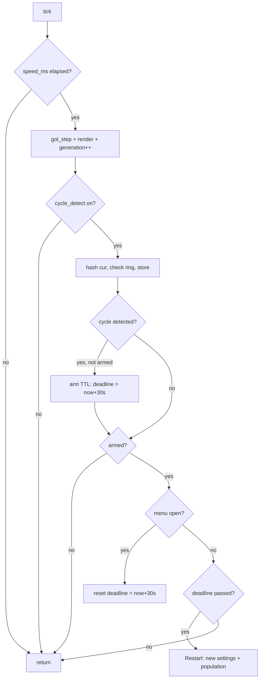
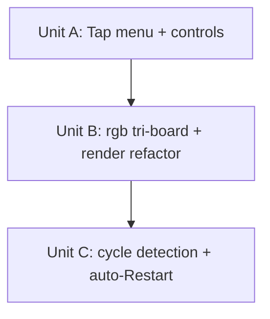

# feat: Game of Life evolution — tap menu, RGB tri-board, cycle detection

## Overview

Evolve the Game of Life mode with three additions:

- **Unit A — Tap menu:** a single tap in the right ~1/4 of the screen opens an
  opaque LVGL overlay (settings/rgb/generation info + Reset / Restart / Cancel)
  while the simulation keeps running underneath.
- **Unit B — `rgb` tri-board:** a new randomized `rgb` setting runs three
  independent boards mapped to the R/G/B channels and composited per cell.
- **Unit C — Cycle detection:** an internal `cycle_detect = !rgb` mode that
  hashes each generation, detects short loops (period ≤ 16), and auto-Restarts
  after a ~30s grace window.

The three units share the GoL mode file ([src/modes/game_of_life.c](src/modes/game_of_life.c))
and the pure core ([src/gol.c](src/gol.c) / [src/gol.h](src/gol.h)). They are
sequenced A → B → C because C reads `rgb` (from B) and pauses on the menu-open
flag (from A).

## Problem Frame

The current GoL mode ([src/modes/game_of_life.c](src/modes/game_of_life.c)) is
fire-and-forget: it randomizes settings on activation, renders a single green
board, and offers no in-mode interaction. Two gaps motivated this work
(see origin: docs/brainstorms/2026-06-09-gol-evolution-requirements.md):

1. No way to inspect the current run's parameters or restart it without leaving
   and re-entering the mode.
2. Settled boards (still lifes / oscillators) can sit visually "stuck"
   indefinitely; and the single-color render under-uses the wide panel.

The panel is 1920×440, single UI thread, all work on the LVGL timer thread.

## Requirements Trace

Carried from the origin requirements document (R-A*, R-B*, R-C* IDs preserved):

- **R-A1..R-A13** — tap trigger (right-quarter, press-point, gesture guard),
  opaque overlay menu, info panel (settings + rgb + generation counter),
  Reset / Restart / Cancel semantics, auto-close, swipe coexistence.
- **R-B1..R-B8** — `rgb` setting (20% random, Redis-injectable), three
  independent boards, R/G/B channel assignment, per-channel composition,
  unchanged `speed_ms` cadence, rgb-off pixel-identical to today.
- **R-C1..R-C10** — internal `cycle_detect = !rgb`, 16-slot FNV-1a ring buffer
  over `cur`, ~30s armed TTL → Restart, pause+reset while menu open, cleared on
  reseed.

## Scope Boundaries

- No double-tap / multi-tap gestures (single tap only).
- No in-menu settings editing (only Reset / Restart / Cancel).
- No deterministic replay of a prior population (Reset re-seeds randomly).
- No alternate menu placements (right strip only).
- No cycle detection while `rgb` is on (intentionally disabled).
- No detection of period > 16 or translating patterns (gliders).
- `cycle_detect` is never user/Redis-exposed (internal, derived from `rgb`).

## Context & Research

### Relevant Code and Patterns

- **GoL core (pure, host-tested):** [src/gol.c](src/gol.c) / [src/gol.h](src/gol.h).
  `gol_settings_t`, `gol_t` (cur/next/trail), `gol_init/free/seed/step/get/trail`,
  `gol_rand_u32` (xorshift32, never returns 0). `cur` is `uint8_t` alive flags,
  row-major `cols*rows`.
- **GoL renderer (LVGL, hardware-verified):** [src/modes/game_of_life.c](src/modes/game_of_life.c).
  `random_settings()`, `render()` (hard-codes green: live `0xFF00FF00`, trail
  `0xFF000000 | (255*t/trail_turns << 8)`), `reseed()`, `activate()` (roll →
  `redis_apply_gol_settings` overlay → reseed), `tick()` (throttle on
  `speed_ms`). Canvas is full-screen XRGB8888, `GESTURE_BUBBLE`, no click flag.
- **Overlay + gesture-guard pattern:** [src/modes/menu.c](src/modes/menu.c) —
  `lv_button_create` children, `LV_EVENT_CLICKED` callbacks, `GESTURE_BUBBLE` on
  interactive children, and the swipe-vs-tap guard
  `if (lv_indev_get_gesture_dir(lv_indev_active()) != LV_DIR_NONE) return;`.
- **Shell navigation:** [src/shell.c](src/shell.c) `gesture_cb` maps
  LEFT/RIGHT/BOTTOM swipes to nav; the GoL canvas bubbles gestures to it.
- **Redis settings injection:** [src/redis.c](src/redis.c) `apply_field()` —
  field→clamped-setting map; `trail` is handled as a bool via `atoi(val) != 0`
  (the pattern `rgb` should mirror). One-shot HGETALL overlay + DEL.
- **Host-test convention:** [tests/test_gol.c](tests/test_gol.c) drives the pure
  core (blinker/oscillator assertions); wired in [CMakeLists.txt](CMakeLists.txt)
  via `add_executable(test_gol ...)` + `add_test(...)`. Pure logic is unit
  tested; LVGL UI is verified on hardware (e.g. [src/modes/menu.c](src/modes/menu.c)
  has no unit test, while [src/modes/dev_view.c](src/modes/dev_view.c) — a pure
  view-model — does).

### Institutional Learnings

- `docs/solutions/` is empty — no prior documented solutions apply.

### External References

- None used — the work follows established in-repo C11/LVGL patterns.

## Key Technical Decisions

| Decision | Rationale |
|---|---|
| Multi-board via `gol_t boards[3]` + `int board_count` (1 or 3), replacing `gol_t gol` + `bool has_grid` | `Restart` can flip `rgb` on↔off, so the allocated board count varies; an int count makes alloc/free unambiguous. |
| Extract per-cell color into a **pure, host-testable** compose helper | Enables the R-B7 composition test *and* the R-B6 "rgb-off pixel-identical" regression guard without an LVGL harness, matching the repo's pure-logic-is-tested convention. Two helpers: `gol_channel_intensity(...)` (one channel → 0..255) and `gol_compose_pixel(c0,c1,c2,board_count)` (→ full XRGB8888 uint32), so the white/yellow/parity scenarios assert on real pixels. |
| Cycle detection lives in a **pure helper** (FNV-1a + 16-slot ring) in the core, not buried in the LVGL tick | Makes R-C3..R-C6 host-testable (blinker detected, glider not, cleared on reseed) per repo convention. |
| FNV-1a 64-bit (not SHA256) over `cur` | No crypto dependency exists in the repo; a hash collision only causes a benign early Restart, so cryptographic strength buys nothing. (see origin) |
| Menu is an **LVGL widget overlay** created/destroyed per open, not painted into the canvas | Gets `LV_EVENT_CLICKED` button handling for free, keeps `render()` canvas-only, and avoids per-generation flicker over the menu region. (see origin R-A5) |
| Tap captured on `LV_EVENT_PRESSED` (press point), canvas gains `LV_OBJ_FLAG_CLICKABLE` | The canvas has no click flag today; press-point (not release) is what R-A1 specifies; gesture guard distinguishes swipe from tap. |
| `cycle_detect` derived as `!rgb` after the Redis overlay, never read from Redis | Internal-only by design (R-C1); evaluated wherever settings are (re)rolled. |
| Append the `rgb` random draw **last** in `random_settings()` | Preserves the existing settings' random stream so prior runs' distributions are unchanged. |

## Open Questions

### Resolved During Planning

- **Reset vs Restart semantics** — Reset = reseed new population, same settings;
  Restart = full regeneration (new settings + population). (origin R-A8/R-A9)
- **Tap region** — right ~1/4 only, no visible hint. (origin R-A1/R-A2)
- **RGB combine** — per-channel composition, no clamp (`255*t/trail_turns` ≤ 255). (origin R-B7)
- **Cycle action + timing** — full Restart after ~30s; pause+reset while menu open. (origin R-C8/R-C9)
- **Hash function** — FNV-1a 64-bit over `cur`. (origin R-C4)

### Deferred to Implementation

- Exact overlay layout/styling (label grouping, button sizes, fonts 14/20) on
  the 440px-tall panel — tune visually on hardware.
- Final RGB cadence feel — `speed_ms` stays identical per R-B8, but whether the
  3× compute is visibly heavy on the Pi5 is an on-device observation.
- Whether the 20% `rgb` weight feels right — tunable constant, revisit after
  hardware testing.
- Precise generation-counter label refresh cadence while the menu is open
  (live-update in `tick`) — confirm it reads cleanly on device.

## High-Level Technical Design

> *This illustrates the intended approach and is directional guidance for review, not implementation specification. The implementing agent should treat it as context, not code to reproduce.*

**Per-cell render composition (Unit B).** Two pure helpers compute one channel's
intensity and assemble the final pixel; the renderer just calls them:

```
channel_intensity(alive, trail_t, trail_turns):
    if alive:        return 255
    if trail_t > 0:  return 255 * trail_t / trail_turns   # already <= 255
    return 0

# compose_pixel is pure -> host-testable for the white/yellow/parity scenarios
compose_pixel(c0, c1, c2, board_count):
    if board_count == 1:                  # rgb off: green-only, identical to today
        return 0xFF000000 | (c0 << 8)
    return 0xFF000000 | (c0 << 16) | (c1 << 8) | c2   # rgb on: R,G,B

# board_count == 1: c0 = channel_intensity(board0 cell)           -> green only
# board_count == 3: c0/c1/c2 = channel_intensity(board0/1/2 cell) -> R,G,B
```

**Cycle detection ring (Unit C), pure + host-testable:**

```
struct cycle_state { uint64_t slots[16]; uint32_t counter; bool armed; uint32_t deadline_tick; }

after gol_step on the single board (cycle_detect only):
    h = fnv1a64(cur, cols*rows)
    if h matches any of the up-to-16 stored slots: -> cycle detected (arm TTL if not armed)
    slots[counter % 16] = h
    counter++

on reseed: zero slots, counter = 0, armed = false
```

**Mode tick decision flow (Unit C timing):**



## Implementation Units



- [x] **Unit A: Tap menu + controls**

**Goal:** Add a right-quarter tap that opens an opaque overlay (info +
Reset/Restart/Cancel) while the sim runs underneath; refactor `activate()` so
Reset/Restart map to clean settings-roll/reseed paths; track a generation
counter and `menu_open` flag.

**Requirements:** R-A1..R-A13.

**Dependencies:** None (ships independently).

**Files:**
- Modify: [src/modes/game_of_life.c](src/modes/game_of_life.c)
- Test: [tests/test_gol.c](tests/test_gol.c) (only if a pure seam is extracted; see Test scenarios)

**Approach:**
- Add to `gol_mode_state_t`: `uint32_t generation`, `bool menu_open`,
  `lv_obj_t *menu` (overlay root, NULL when closed).
- Split `activate()`'s body into a `roll_and_reseed()` (new random settings +
  Redis overlay + reseed → "Restart") and a `reseed_same()` (reuse current
  `st->gol.cfg` → "Reset"). `activate()` calls `roll_and_reseed()`.
- Reset `generation = 0` in `reseed()`; increment it in `tick()` after
  `gol_step`.
- Add `LV_OBJ_FLAG_CLICKABLE` to the canvas; add an `LV_EVENT_PRESSED` handler
  that (a) returns if `lv_indev_get_gesture_dir(...) != LV_DIR_NONE` (swipe
  guard, per [src/modes/menu.c](src/modes/menu.c)), (b) reads the press point,
  (c) opens the menu only when `x >= disp_w * 3 / 4` and the menu is closed.
- Build the overlay as LVGL widgets on the GoL screen: an opaque panel aligned
  to the right strip, an info label block (settings + `rgb` on/off + generation),
  and three buttons. Buttons + panel set `GESTURE_BUBBLE` so swipes still reach
  the shell (R-A13). Button callbacks: Reset → `reseed_same` + close; Restart →
  `roll_and_reseed` + close; Cancel → close. Close = delete overlay, clear
  `menu_open`.
- While `menu_open`, refresh the generation label in `tick()`.

**Patterns to follow:**
- [src/modes/menu.c](src/modes/menu.c) overlay construction, `LV_EVENT_CLICKED`
  button callbacks, `GESTURE_BUBBLE` on interactive children, and the
  swipe-vs-tap gesture guard.

**Test scenarios:**
<!-- The menu is LVGL UI, verified on hardware per repo convention (menu.c has no unit test). The one extractable pure seam is the region predicate; keep it trivial. -->
- Happy path (hardware): tap in right quarter opens the overlay; sim keeps
  stepping behind it; generation label updates live.
- Happy path (hardware): Reset restarts the population with the same visible
  cell size/density and closes the menu; Restart visibly changes settings and
  closes the menu; Cancel closes with no change.
- Edge case (hardware): a tap in the left 3/4 does nothing; a swipe starting in
  the right quarter navigates (does not open the menu).
- Edge case (hardware): swipe-left/right while the menu is open still navigates
  away; re-entering the mode shows a fresh run with the menu closed.
- Pure (optional): if the right-quarter test is extracted as a pure predicate,
  assert `x = disp_w*3/4` opens and `x = disp_w*3/4 - 1` does not.

**Verification:**
- On device: tapping the right quarter reliably opens the menu; the three
  buttons behave per R-A8..R-A11; swipe navigation is unaffected; the sim never
  visibly pauses. Cross-build is clean; `test_gol` still passes.

---

- [x] **Unit B: `rgb` tri-board + render refactor**

**Goal:** Add the `rgb` setting, run three independent boards when on, and
composite them per channel — with the rgb-off path byte-identical to today.

**Requirements:** R-B1..R-B8, and R-A6 (surface `rgb` in the info panel).

**Dependencies:** Unit A (info panel surfaces `rgb`; not a hard code dependency,
but planned after A).

**Files:**
- Modify: [src/gol.h](src/gol.h) (add `bool rgb` to `gol_settings_t`)
- Modify: [src/gol.c](src/gol.c) (pure channel-intensity + compose-pixel helpers)
- Modify: [src/modes/game_of_life.c](src/modes/game_of_life.c) (multi-board
  state, `random_settings`, `render`, `reseed`, `reseed_same`, `roll_and_reseed`)
- Modify: [src/redis.c](src/redis.c) (`apply_field`: `rgb`)
- Modify: [README.md](README.md) (GoL settings table: add `rgb`)
- Test: [tests/test_gol.c](tests/test_gol.c)

**Approach:**
- `gol_settings_t` gains `bool rgb`.
- Add a pure `gol_channel_intensity(alive, trail_t, trail_turns)` (0..255) and a
  pure `gol_compose_pixel(c0, c1, c2, board_count)` (→ XRGB8888 uint32) to
  [src/gol.c](src/gol.c); the renderer calls both for the single- and tri-board
  paths so the rgb-off output is provably unchanged.
- `random_settings()`: append a 20% `rgb` roll **last** (preserve the existing
  random stream).
- `gol_mode_state_t`: replace `gol_t gol` + `bool has_grid` with
  `gol_t boards[3]` + `int board_count`. `reseed()` first frees **all three**
  board slots unconditionally (`gol_free` is zeroed-safe), **then** sets
  `board_count` (1 when rgb off, 3 when on) and allocs/seeds that many boards,
  each with an independent `gol_rand_u32` draw from `st->rng`. (Freeing before
  setting the new count prevents a 3→1 leak on an rgb on→off transition.)
- `reseed_same()` (the Reset path from Unit A) now reads `boards[0].cfg`; it must
  **copy that cfg into a stack local before** calling `reseed()` (which frees
  `boards[0]`), to avoid aliasing the board it re-seeds.
- `render()`: for each cell, gather channel intensities from board 0/1/2 via
  `gol_channel_intensity` and assemble the pixel via `gol_compose_pixel`
  (single board → green only). Background stays opaque black.
- `tick()`: step every allocated board, then render once.
- `apply_field()`: handle `rgb` mirroring `trail` (`atoi(val) != 0`, no clamp).
- README: document `rgb` (0/1) in the GoL settings table.

**Technical design:** *(directional — see High-Level Technical Design)*

**Patterns to follow:**
- [src/redis.c](src/redis.c) `apply_field` `trail` bool handling.
- Existing `render()` trail math `255 * t / trail_turns` (must remain identical
  for the green channel).

**Test scenarios:**
- Happy path: `gol_channel_intensity(alive=true, ...) == 255`; trail value `t`
  → `255 * t / trail_turns`; dead+no-trail → 0.
- Edge case: `trail_turns` floor (helper given `trail_turns` ≥ 1) — full trail
  `t == trail_turns` → 255; `t == 0` → 0.
- Regression (rgb-off pixel parity): for a small seeded board, the composed
  pixel via the new helper equals the old formula (`0xFF00FF00` live;
  `0xFF000000 | (green<<8)` trail) for every cell across several generations.
- Integration: three boards seeded from distinct rng draws diverge (not
  identical populations) and each steps independently (board 0 stepping does not
  change board 1's `cur`).
- Edge case: composed pixel for a cell alive on all three boards is white
  (`0xFFFFFFFF`); alive on boards 0+1 only is yellow (`0xFFFFFF00`).

**Verification:**
- `test_gol` passes including the parity and composition cases. On device with
  `rgb` off, the board looks identical to today; with `rgb` on (force via
  `redis-cli HSET kdeskdash:gol:settings rgb 1`), three colored populations
  render and combine; `speed_ms` cadence is unchanged.

---

- [x] **Unit C: Cycle detection + auto-Restart**

**Goal:** When `cycle_detect` (= `!rgb`) is on, hash each generation, detect a
loop of period ≤ 16, and Restart after a ~30s grace window that pauses+resets
while the menu is open.

**Requirements:** R-C1..R-C10.

**Dependencies:** Unit B (`rgb` flag drives `cycle_detect`), Unit A
(`menu_open` pauses the TTL).

**Files:**
- Modify: [src/gol.c](src/gol.c) / [src/gol.h](src/gol.h) (pure FNV-1a + ring
  helper)
- Modify: [src/modes/game_of_life.c](src/modes/game_of_life.c) (state, tick
  wiring, TTL)
- Test: [tests/test_gol.c](tests/test_gol.c)

**Approach:**
- Add a pure cycle helper to the core: an FNV-1a 64-bit over the `cur` buffer
  and a fixed 16-slot ring with an incrementing counter. Expose
  `record-and-detect` (hash → compare against stored → store at `counter % 16`,
  increment) and a `reset` (zero slots + counter). Keep it free of LVGL.
- `gol_mode_state_t` gains: `bool cycle_detect`, the cycle ring state,
  `bool cycle_armed`, `uint32_t cycle_deadline` (lv_tick).
- Set `cycle_detect = !rgb` wherever settings are (re)rolled (after the Redis
  overlay), and clear/reset the ring + `cycle_armed` on every reseed (R-C6).
- In `tick()` (single-board path only, after `gol_step`): if `cycle_detect`,
  record-and-detect; on first detection set `cycle_armed` and
  `cycle_deadline = now + 30s`. If `cycle_armed`: when `menu_open`, set
  `cycle_deadline = now + 30s` (pause+reset, R-C9); else when
  `lv_tick_elaps` past the deadline, call `roll_and_reseed()` (Restart, R-C8).
- A manual Reset/Restart already calls reseed, which clears the armed state.
- Skip all cycle work entirely when `rgb` is on (R-C1).

**Patterns to follow:**
- [tests/test_gol.c](tests/test_gol.c) oscillator fixtures (blinker) for
  detection tests.
- Existing `lv_tick_elaps`/`lv_tick_get` throttle usage in `tick()`.

**Test scenarios:**
- Happy path: FNV-1a of a known small buffer matches a precomputed constant
  (stability/regression anchor); two different buffers produce different hashes.
- Happy path: a period-2 blinker is detected within the 16-gen span (a repeat
  hash appears); a still-life (block) is detected on the next generation.
- Edge case: a translating glider on a large enough board does **not** trigger
  detection within the span (board never repeats identically).
- Edge case: ring cleared on reseed — hashes from a prior run cannot produce a
  match in the new run; zeroed slots never collide with a real board hash.
- Edge case: with a full ring (counter > 16), the oldest slot is overwritten at
  `counter % 16` and detection still uses the live 16-slot window.
- Error/robustness: detection over `board_count == 1` only; helper is never
  invoked for the rgb-on path (assert the wiring guard at the mode level via a
  small extracted predicate or document as hardware-verified).

**Verification:**
- `test_gol` passes the hash + detection + reset cases. On device with `rgb`
  off, a board that settles into a still-life/oscillator auto-Restarts ~30s
  later; opening the menu during the countdown holds the board, and closing it
  restarts a fresh ~30s; with `rgb` on, no auto-Restart occurs.

## System-Wide Impact

- **Interaction graph:** New `LV_EVENT_PRESSED` handler on the GoL canvas plus
  overlay button `LV_EVENT_CLICKED` callbacks. Must not interfere with the
  shell's `LV_EVENT_GESTURE` navigation ([src/shell.c](src/shell.c)) — the
  gesture guard and `GESTURE_BUBBLE` flags preserve swipe nav.
- **Error propagation:** Board allocation can fail (`gol_init` → false / `cbuf`
  malloc → NULL); existing code degrades to a blank screen. The 3-board path
  must apply the same degradation if any board fails to allocate (free the
  partial set and degrade to blank, logging once) — it must **not** silently
  fall back to a single board, which would drop the rgb feature unannounced.
- **State lifecycle risks:** The `boards[3]` array must be fully freed on reseed
  and on any rgb on↔off transition to avoid leaks; the cycle ring must reset on
  every reseed to avoid stale-hash false matches; `menu` overlay must be deleted
  (not just hidden) on close and on mode re-activation.
- **API surface parity:** `gol_settings_t` gains `rgb`; any code initializing it
  (e.g. test fixtures using designated initializers) is unaffected since
  unset fields zero-initialize (`rgb` defaults false). `apply_field` is the only
  Redis consumer to update.
- **Integration coverage:** The Redis `rgb` injection path and the LVGL overlay
  are verified on hardware; pure composition and cycle logic are unit-tested.
- **Unchanged invariants:** The pure core API (`gol_init/free/seed/step/...`) is
  unchanged except for the additive `rgb` field and the new cycle helper; the
  rgb-off render output is explicitly required to stay pixel-identical; existing
  swipe navigation and the Redis one-shot overlay+DEL semantics are unchanged.

## Risks & Dependencies

| Risk | Mitigation |
|------|------------|
| Renderer refactor silently changes the rgb-off output | Pure parity test asserts the new compose helper reproduces the exact old formula across several generations before relying on it. |
| 3× compute (rgb on) makes the sim stutter on the Pi5 | `speed_ms` cadence is unchanged by design; if visibly heavy, the 20% weight / cell-size floor are tunable — flagged as a deferred on-device observation. |
| Tap handler steals swipes meant for navigation | Reuse the proven `lv_indev_get_gesture_dir() != LV_DIR_NONE` guard + `GESTURE_BUBBLE`; sub-threshold drags in the right quarter reading as taps is an accepted edge case (origin R-A3). |
| Board-array leak on rgb on↔off transitions | `reseed()` frees all currently allocated boards before re-allocating; covered by explicit lifecycle note and on-device long-run check. |
| Stale cycle hashes cause a false early Restart after reseed | Ring + counter zeroed on every reseed (R-C6); unit-tested. |
| Hash collision triggers an early Restart | Accepted — benign (just a fresh board); FNV-1a 64-bit collision odds are negligible for these board sizes. |

## Documentation / Operational Notes

- [README.md](README.md): add `rgb` (0/1) to the GoL settings table; optionally
  note the right-quarter tap menu (or intentionally leave it as an IYKYK
  feature per R-A2 — decide at doc time).
- [deploy/kdeskdash.env.example](deploy/kdeskdash.env.example): no new env vars
  (rgb is a `gol:settings` hash field, not an env var) — no change expected.
- Deploy/runtime unchanged: same single binary, same systemd service.

## Sources & References

- **Origin document:** [docs/brainstorms/2026-06-09-gol-evolution-requirements.md](docs/brainstorms/2026-06-09-gol-evolution-requirements.md)
- Related code: [src/modes/game_of_life.c](src/modes/game_of_life.c),
  [src/gol.c](src/gol.c), [src/gol.h](src/gol.h), [src/redis.c](src/redis.c),
  [src/modes/menu.c](src/modes/menu.c), [src/shell.c](src/shell.c)
- Tests: [tests/test_gol.c](tests/test_gol.c), [CMakeLists.txt](CMakeLists.txt)
