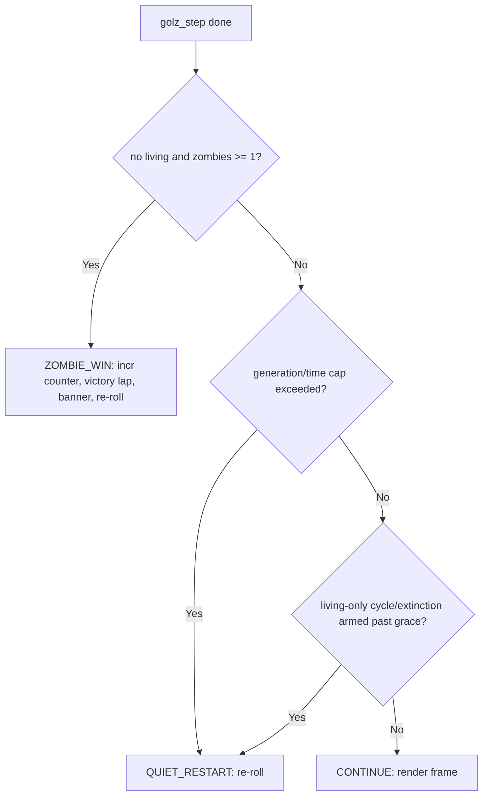
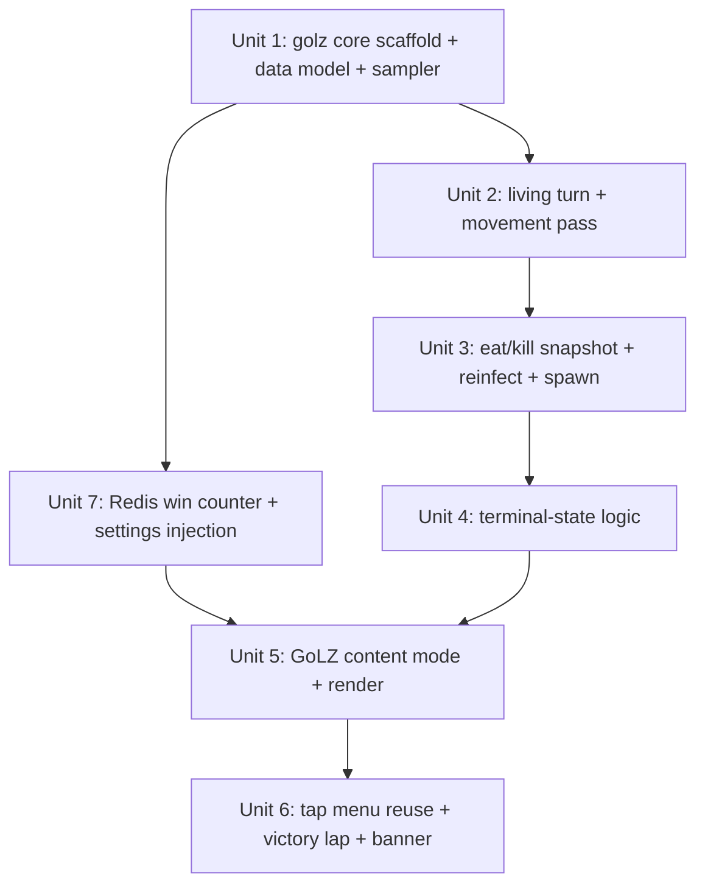

# feat: GoLZ — Game of Life with Zombies mode

## Overview

Add a new additive content mode **GoLZ** that turns Conway's Game of Life into a
two-faction simulation: the ordinary living population plus a roaming **zombie**
faction that moves, eats, reinfects, spawns from the dead, and can win by wiping
out all life. A zombie win triggers a downward "victory lap", a full-screen
"The Zombies Won — N total" banner, and a persistent Redis-backed win counter.

The plan reuses the proven Game of Life core ([src/gol.c](src/gol.c)) **verbatim**
for the living layer and builds the zombie faction as a separate pure,
host-testable module layered on top — so `gol_step` is never modified and all new
rules are deterministically testable like the existing core.

## Problem Frame

GoL recently gained tap controls, an RGB tri-board variant, and cycle detection,
and it's a hit (see origin: [docs/brainstorms/2026-06-09-golz-zombies-requirements.md](docs/brainstorms/2026-06-09-golz-zombies-requirements.md)).
GoLZ exists to add a distinct, higher-drama screensaver that stands on its own in
the swipe cycle and menu while reusing the GoL core. The audience is the panel
viewer (rpidash2, 1920×440); the mode must run unattended forever and **never
freeze** on any terminal state.

## Requirements Trace

Carried forward from the origin requirements document (R1–R23):

- R1. New content mode **GoLZ** in swipe cycle + launcher menu.
- R2. Single-board only — no RGB tri-board.
- R3. Reuse the pure host-testable GoL core where practical.
- R4. Each generation = two ordered turns: Living turn, then Zombie turn.
- R5. Living turn = toroidal Conway on living only; record living-turn deaths; zombies are not Conway neighbors; birth onto a zombie cell suppressed.
- R6. Zombie turn = reshuffled order; movement pass completes before eat/kill; eat/kill counts use a **frozen post-movement snapshot**.
- R7. Movement = pick 1-of-8 at random; blocked by any occupied cell → stay put (single attempt).
- R8. Eat/kill by living-neighbor count: 0 nothing · 1–2 eat one · 3 standoff · 4–5 zombie killed · 6–8 survives.
- R9. Eaten cell: `zombie_reinfect` (default 10%) → becomes a new zombie, else dies.
- R10. After eat/kill, `zombie_spawn_chance` (default 20%) spawns `ceil(random(1%..30%) × deaths)` (≥1 when ≥1 died); deaths = Conway deaths + zombie-eaten living cells (reinfected excluded); zero deaths → no spawn.
- R11. Spawned zombies placed on randomly chosen empty cells (bounded sampler); drop overflow.
- R12. Reinfected + spawned zombies first act the **following** generation.
- R13. Zombie win = no living and ≥1 zombie; checked **before** any cycle/extinction restart.
- R14. Victory lap (strictly downward, bounded drain), trails fade to black, then "The Zombies Won — N total" banner centered + scrim, 30 s hold, re-roll restart.
- R15. Zombies eliminated while living remain → continue as plain GoL; existing cycle/extinction ends the round; no celebration/counter change.
- R16. Stalemate/extinction handled by existing cycle/extinction detection (living-cells-only hash) → quiet restart.
- R17. Persistent win counter in Redis (`kdeskdash:golz:wins`, atomic `INCR`, once at win detection); missing/unparseable → 0, never negative; in-memory fallback without Redis.
- R18. Win count renders **in-mode** (corner readout + banner); menu untouched.
- R19. Living green, zombies red; both leave own-color fading trails; live occupant color overrides existing trail; hue is the sole differentiator.
- R20. Reuse GoL tap control menu (Reset / Restart / Cancel).
- R21. `zombie_reinfect`, `zombie_spawn_chance`, initial zombie count (0–5) tunable via Redis settings injection.
- R22. Per-round settings randomized within sensible ranges at activation (mirroring GoL `random_settings`).
- R23. Unconditional restart backstop (max generation count and/or wall-clock) forces a quiet re-roll regardless of board state.

## Scope Boundaries

- No RGB tri-board variant in GoLZ (R2).
- No "living survive" celebration or counter — zombie wins are the only counted outcome.
- No new on-disk persistence; the counter uses Redis only.
- **GoL itself is unchanged** — `gol_step` and the existing GoL mode are not modified; GoLZ is purely additive.
- The shared menu ([src/modes/menu.c](src/modes/menu.c)) is not modified — the counter renders inside the GoLZ surface.
- No interactivity beyond the reused tap control menu.

## Context & Research

### Relevant Code and Patterns

- **Living-layer core (reuse verbatim):** [src/gol.c](src/gol.c) / [src/gol.h](src/gol.h) — `gol_t` (row-major `cur`/`next`/`trail`), `gol_init`/`gol_free`/`gol_clear`/`gol_seed`/`gol_step`, toroidal `live_neighbors`, `gol_live_count`. `gol_step` only reads `cur`, so post-step mutation of `cur` (for eaten cells) is safe.
- **RNG seam (reuse):** `gol_rand_u32(uint32_t *state)` xorshift32 — caller-owned `uint32_t` threaded through every random draw for deterministic tests.
- **Cycle/extinction detection (reuse):** `gol_cycle_t` 16-slot FNV-1a ring (`gol_fnv1a64`, `gol_cycle_reset`, `gol_cycle_record`) hashing **living cells only**. Reuse the existing 64-bit offset basis constant; do not retype it.
- **Render composition helpers (reuse + extend):** `gol_channel_intensity(alive, trail_t, trail_turns) → 0..255` and `gol_compose_pixel(...)`; trail math `255*t/trail_turns` is already ≤255 (no clamping).
- **GoL content mode (pattern to mirror):** [src/modes/game_of_life.c](src/modes/game_of_life.c) — `kd_mode_t` create, full-screen `lv_canvas` XRGB8888 owned buffer, `render()` writes per-cell blocks then one `lv_obj_invalidate`, `tick()` gated by `lv_tick_elaps(last_step) < speed_ms`, `random_settings`, and the Reset/Restart/Cancel tap overlay.
- **Mode interface + registration:** `kd_mode_t` ([src/mode.h](src/mode.h)): `id`, `title`, `screen`, `activate`, `deactivate`(nullable), `tick`(nullable), `state`. Register via `shell_register_content_mode(...)` in [src/main.c](src/main.c) (cap 8, currently 3 content modes).
- **Redis client (pattern):** [src/redis.c](src/redis.c) / [src/redis.h](src/redis.h) — single static `redis_client_t g_control`, `redis_client_ensure` gates ops with reconnect/backoff, all failures swallowed. `KEY_*` `#define`s; `redis_apply_gol_settings` one-shot `HGETALL`→`apply_field`→`DEL`; `redis_get_string` GET-with-default.
- **Host test scaffold:** [tests/test_gol.c](tests/test_gol.c) — frameworkless `check`/`check_eq`, deterministic seeds; each test target compiles only the pure sources it needs ([CMakeLists.txt](CMakeLists.txt) inside `if(NOT CMAKE_CROSSCOMPILING)`).

### Institutional Learnings

- **Swipe-vs-tap gesture guard** ([docs/solutions/best-practices/lvgl-swipe-vs-tap-gesture-guard.md](docs/solutions/best-practices/lvgl-swipe-vs-tap-gesture-guard.md)): every reused `LV_EVENT_CLICKED` callback must guard with `lv_indev_t *indev = lv_indev_active(); if (indev && lv_indev_get_gesture_dir(indev) != LV_DIR_NONE) return;` — the `indev &&` NULL-check is mandatory. Set `LV_OBJ_FLAG_GESTURE_BUBBLE` on the overlay panel **and** every child button/label or swipe-nav dies over the menu. Region taps: capture point on `LV_EVENT_PRESSED`, decide on `LV_EVENT_CLICKED`.
- **Living-cells-only hash + terminal ordering** (GoL evolution plan/brainstorm): hash living cells only and evaluate the zombie-win check **before** the cycle/extinction detector each generation so a win is never preempted.
- **Pure core + injectable RNG** convention: pure logic gets a host test; LVGL UI is hardware-verified only (no UI unit tests).
- **One invalidate per generation**: the menu overlay / banner / counter are separate LVGL widgets, never painted into the canvas pixel buffer.
- **Redis defensive reads**: missing/unparseable counter → 0, never negative; `INCR` once at win-detection.
- **Bounded placement**: no measured benchmark exists for the ~211k worst-case grid — use a bounded sampler (collect empties → sample without replacement) and verify the two-turn cadence against `speed_ms` on-device.

### External References

None — the work is fully grounded in existing repo patterns (GoL core, Redis client, mode registration, host test scaffold). No external research warranted.

## Key Technical Decisions

| Decision | Rationale |
|---|---|
| **Two-layer model: reuse `gol_t` for living + parallel zombie grid** (do not extend `gol_t` to 3-state, do not modify `gol_step`) | Keeps the proven core untouched (scope boundary "GoL unchanged"), preserves `gol_step` semantics, and isolates all new rules in a testable module. `gol_step` only reads `cur`, so layering zombie mutations after the step is safe. (see origin: R3 reuse strategy) |
| **New pure module `src/golz.c` / `src/golz.h`, LVGL-free** | Mirrors the `gol.c` pure-core convention so the entire zombie ruleset links into a host test (`tests/test_golz.c`) with no LVGL/Redis dependency. |
| **"New this generation" via a separate `z_new` pending grid** | A plain enum can't encode R12's deferred activation. A second `uint8_t` grid holds zombies born this gen (reinfect + spawn); promoted into the active zombie grid at the **start** of the next `golz_step`. Simple, branch-free, host-testable. |
| **Single bounded empty-cell sampler** shared by initial seeding and spawn placement | Avoids unbounded random-retry scans on dense boards (R11/R21). Collect empty indices into a scratch list once, partial Fisher-Yates to draw N without replacement. |
| **One composed frame per generation** (final post-zombie-turn state); `speed_ms` = one full two-turn generation | Matches the existing single-invalidate render contract; the intermediate living/movement sub-states are not shown (simpler, flicker-free). (see origin: R4/R19 deferred render question) |
| **Terminal-check order: zombie-win (R13) → backstop (R23) → cycle/extinction (R16)** | Guarantees a win is never preempted by the stalemate net, the unconditional cap guarantees "never freezes" even under an unforeseen equilibrium, and the living-only cycle/extinction check is the normal round-ender. Matches Unit 4 and the design diagram. |
| **In-mode counter doubles as the GoLZ identity marker** | The persistent corner "Zombie wins: N" readout makes a 0-initial-zombie round still read as GoLZ at a glance, resolving the deferred identity-marker question without touching the menu. |
| **Append new fields to `random_settings`/`apply_field` streams** | Drawing new GoLZ params last preserves the existing PRNG stream reproducibility, matching the GoL `rgb`-appended-last convention. |

## Open Questions

### Resolved During Planning

- **Code-reuse strategy (R3):** Parallel zombie layer alongside an unmodified `gol_t`; new pure `src/golz.c`. (Research confirmed `gol_step` reads only `cur`.)
- **Deferred-activation data model (R12):** Separate `z_new` pending grid promoted at the start of the next step.
- **Bounded placement (R11/R21):** One shared collect-empties + partial Fisher-Yates sampler.
- **RNG seam (Success):** Thread the caller-owned `uint32_t *rng_state` (via `gol_rand_u32`) through every zombie draw — shuffle, direction, eat target, reinfect roll, spawn roll/count/placement.
- **Render composition (R4/R19):** One composed frame per generation; `speed_ms` covers a full two-turn generation.
- **0-initial-zombie identity (R21):** The in-mode counter readout serves as the persistent GoLZ marker.
- **Tap behavior during lap/banner (R14/R20):** Taps are ignored during the victory lap; a tap during the 30 s banner hold short-circuits the remaining hold and triggers the re-roll restart. (Sensible default; trivially adjustable on-device.)

### Deferred to Implementation

- **Exact randomization ranges + Redis field names** for `zombie_reinfect`, `zombie_spawn_chance`, initial count, and the backstop cap — tune on device (R21/R22). Proposed key: `kdeskdash:golz:settings` (hash, one-shot overlay) mirroring `kdeskdash:gol:settings`.
- **Two-turn cadence headroom** on the ~211k worst-case grid — no prior benchmark. Instrument `golz_step` + `render` with `lv_tick_elaps` at the worst case (`cell_size=2`, a deliberately **zombie-saturated** board, not a fresh seed) and log per-generation µs. Pass/fail: a worst-case generation must stay **≤ 50% of the minimum `speed_ms` floor** (≤ ~40 ms if the floor stays 80 ms) to preserve UI-thread headroom for input/swipe. Fallback if it fails: raise the GoLZ `speed_ms` and/or `cell_size` floor for this mode (mirroring the GoL cell-size-floor rationale) rather than shipping visible stutter.
- **Victory-lap animation timing** (pace slower than normal so the march reads as deliberate) and the exact trail-drain-to-black sequencing before the banner — settle while watching it on-device.
- **Banner font size** — confirm the desired `lv_font_montserrat_*` size is enabled in [lv_conf.h](lv_conf.h) before use; enable if absent.

## High-Level Technical Design

> *This illustrates the intended approach and is directional guidance for review, not implementation specification. The implementing agent should treat it as context, not code to reproduce.*

**Two-layer board.** The living layer is an unmodified `gol_t`. The zombie faction
is two parallel grids owned by the new `golz_t`:

```
golz_t
├── gol_t living            // reused verbatim; living->cur is the living layer
├── uint8_t *zombies        // 0 = no zombie, 1 = active zombie
├── uint8_t *z_new          // zombies born this gen (reinfect/spawn); promoted next step
├── uint8_t *z_trail        // zombie (red) fade trail, mirrors gol_t.trail (R19; added during impl)
├── uint8_t *prev_living    // golz-owned copy of living->cur taken BEFORE gol_step (death diff)
├── uint8_t *snapshot       // golz-owned copy of living->cur taken AFTER movement (eat/kill reads)
├── uint8_t *died_mask      // living cells that died this gen (Conway deaths + zombie-eaten); reset each step
├── int     *empties        // scratch index list for the sampler; allocated once at init
├── golz_settings_t cfg     // zombie_reinfect, zombie_spawn_chance, initial_count, backstop
├── uint32_t *rng           // caller-owned PRNG seam (gol_rand_u32)
└── gol_cycle_t cycle       // living-only hash ring (reused)
```

All parallel grids and the `empties` scratch are allocated once at `golz_init`
(sized `living.cols*living.rows`) and reused every step — never per-generation
malloc/free. `prev_living`, `snapshot`, and `died_mask` are fully overwritten
(or `memset`) at the points noted below so nothing accumulates across generations.
The sampler's "empty" predicate is `living==0 && zombies==0 && z_new==0`.

**One `golz_step` (a full generation):**

```
golz_step(g):
  1. promote z_new -> zombies; clear z_new          # R12 deferred activation
  2. copy living->cur into prev_living; memset died_mask = 0
  3. living turn:  gol_step(&g->living)             # R5 Conway on living only
       - zombies not counted as neighbors (separate grid)
       - suppress birth onto a zombie cell (clear living->cur[i] AND living->trail[i] where zombies[i])
       - died_mask[i] = prev_living[i] && !living->cur[i]   # genuine Conway deaths only
  4. movement pass (R6/R7): shuffle zombie order (rng);
       each zombie picks 1 of 8 dirs (same ±1 toroidal wrap as live_neighbors);
       blocked by any occupied (living OR zombie) -> stay
  5. memcpy living->cur into snapshot                # R6 frozen post-movement snapshot
  6. eat/kill pass (R8/R9), counts judged vs snapshot, mutations applied to live grids:
       0 -> none | 1-2 -> eat one random snapshot-living neighbor
         (reinfect roll: hit -> z_new; miss -> death, add to died_mask)
       3 -> none | 4-5 -> remove this zombie | 6-8 -> none
       (eat targeting an already-cleared live cell = no-op)   # double-eat guard
  7. spawn (R10/R11): deaths = popcount(died_mask);
       if spawn_roll and deaths>0: n = max(1, ceil(rand(1%..30%) * deaths));
       sampler (empty = living==0 && zombies==0 && z_new==0) places n into z_new
  8. (mode-side, after golz_step returns) golz_terminal(g) -> CONTINUE | ZOMBIE_WIN | QUIET_RESTART   # R13/R23/R16
```

**Per-generation terminal decision (mode-side):**



## Implementation Units



- [x] **Unit 1: GoLZ pure core scaffold, data model, and bounded sampler**

**Goal:** Establish the LVGL-free `golz` module — the `golz_t` two-layer struct, lifecycle, accessors, and the shared bounded empty-cell sampler — plus its host test target.

**Requirements:** R3, R11, R12 (data model), R21 (settings struct)

**Dependencies:** None

**Files:**
- Create: `src/golz.h`
- Create: `src/golz.c`
- Create: `tests/test_golz.c`
- Modify: `CMakeLists.txt` (add `src/golz.c` to `kdeskdash`; add `test_golz` target compiling `tests/test_golz.c src/golz.c src/gol.c`)

**Approach:**
- `golz_t` wraps a reused `gol_t living` plus `zombies`, `z_new`, `prev_living`, `snapshot`, `died_mask` grids, an `empties` int scratch list, a `golz_settings_t` (`zombie_reinfect`, `zombie_spawn_chance`, `initial_count`, `max_generations`/backstop), and a caller-owned `uint32_t *rng`.
- `golz_init`/`golz_free`/`golz_clear` allocate/zero **all** parallel grids and the `empties` scratch (sized `living.cols*living.rows`) **once at init** alongside `gol_init`; nothing is malloc'd per step.
- `golz_seed(g, rng_state)`: seed the living layer via `gol_seed`, then place `initial_count` (0–5) zombies on empty cells via the sampler.
- Sampler `golz_sample_empty(g, out_indices, want, rng)`: scan cells where **`living==0 && zombies==0 && z_new==0`** into the pre-allocated `empties` list, partial Fisher-Yates to draw up to `want` without replacement; returns the count actually placed. Reuses the init-time scratch (no allocation in the hot path).
- Draw all randomness from `gol_rand_u32(g->rng)`.

**Patterns to follow:**
- `gol_init`/`gol_free` allocation + null-safe free ([src/gol.c](src/gol.c)).
- Frameworkless test scaffold ([tests/test_gol.c](tests/test_gol.c)); test target shape inside `if(NOT CMAKE_CROSSCOMPILING)` ([CMakeLists.txt](CMakeLists.txt)).

**Test scenarios:**
- Happy path: `golz_init` allocates grids of `cols*rows`; `golz_free` is safe on a zeroed struct and after init.
- Happy path: `golz_seed` with a fixed seed places exactly `initial_count` zombies, all on empty (non-living) cells; repeated seed with same RNG state is identical (determinism).
- Edge case: `initial_count == 0` places zero zombies; board equals a plain GoL seed.
- Edge case: sampler `want` greater than available empties returns only the available count, never duplicates an index, never overruns the scratch buffer.
- Edge case: sampler treats a cell occupied by `z_new` (reinfected this gen) as non-empty — never places a spawn onto a `z_new` cell.
- Edge case: sampler on a fully occupied board returns 0.

**Verification:** `test_golz` builds and passes under `ctest --test-dir build`; no LVGL/Redis symbols are referenced by `src/golz.c`.

- [x] **Unit 2: Living turn and zombie movement pass**

**Goal:** Implement the first half of `golz_step` — the Conway living turn (with zombie-aware birth suppression and death recording) and the sequential movement pass.

**Requirements:** R4, R5, R7, R12 (promotion at step start)

**Dependencies:** Unit 1

**Files:**
- Modify: `src/golz.c`, `src/golz.h`
- Modify: `tests/test_golz.c`

**Approach:**
- At the top of `golz_step`: promote `z_new` into `zombies`, then clear `z_new`; copy `living->cur` into the golz-owned `prev_living` and `memset` `died_mask` to 0 (so the spawn `popcount` reflects only this generation).
- Living turn: call `gol_step(&g->living)` (zombies live in a separate grid, so they are inherently not Conway neighbors); after the step, suppress any birth that landed on a zombie cell by clearing **both** `living.cur[i]` and `living.trail[i]` where `zombies[i]` (clearing the trail avoids a phantom green smear if the zombie later moves off); compute `died_mask[i] = prev_living[i] && !living.cur[i]` (genuine Conway deaths only — a suppressed birth had `prev_living[i]==0` so it is not counted).
- Movement pass: build a zombie index list, shuffle with Fisher-Yates from `g->rng`; for each, pick 1 of 8 directions using the **same ±1 single-add toroidal wrap convention** as `live_neighbors` in [src/gol.c](src/gol.c) (`live_neighbors` is `static`, so replicate the exact wrap, or use `((v % n) + n) % n`); if the target cell has a living cell or a zombie, stay; else move the zombie flag.

**Patterns to follow:**
- Toroidal neighbor wrap in `live_neighbors` ([src/gol.c](src/gol.c)).
- Deterministic-seed assertions in [tests/test_gol.c](tests/test_gol.c).

**Test scenarios:**
- Happy path: a known Conway pattern (e.g., blinker) on the living layer steps identically to `gol_step` when no zombies are present.
- Edge case: a Conway birth cell coincident with a zombie is suppressed (cell stays zombie, not living) **and** `living.trail[i] == 0` (no phantom green trail seeded on the suppressed birth).
- Happy path: zombies are not counted as neighbors — a living cell that would die/survive does so based only on living neighbors, with adjacent zombies present.
- Happy path: a lone zombie with all 8 neighbors empty always moves to the rolled direction (seeded).
- Edge case: a zombie whose rolled target is occupied (living or zombie) stays put (single attempt, no retry).
- Edge case: a zombie at a board edge rolling an off-edge direction wraps toroidally to the opposite edge (matches `live_neighbors` wrap).
- Edge case: movement order shuffle is deterministic for a fixed RNG state; two zombies rolling into the same empty cell — the first claims it, the second is blocked.
- Integration: `died_mask` after the living turn contains exactly the cells that were living-before and dead-after Conway; a suppressed birth on a zombie cell is **not** in `died_mask`.
- Integration: `died_mask` is fully reset each step — running two generations does not accumulate stale death bits (popcount reflects only the latest generation).

**Verification:** Living-only behavior is bit-identical to `gol_step`; movement blocking and birth-suppression hold under seeded tests.

- [x] **Unit 3: Eat/kill snapshot pass, reinfection, and spawning**

**Goal:** Complete `golz_step` — the snapshot-based eat/kill resolution, reinfection, and spawn-from-the-dead, with correct next-generation activation timing.

**Requirements:** R6, R8, R9, R10, R11, R12

**Dependencies:** Unit 2

**Files:**
- Modify: `src/golz.c`, `src/golz.h`
- Modify: `tests/test_golz.c`

**Approach:**
- Snapshot the living grid after movement (single copy) so all eat/kill counts read the frozen state.
- Per zombie (in the shuffled order): count snapshot-living 8-neighbors and apply the table — 0/3/6–8 nothing, 1–2 eat one randomly chosen snapshot-living neighbor, 4–5 remove this zombie.
- Eat resolution mutates the **live** grids: clear `living.cur[target]`; roll `zombie_reinfect` — hit → set `z_new[target]`; miss → death, set `died_mask[target]`. An eat whose live target is no longer living (already cleared by an earlier zombie) is a no-op.
- Spawn: `deaths = popcount(died_mask)` (Conway deaths + zombie-eaten living cells; reinfected are excluded because they went to `z_new`, not `died_mask`); if the spawn roll hits and `deaths > 0`, `n = max(1, ceil(random(1%..30%) * deaths))`; place via the Unit 1 sampler into `z_new` (the sampler's `z_new==0` predicate prevents placing onto a cell reinfected earlier this step). Zero deaths → no spawn regardless of roll.
- The movement and eat/kill passes are `O(zombies)`; the zombie population is implicitly capped by `cols*rows`, so the worst case (a zombie-saturated board) is roughly one extra `gol_step`-equivalent — budgeted in the Unit 5 cadence check.

**Patterns to follow:**
- Shared sampler from Unit 1; RNG seam `gol_rand_u32(g->rng)`.

**Test scenarios:**
- Happy path (each bucket): construct a zombie with exactly 0, 1, 2, 3, 4, 5, 6, 7, 8 snapshot-living neighbors and assert the outcome (nothing / eat / nothing / killed / survives).
- Happy path: a 1–2-neighbor zombie eats exactly one living neighbor; the chosen index is deterministic for a fixed RNG state.
- Edge case: `zombie_reinfect = 100%` turns every eaten cell into a `z_new` zombie (no death recorded); `zombie_reinfect = 0%` records every eaten cell as a death.
- Edge case: two zombies both adjacent to the same lone living cell — first eats it, second's eat is a no-op (no crash, no phantom removal).
- Edge case: snapshot semantics — an earlier zombie's eat does not change a later zombie's neighbor count within the same pass.
- Happy path: spawn count math — `deaths = 10`, forced roll-hit, RNG fixed → `n = ceil(p × 10)` within 1..3 and ≥1.
- Edge case: `zombie_spawn_chance = 0%` never spawns even with `deaths > 0` (forced fail roll); `zombie_spawn_chance = 100%` always spawns ≥1 when `deaths > 0` (forced hit); deterministic for a fixed RNG state.
- Edge case: `deaths = 1`, forced spawn-roll hit → `n = 1` (the `max(1, ceil(p×1))` floor holds for the smallest non-zero death count across the full 1%..30% range).
- Edge case: `deaths = 0` with a forced spawn-roll-hit spawns nothing.
- Edge case: spawn `n` exceeding available empties places only what fits; spawn never lands on a cell reinfected earlier this same step.
- Happy path (pure compose helper, R19): living cell → green channel, zombie cell → red channel; a zombie on a formerly-green cell and a living cell on a formerly-red cell both take the occupant hue (occupant overrides trail); an empty cell with a residual trail fades via `gol_channel_intensity` in its own color.
- Integration (R12 timing): reinfected and spawned zombies sit in `z_new` this step and only become active (movable/eating) on the next `golz_step`.

**Verification:** All eat/kill buckets, reinfection extremes, double-eat no-op, and spawn count/timing pass under seeded host tests.

- [x] **Unit 4: Terminal-state logic — win / extinction / cycle / backstop**

**Goal:** Provide the per-generation terminal decision used by the mode: zombie-win precedence, living-only cycle/extinction reuse, and the unconditional restart backstop.

**Requirements:** R13, R15, R16, R23

**Dependencies:** Unit 3

**Files:**
- Modify: `src/golz.c`, `src/golz.h`
- Modify: `tests/test_golz.c`

**Approach:**
- `golz_terminal(g)` returns an enum `{ GOLZ_CONTINUE, GOLZ_ZOMBIE_WIN, GOLZ_QUIET_RESTART }`.
- Order: (1) zombie win = `gol_live_count(&g->living) == 0 && zombie_count > 0`; (2) backstop = generation counter ≥ `cfg.max_generations` (and/or wall-clock cap surfaced to the mode); (3) cycle/extinction via the reused `gol_cycle_t` ring recorded on **living cells only** (`living.cur`), respecting the existing armed-grace behavior.
- Expose a `zombie_count` helper and a generation counter on `golz_t`.

**Patterns to follow:**
- `gol_cycle_record` / `gol_fnv1a64` reuse ([src/gol.c](src/gol.c)); hash `living.cur` only.

**Test scenarios:**
- Happy path: no living + ≥1 zombie → `GOLZ_ZOMBIE_WIN`.
- Edge case (precedence): a board that is simultaneously a still-life on living==0 with zombies present returns `ZOMBIE_WIN`, never `QUIET_RESTART` (win checked first).
- Edge case: a stable living oscillator with a wandering zombie still trips cycle detection (living-only hash ignores the moving zombie) → `QUIET_RESTART` after grace.
- Edge case: both factions extinct (no living, no zombies) → `QUIET_RESTART`, not a win.- Edge case (R15): living cells present and `zombie_count == 0` → `GOLZ_CONTINUE` (no win, no `QUIET_RESTART`) until the existing cycle/extinction or backstop ends the round; the win counter is unchanged.- Edge case: backstop — after `max_generations` with the board still active (living present), returns `QUIET_RESTART`.

**Verification:** Terminal ordering and living-only hashing hold under seeded tests; no terminal state returns `CONTINUE` indefinitely (backstop guarantees termination).

- [x] **Unit 7: Redis win counter and settings injection**

**Goal:** Add the persistent zombie-win counter (atomic INCR + defensive GET) and the GoLZ settings-injection read, with safe in-memory fallback.

**Requirements:** R17, R21

**Dependencies:** Unit 1 (for the settings struct shape)

**Files:**
- Modify: `src/redis.c`, `src/redis.h`
- Create: `tests/test_golz_counter.c` (only if a pure parse helper is extracted; otherwise fold into `test_golz`)
- Modify: `CMakeLists.txt` (only if a new test target is added)

**Approach:**
- Add `#define KEY_GOLZ_WINS "kdeskdash:golz:wins"` and (proposed) `#define KEY_GOLZ_SETTINGS "kdeskdash:golz:settings"`.
- `redis_golz_incr_wins(void) -> long`: after `redis_client_ensure`, issue `INCR KEY_GOLZ_WINS`, return `reply->integer` (post-increment count), free reply, swallow failure (return a sentinel the caller treats as "unknown").
- `redis_golz_get_wins(long default_val) -> long`: `redis_get_string(KEY_GOLZ_WINS, buf, ...)` then parse; missing/unparseable/negative → `default_val` (0). Extract the parse-and-clamp into a small pure helper so it is host-testable.
- `redis_apply_golz_settings(golz_settings_t *cfg)`: one-shot `HGETALL KEY_GOLZ_SETTINGS` → per-field `apply_field`-style overlay (bounded) → `DEL`, mirroring `redis_apply_gol_settings`.
- Mode keeps an in-memory `long wins` mirror so the displayed count works with Redis absent (R17 fallback).

**Patterns to follow:**
- `redis_set_active_mode` SET shape, `redis_apply_gol_settings` one-shot overlay, `apply_field` bounds, `redis_get_string` default-on-miss ([src/redis.c](src/redis.c)).

**Test scenarios:**
- Happy path (pure parse helper): `"7"` → 7; `"0"` → 0.
- Edge case: missing/empty/non-numeric → default (0); a negative string → 0 (never negative).
- Edge case: a very large value parses without overflow into the chosen integer type or clamps safely.
- Edge case (pure clamp helper, R21): out-of-range injected settings clamp to valid bounds (`zombie_reinfect`/`zombie_spawn_chance` to [0,100]%, initial count to [0,5]); blank/non-numeric fields leave the randomized default untouched.

**Test expectation:** the live INCR/HGETALL paths are Redis-integration and hardware-verified (the client swallows failures); only the pure parse/clamp helper carries host tests.

**Verification:** Counter parse helper passes host tests; with Redis present, a win increments `kdeskdash:golz:wins` exactly once; with Redis absent the app runs and the in-memory mirror displays.

- [ ] **Unit 5: GoLZ content mode, render, and registration**

**Goal:** Wire the pure core into a `kd_mode_t` content mode — canvas render of the two-faction board (with own-color trails and occupant override), the in-mode win-counter readout, the two-turn `tick` cadence, per-round randomized settings, and registration in `main.c`.

**Requirements:** R1, R2, R4, R18, R19, R22

**Dependencies:** Unit 4, Unit 7

**Files:**
- Create: `src/modes/golz.c`
- Create: `src/modes/golz.h`
- Modify: `src/main.c` (register `golz_mode_create("golz", "GoLZ")`)
- Modify: `CMakeLists.txt` (add `src/modes/golz.c` to `kdeskdash`)

**Approach:**
- `golz_mode_create(id, title)` callocs a `kd_mode_t` + private state (canvas, `cbuf` XRGB8888, `golz_t`, `rng`, `last_step`, `generation`, win count, menu/overlay/banner objects), wiring `activate` and `tick`.
- `activate`: build the full-screen `lv_canvas` (mirror `build_screen` in [src/modes/game_of_life.c](src/modes/game_of_life.c)); roll per-round settings (extend a `random_settings`-style roller, new fields drawn last); read the persisted win count via `redis_golz_get_wins(0)` into the in-memory mirror; create the corner "Zombie wins: N" label overlay (also the GoLZ identity marker).
- `tick`: gated by `lv_tick_elaps(last_step) < speed_ms`; when due, run one `golz_step` (a full two-turn generation), evaluate `golz_terminal`, then render one composed frame and one `lv_obj_invalidate`.
- `render`: per cell choose color — living → green channel, zombie → red channel, empty → own-color fading trail via `gol_channel_intensity`; the live occupant color overrides any trail (zombie-on-green → red, living-on-red → green). One composed frame per generation.
- Terminal routing: `ZOMBIE_WIN` → Unit 6 victory sequence (incr counter once, update mirror + label); `QUIET_RESTART` → re-roll + reseed; `CONTINUE` → keep stepping.

**Patterns to follow:**
- `build_screen` / `render` / `tick` cadence and `random_settings` in [src/modes/game_of_life.c](src/modes/game_of_life.c); `kd_mode_t` registration in [src/main.c](src/main.c).
- One `lv_obj_invalidate` per generation; banner/counter are overlay widgets, never painted into `cbuf`.

**Test scenarios:**
- Test expectation: none — LVGL UI is hardware-verified per project convention. The render color/compose math (occupant-override + trail fade) is covered as a pure helper test in the core unit; hardware verification confirms the GoLZ tile appears in the swipe cycle + menu, living renders green, zombies render red, and the corner counter shows.

**Verification:** On rpidash2 the GoLZ tile appears in the swipe cycle and menu; a round renders green living + red zombies with fading own-color trails; the corner "Zombie wins: N" readout is visible even on a 0-initial-zombie round; the instrumented worst-case generation (`cell_size=2`, zombie-saturated) stays ≤ 50% of the minimum `speed_ms` floor.

- [ ] **Unit 6: Tap menu reuse, victory lap, and "The Zombies Won" banner**

**Goal:** Reuse the GoL tap control menu under GoLZ and implement the zombie-win celebration — the downward victory lap, trail-drain-to-black, the centered banner with scrim, the 30 s hold, and the re-roll restart.

**Requirements:** R14, R17 (increment timing), R18, R20

**Dependencies:** Unit 5

**Files:**
- Modify: `src/modes/golz.c`, `src/modes/golz.h`

**Approach:**
- Reuse the Reset/Restart/Cancel right-quarter tap overlay from [src/modes/game_of_life.c](src/modes/game_of_life.c): Reset → reseed same settings, Restart → roll new settings + reseed, Cancel → close. Apply the gesture guard (`indev && lv_indev_get_gesture_dir(...) != LV_DIR_NONE → return`) and `LV_OBJ_FLAG_GESTURE_BUBBLE` on the panel **and** every child (see [docs/solutions/best-practices/lvgl-swipe-vs-tap-gesture-guard.md](docs/solutions/best-practices/lvgl-swipe-vs-tap-gesture-guard.md)).
- On `ZOMBIE_WIN`: increment the persistent counter once via `redis_golz_incr_wins` (update the in-memory mirror + label), then enter the victory-lap state: suspend normal rules, move all zombies strictly downward one row per step (no toroidal wrap vertically), bounded so the lap always terminates; once all zombies have died at the bottom and their trails have faded to black, show the full-screen "The Zombies Won — N total" banner (centered, sized to the short axis, high-contrast scrim over the frozen board); hold 30 s, then re-roll + reseed.
- Tap behavior: ignore taps during the victory lap; a tap during the 30 s banner short-circuits the hold to the re-roll restart.

**Patterns to follow:**
- Tap overlay construction + gesture guard in [src/modes/game_of_life.c](src/modes/game_of_life.c) and the gesture-guard solution doc.
- Banner/scrim/counter as overlay widgets, not canvas pixels.

**Test scenarios:**
- Test expectation: none — LVGL UI + animation is hardware-verified. The lap-termination guarantee (strictly downward, bounded drain) is asserted in the pure core if the lap movement is implemented as a pure helper; otherwise verified on-device. Hardware verification confirms: swipe still navigates over the menu, Reset/Restart/Cancel behave, the lap drains and fades to black, the banner is legible and centered, the 30 s hold then restarts, and the counter increments exactly once per win.

**Verification:** A forced zombie win on-device drives lap → trail-drain → banner (30 s) → re-roll without freezing; the counter increments exactly once; tap controls and swipe-nav coexist correctly.

## System-Wide Impact

- **Interaction graph:** GoLZ attaches its own LVGL event callbacks (tap overlay, banner) to its own objects; navigation gestures remain shell-owned. New mode registered in [src/main.c](src/main.c) (4th content mode, cap 8). New Redis helpers in [src/redis.c](src/redis.c) called only from the GoLZ mode.
- **Error propagation:** All Redis ops swallow failure (Redis-down = no-op); the in-memory win mirror keeps the UI correct. The bounded sampler and the R23 backstop guarantee no unbounded loop on the single UI thread.
- **State lifecycle risks:** `z_new` promotion must happen exactly once at step start (double-promotion would let new zombies act early — violates R12); the snapshot copy must be taken once after movement (stale/missing snapshot breaks determinism). The win counter increments exactly once per win (guard re-entrant detection during the lap/banner).
- **API surface parity:** GoL mode and `gol_step` are explicitly unchanged. The menu is unchanged. No other mode is affected.
- **Integration coverage:** The two-turn step + terminal ordering + spawn-timing are covered by `test_golz`; the LVGL render/animation and live Redis paths are hardware-verified per convention.
- **Unchanged invariants:** `gol_t`, `gol_step`, `gol_seed`, `gol_cycle_*`, the GoL content mode, and the menu rendering are not modified. GoLZ reuses these read-only (and mutates only its own copy of `living.cur` after each `gol_step`).

## Risks & Dependencies

| Risk | Mitigation |
|------|------------|
| Two-turn generation exceeds the frame budget on the ~211k worst-case grid | All added passes are `O(cells)` linear sweeps or `O(zombies)` (cap `cols*rows`, ~2× a GoL generation worst case); the heavy cost is the already-shipping `gol_step` + render. Bounded init-time sampler (no per-step alloc); single composed frame + one invalidate. Instrument worst-case (zombie-saturated, `cell_size=2`) and require ≤ 50% of the min `speed_ms`; fallback raise GoLZ `speed_ms`/`cell_size` floor. |
| `z_new` double-promotion or missing snapshot breaks R12 / determinism | Promotion is the first step of `golz_step`; snapshot taken once post-movement; both covered by R12-timing and snapshot host tests. |
| Win counter double-counts during the lap/banner re-entrancy | Increment exactly once at win detection (R13), guarded by a per-round "win recorded" latch; reset on re-roll. |
| Victory lap never terminates (degenerate motion) | Strictly-downward monotone movement with a bounded per-row drain; the R23 backstop is a defense-in-depth fallback. |
| Reused tap callbacks kill swipe-nav over the menu | Apply the gesture guard with the mandatory `indev &&` NULL-check and `LV_OBJ_FLAG_GESTURE_BUBBLE` on the panel + every child (per the solution doc). |
| Redis unavailable on device | All ops swallow failure; in-memory win mirror; mode runs unchanged. |

## Documentation / Operational Notes

- After implementation, the two-layer reuse pattern and the terminal-ordering rule are good `/ce-compound` candidates for `docs/solutions/` (the GoL cycle/Redis/render learnings are still only in brainstorm/plan form).
- On-device tuning of `zombie_reinfect`, `zombie_spawn_chance`, initial count, and the backstop cap happens via `kdeskdash:golz:settings` injection; record the chosen ranges once settled.
- Confirm the banner font size is enabled in [lv_conf.h](lv_conf.h) before use.

## Sources & References

- **Origin document:** [docs/brainstorms/2026-06-09-golz-zombies-requirements.md](docs/brainstorms/2026-06-09-golz-zombies-requirements.md)
- Living-layer core: [src/gol.c](src/gol.c), [src/gol.h](src/gol.h)
- GoL content mode (pattern): [src/modes/game_of_life.c](src/modes/game_of_life.c)
- Mode interface + registration: [src/mode.h](src/mode.h), [src/shell.c](src/shell.c), [src/main.c](src/main.c)
- Redis client: [src/redis.c](src/redis.c), [src/redis.h](src/redis.h)
- Host test scaffold + build: [tests/test_gol.c](tests/test_gol.c), [CMakeLists.txt](CMakeLists.txt)
- Gesture guard learning: [docs/solutions/best-practices/lvgl-swipe-vs-tap-gesture-guard.md](docs/solutions/best-practices/lvgl-swipe-vs-tap-gesture-guard.md)
- Prior GoL evolution plan: [docs/plans/2026-06-09-001-feat-gol-evolution-plan.md](docs/plans/2026-06-09-001-feat-gol-evolution-plan.md)
