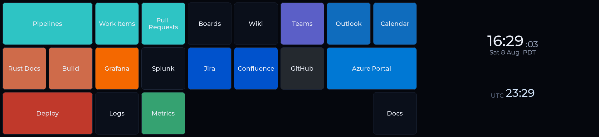

# 025 — Launcher mode: 9×3 button grid + shared clock widget

WI #1134 · proposal korg:1140 · slice 3 of program korg:1143 "Launcher — retire the Stream Deck"

## Goal

Build the panel half of the Stream Deck replacement: a touch grid of buttons fed
by `kvscf:launcher:<host>`, and a local + UTC clock in the space beside it.
Tapping a button publishes `{token, button:<key>}` to `kvscf:focus:<host>`;
kvscf foregrounds that button's preferred Edge window and opens the URL **in
it** — the part a Stream Deck cannot do.

The producing side shipped first (kvscf sprint 016, PR #18) and froze its
contract as §6 of kvscf `docs/kdeskdash-vscode-mode.md`. This sprint consumed
that contract with no round-trips, the same way the Edge mode (§3) did.

## What shipped

- **[src/kvscf_feed.c](../src/kvscf_feed.c)** — the launcher core, alongside the
  existing instances/edge/apps parsers: `kvscf_parse_launcher` (envelope +
  per-button validation with earlier-wins overlap resolution),
  `kvscf_press_payload`, `kvscf_button_rgb` (hex *or* a name from the repo
  palette), and `kvscf_label_filter`. All pure, all host-tested.
- **[src/kvscf_redis.c](../src/kvscf_redis.c)** — `kvscf_redis_refresh_launcher`
  (`SCAN kvscf:launcher:*` → GET → parse) and `kvscf_redis_press`, on the same
  handle and behind the same "never send unauthenticated" guard as
  `kvscf_redis_focus`.
- **[src/clock_core.{c,h}](../src/clock_core.c)** — pure clock formatting (local
  and UTC faces) plus the type-scale chooser, host-tested across a DST boundary
  and a date line.
- **[src/clock_widget.{c,h}](../src/clock_widget.c)** — the shared dual-clock:
  takes a parent container, measures it, picks a tier. Built shared **from the
  start** because WI #1136 rebuilds `clock` mode on it, which is what makes that
  WI an M instead of a second clock implementation.
- **[src/modes/launcher.c](../src/modes/launcher.c)** — the mode: 70/30 split,
  LVGL grid sized from the feed, cache-and-dim, swipe-guarded taps, optimistic
  feedback.
- Integration was the promised three lines — roster in
  [src/modeset.c](../src/modeset.c), a case in [src/main.c](../src/main.c), a
  [CMakeLists.txt](../CMakeLists.txt) entry — plus widening the kvscf feed
  init gate from "foreground is registered" to "foreground *or* launcher is".
- One new palette entry, `UTC_FROST`, for the UTC face.

## Decisions

**The geometry was measured before it was built, and the panel agreed.** 70/30
on 1920×440 gives 1344/576; three rows gives ~146 px; 1344/146 = 9.2 → nine
columns; cells land at ~149×146 px ≈ **21.6 mm**, against a Stream Deck key's
19 mm. The replacement has bigger targets than the hardware it replaces.

**The status line lives in the clock pane, not under the grid.** A strip beneath
the grid would have eaten into the 440 px the row height was computed from, and
the measured geometry is the whole argument for this layout. The right-hand pane
had room to spare.

**`grid` is read, never assumed.** Rows and cols come off the wire and drive the
LVGL track descriptors directly, so the editor's idea of the layout (slice 4)
and this renderer's cannot drift. There is no `3` or `9` anywhere in
[launcher.c](../src/modes/launcher.c); `KV_GRID_ROWS_MAX`/`COLS_MAX` are buffer
ceilings, not a layout.

**An over-long button `key` is rejected, not truncated.** Sprint 008 shipped a
silent truncation bug because a field sized for one kind of value met another,
and a *clipped key presses the wrong button*. Labels still truncate — that is
only cosmetic. Both are asserted, including a byte-exact round-trip of the
longest key that fits.

**Cache-and-dim, never blank.** A failed refresh leaves the caller's config
untouched by construction: `kvscf_parse_launcher` only writes `out` once the
payload is known-usable, so there is no window where a half-parsed feed can
erase a good layout. After ~3 missed polls the grid greys and the pane says
`kvscf offline`. Verified by deleting the key on a live panel — the buttons
stayed.

## Emoji: checked early, and the answer was no

The handoff flagged tofu on a launcher button as a v1 bug rather than polish, so
this got probed before any rendering code was written. The result is worth
recording, because the intuition was wrong:

**`fonts/ttf/SymbolsNerdFont-Regular.ttf` contains zero emoji** — 0 codepoints
in U+1F300–1FAFF, no U+FE0F, and no Latin either (it is a symbols-only font).
Montserrat has no emoji. So there was never a font in this build that could draw
`🦀`, and chaining the Nerd Font in for button labels would have bought nothing.

Worse, the obvious fix does not work: LVGL's `lv_font_t.fallback` chain relies on
`lv_font_get_glyph_dsc` returning false for a missing glyph, and **TinyTTF
reports every glyph as present** (the same trap `docs/solutions/` already
records for glyph probing). A TinyTTF primary with a Montserrat fallback would
render Latin as blanks, not fall through.

So the mode draws labels in one bitmap font and **filters the label down to what
that font can actually draw** — `kvscf_label_filter`, which also always drops
ZWJ, variation selectors and skin-tone modifiers, then collapses the whitespace
the removal leaves behind. `"🦀 Rust Docs"` renders as `Rust Docs`, not as a box
followed by an indent. Confirmed on the panel.

The same rule caught a bug in this sprint's own chrome: the clock's date line
used `·` (U+00B7), which Montserrat also lacks, and the panel logged a missing
glyph until it became two spaces.

Rendering Ken's emoji *properly* needs a monochrome emoji font (Noto Emoji is
~1.5 MB) plus a composite `lv_font_t` that dispatches across fonts, since the
built-in fallback chain cannot be used from a TinyTTF primary. That is a real
piece of work and a real vendored asset — follow-up, not v1.

## Two bugs the panel found that the host build could not

1. **SEGV on first paint.** Children of an LVGL grid need a cell, and the grid
   needs track descriptors, from the moment they exist — LVGL lays hidden
   children out too. Creating the 72-button pool before any feed had arrived
   crashed on the first layout pass, in a restart loop. Both the placeholder 1×1
   track set and the per-button default cell are there for that.
2. **The clock was calibrated by guess.** The tier thresholds asked for 900 px of
   width before granting the large scale, on the theory that "large" meant "full
   screen". The 576 px pane got the medium scale and rendered a small clock in a
   mostly empty box. What the large scale actually needs is ~250 px; width was
   never the interesting constraint, height is. Recalibrated against the panel,
   and the tests updated to match the panel rather than the guess.

A third thing only the panel showed: spreading four rows evenly down the pane
made them read as four unrelated readouts. Each face now keeps its date grouped
under it, and the spacing goes *between* the two faces.

## Verified on hardware

Iterated on rpidash2 via `just push-dev`, then restored it to
`0.24.0-6f819b7` and its original 9-mode set. Neither committed host env file
was touched — adding `launcher` to rpidash3 is slice 5's line to write.

- Grid, spans, and all three colour paths (hex, palette name, unknown/empty →
  default) render correctly at 9×3.
- Two deliberately bad buttons (off-grid, overlapping) were skipped and logged
  once: `launcher: skipped 2 invalid button(s) from kwork`.
- Emoji labels rendered clean, no tofu.
- Cache-and-dim held the layout when the key was deleted.
- **The tap was verified end-to-end, not inferred.** evdev nodes cannot be
  written to, so the check ran through a throwaway `uinput` absolute-pointer
  device with `KDESKDASH_TOUCH_DEV` pointed at it: a synthetic tap at the
  Pipelines button put exactly `{"token":"kvscf-…","button":"ado-pipelines"}` on
  `kvscf:focus:kwork`. This is the only mode that acts on another machine; it
  seemed worth proving rather than assuming.

## Follow-ups

- **#1135 (slice 4)** — the kvscf editor window. Unblocked by this.
- **#1136** — rebuild `clock` mode on `clock_widget`. The widget is ready; that
  WI also owns making a full-screen clock genuinely *fill* its screen, which
  Montserrat's 48 px ceiling means is a transform-scaling job, not a font-size
  one.
- **#1137 (slice 5)** — kwork/rpidash3 pairing, which adds `launcher` to
  rpidash3's ops list and carries the isolated-Redis work.
- **Emoji, properly** — a vendored monochrome emoji font plus a composite font
  that dispatches across fonts. Worth doing only if Ken's real button labels
  turn out to lean on emoji; the filter means they are legible either way.
- The Launcher is not on any panel yet — it is in the roster and buildable, but
  both hosts pin `KDESKDASH_MODES`, so nothing changed on either desk.

## Deployed 2026-08-08

Published from merged `main` (`4049571`) and installed on the whole fleet.

- **Artifact:** `0.25.0-4049571` (store `latest`). `VERSION` moved to `0.25.0`,
  the minor tracking the sprint number as usual.
- **Rollback target:** `0.24.0-6f819b7` — `just deploy <host> 0.24.0-6f819b7`.
- **rpidash2** (Pi 5, dev desk) — `kdeskdash 0.25.0-4049571`, unit active,
  frame captured (Claude mode).
- **rpidash3** (Pi 4, work desk) — `kdeskdash 0.25.0-4049571`, unit active,
  frame captured. Reachable this time, so the fleet is uniform rather than
  split.

The unit file did not change this sprint, so no `install-service` was needed,
and no device env file was touched.

**Verified live, sprint-specifically:** the new binary is running on both
boards *and* the Launcher is correctly **inert** on both. rpidash3's Menu frame
shows its six tiles (Icons, Palette | Remote, Clock, Dev, Calc) with no Launcher
tile — which is the intended outcome, since adding `launcher` to the roster must
not change a panel whose `KDESKDASH_MODES` does not name it. Turning it on for
the work desk is slice 5's one-word edit.
